# caretSDM
Luíz Fernando Esser

# caretSDM

`caretSDM` is a under development R package that uses the powerful
`caret` package as the main engine to obtain Species Distribution
Models. As `caret` is a packaged turned to build machine learning
models, `caretSDM` has a strong focus on this approach.

## Installing

First we will install the package from github. For that we will need to
install the `devtools` package first and then install the `caretSDM`
package.

``` r
install.packages(setdiff("devtools", rownames(installed.packages())))
install_github("luizesser/caretSDM")
options(timeout = 600)
```

``` r
library(caretSDM)
```

    Warning: replacing previous import 'caret::progress' by 'httr::progress' when
    loading 'caretSDM'

    Warning: replacing previous import 'dplyr::union' by 'raster::union' when
    loading 'caretSDM'

    Warning: replacing previous import 'dplyr::intersect' by 'raster::intersect'
    when loading 'caretSDM'

    Warning: replacing previous import 'dplyr::select' by 'raster::select' when
    loading 'caretSDM'

    Warning: replacing previous import 'raster::select' by 'dplyr::select' when
    loading 'caretSDM'

``` r
library(stars)
```

    Loading required package: abind

    Loading required package: sf

    Linking to GEOS 3.11.0, GDAL 3.5.3, PROJ 9.1.0; sf_use_s2() is TRUE

``` r
# keep track of time:
x1 <- Sys.time()
```

## Pre-Processing

### Obtaining example data

Now we will create some example data. Starting with occurrences and then
predictors data. The first one is a function to obtain species data from
GBIF, while the second is a function to obtain climatic variables from
WorldClim 2.1. You can read more about them by running in the console
`?GBIF_data` and `?WorldClim_data`.

``` r
# occ_data <- GBIF_data("Araucaria angustifolia")
occ_data <- read.csv("input_data/spp_data.csv")
```

``` r
pred_data <- WorldClim_data(period = "current", resolution = 10)
```

### The `input_sdm` class

In this package we will use multiple classes to perform our analysis.
Every time we use those objects to perform some kind of analysis, the
object will keep the information of what we did. Ideally, the workflow
will have only one object throughout it. The `input_sdm` class is the
key class in the workflow, where every function will orbitate. That
class puts occurrences, predictors, scenarios, models and predictions
together to perform analysis that are only possible when two or more of
these classes are available. First, we create the object by informing
the occurrences, predictors and scenarios classes.

The first class we will use is the occurrences class (*i.e.* “response
variable”, “target” or “label”). This class receives the occurrence data
of the species. But, despite most species data available is
presence-only, we consider here in this package that occurrence data is
composed of two classes: presences and absences. If absences are not
available in species data (which is expected), we will build multiple
sets of pseudo-absences to be used in substitution. These datasets will
be stored under `occurrences` in `input_sdm`.

Parallel to the `occurrences` class, we will have the `predictors` class
to receive the environmental/climatic data (*i.e.* “predictor
variables”, “covariates”, “explanatory variables”, “features” or
“control variables”). With this class we will perform analysis using
only the predictors (such as geoprocessing transformations; `rescaling`
argument) and together with the `occurrences` class (such as variable
selection routines). It is important to say that this package has a
strong geoprocessing background. In this way, it is possible to declare
your study area using a shapefile, but also create a new grid over the
study area by applying a rescaling method. This can also provide new
EPSG to the data to avoid latidudinal convergence.

`input_sdm` function also receives a `scenarios` object, where the
researcher can provide new data to project the models. This data can be
from future or past scenarios. One can also provide a new `study_area`
if the aim of the modeling is to project a model in a new area (*e.g.*
as in invasiveness assessments). Lately, when projecting the models, we
can include the predictors data as new data to be projected on. This is
useful for projecting models in the same region where the model was
built.

It is possible to pass multiple classes to the `occurrences`,
`predictors` and `scenarios` functions as rasterStacks (from raster
package), SpatRaster (from terra package), stars (from stars package),
data.frames, simple features (sf package) and others. In this way, if
you want to import data to R in your own way and then work them with
your favorite package your are able to pass it to `caretSDM` afterwards.
We propose here the use of the directory to enter data into caretSDM. By
passing the directory to the predictors and scenarios functions, they
will recognize data in folder and import it as stars objects (all the
processing with geographic data in `caretSDM` is done using `stars` and
`sf` packages).

``` r
# folder containing the current data downloaded from WorldClim.
folder_current <- "~/Documents/GitHub/caretSDM/input_data/WorldClim_data_current"

# folder containing the future data downloaded from WorldClim.
folder_future <- "~/Documents/GitHub/caretSDM/input_data/WorldClim_data_future"

# importing the study area and informing the crs.
study_area <- st_read("input_data/Amazon/AmazonHydroRivers4.shp")
```

    Reading layer `AmazonHydroRivers4' from data source 
      `/Users/luizesser/Documents/GitHub/caretSDM/input_data/Amazon/AmazonHydroRivers4.shp' 
      using driver `ESRI Shapefile'
    Simple feature collection with 107294 features and 14 fields
    Geometry type: LINESTRING
    Dimension:     XY
    Bounding box:  xmin: -79.37708 ymin: -20.21042 xmax: -48.44375 ymax: 5.139583
    Geodetic CRS:  WGS 84

``` r
# create the input_sdm that we will work with during the workflow.
i <- input_sdm(
  occurrences(occ_data),
  predictors(folder_current,
    study_area = study_area,
    rescaling = list(cellsize = 100000, epsg = 6933)
  ),
  scenarios(folder_future,
    study_area = study_area,
    rescaling = list(cellsize = 100000, epsg = 6933)
  )
)
i
```

                caretSDM           
    ...............................
    Class                         : input_sdm
    --------  Occurrences  --------
    Species Names                 : Colossoma.macropomum Mylossoma.aureum 
    Number of presences           : 448 486 
    --------  Predictors  ---------
    Number of Predictors          : 19 
    Predictors Names              : bio1, bio10, bio11, bio12, bio13, bio14, bio15, bio16, bio17, bio18, bio19, bio2, bio3, bio4, bio5, bio6, bio7, bio8, bio9 
    Extent                        : -7658800 -4658800 -2526520 673480.4 (xmin, xmax, ymin, ymax)
    EPSG                          : EPSG:6933 
    Resolution                    : 1e+05 1e+05 (x, y)
    ---------  Scenarios  ---------
    Scenarios Names               : mi_ssp126_10_2030.tif mi_ssp126_10_2090.tif mi_ssp585_10_2030.tif mi_ssp585_10_2090.tif 
    Number of Scenarios           : 4 

**TIP:** pay attention on the information printed above. As we follow
this tutorial, information will get richer.

### Data Cleaning

As the first step in our workflow, we will clean our occurrences data by
applying a group of functions from the package `CoordinateCleaner`. In
this function, we also provide a way to check for environmental
duplicates, by including a predictors object. This function also checks
for records in the sea if the species is terrestrial, but note that this
can be switched off if the studied species is not terrestrial. The way
`caretSDM` works, we can always overwrite the main `input_sdm` object to
update it. The function will return a new object with all the previous
information and the new information obtained from the `data_clean`
function, note that at the end of the Data Cleaning information there is
the Duplicated Cell method. This method is only possible when we have
both the `occurrence` and `predictors` data.

``` r
i <- data_clean(i)
```

    Testing country capitals

    Removed 0 records.

    Testing country centroids

    Removed 1 records.

    Testing duplicates

    Removed 159 records.

    Testing equal lat/lon

    Removed 0 records.

    Testing biodiversity institutions

    Removed 0 records.

    Testing coordinate validity

    Removed 0 records.

    Testing sea coordinates

    Reading layer `ne_110m_land' from data source 
      `/private/var/folders/j_/4jszkpkd3bl5y4ccl0qht1qh0000gn/T/Rtmpkg8oW9/ne_110m_land.shp' 
      using driver `ESRI Shapefile'
    Simple feature collection with 127 features and 3 fields
    Geometry type: POLYGON
    Dimension:     XY
    Bounding box:  xmin: -180 ymin: -90 xmax: 180 ymax: 83.64513
    Geodetic CRS:  WGS 84

    Removed 0 records.

    [1] "Predictors identified, procceding with grid filter (removing NA and duplicated data)."
    [1] "CRS from predictors is different from occurrences' CRS. Ocurrences' CRS will be transformed to predictors' CRS."

``` r
i
```

                caretSDM           
    ...............................
    Class                         : input_sdm
    --------  Occurrences  --------
    Species Names                 : Colossoma.macropomum Mylossoma.aureum 
    Number of presences           : 98 95 
    Data Cleaning                 : NAs, Capitals, Centroids, Geographically Duplicated, Identical Lat/Long, Institutions, Invalid, Non-terrestrial, Duplicated Cell (grid) 
    --------  Predictors  ---------
    Number of Predictors          : 19 
    Predictors Names              : bio1, bio10, bio11, bio12, bio13, bio14, bio15, bio16, bio17, bio18, bio19, bio2, bio3, bio4, bio5, bio6, bio7, bio8, bio9 
    Extent                        : -7658800 -4658800 -2526520 673480.4 (xmin, xmax, ymin, ymax)
    EPSG                          : EPSG:6933 
    Resolution                    : 1e+05 1e+05 (x, y)
    ---------  Scenarios  ---------
    Scenarios Names               : mi_ssp126_10_2030.tif mi_ssp126_10_2090.tif mi_ssp585_10_2030.tif mi_ssp585_10_2090.tif 
    Number of Scenarios           : 4 

**TIP:** Note that the information regarding the `i` object changed. Now
it includes the information that we performed a Data Cleaning routine
and explicitly informs what methods were used.

### Variable Selection

In `vif_predictors`, we are able to perform two methods to select
variables: selecting all area or using the presence records (which is
debatable, but implemented).

``` r
i <- vif_predictors(i, area = "all")
```

    Using all variables available: bio1, bio10, bio11, bio12, bio13, bio14, bio15, bio16, bio17, bio18, bio19, bio2, bio3, bio4, bio5, bio6, bio7, bio8, bio9

``` r
i
```

                caretSDM           
    ...............................
    Class                         : input_sdm
    --------  Occurrences  --------
    Species Names                 : Colossoma.macropomum Mylossoma.aureum 
    Number of presences           : 98 95 
    Data Cleaning                 : NAs, Capitals, Centroids, Geographically Duplicated, Identical Lat/Long, Institutions, Invalid, Non-terrestrial, Duplicated Cell (grid) 
    --------  Predictors  ---------
    Number of Predictors          : 19 
    Predictors Names              : bio1, bio10, bio11, bio12, bio13, bio14, bio15, bio16, bio17, bio18, bio19, bio2, bio3, bio4, bio5, bio6, bio7, bio8, bio9 
    Extent                        : -7658800 -4658800 -2526520 673480.4 (xmin, xmax, ymin, ymax)
    EPSG                          : EPSG:6933 
    Resolution                    : 1e+05 1e+05 (x, y)
    Area (VIF)                    : all
    Selected Variables (VIF)      : bio18, bio4, bio8 
    ---------  Scenarios  ---------
    Scenarios Names               : mi_ssp126_10_2030.tif mi_ssp126_10_2090.tif mi_ssp585_10_2030.tif mi_ssp585_10_2090.tif 
    Number of Scenarios           : 4 

### Generate Pseudoabsences

As we mentioned before, pseudoabsence data will be stored in the
`occurrences` object (inside the `input_sdm`). To generate them, you can
inform some parameters. The argument `variables_selected` will inform
which variables you want to use to build your pseudoabsences/models.
This can either be a vector of variables names or a previously performed
selection method.

``` r
i <- pseudoabsences(i, method = "bioclim", variables_selected = "vif")
```

    Using variables selected by  vif :  bio18 bio4 bio8

``` r
i
```

                caretSDM           
    ...............................
    Class                         : input_sdm
    --------  Occurrences  --------
    Species Names                 : Colossoma.macropomum Mylossoma.aureum 
    Number of presences           : 98 95 
    Pseudoabsence methods         :
        Method to obtain PAs      : bioclim 
        Number of PA sets         : 10 
        Number of PAs in each set : 98 95 
    Data Cleaning                 : NAs, Capitals, Centroids, Geographically Duplicated, Identical Lat/Long, Institutions, Invalid, Non-terrestrial, Duplicated Cell (grid) 
    --------  Predictors  ---------
    Number of Predictors          : 19 
    Predictors Names              : bio1, bio10, bio11, bio12, bio13, bio14, bio15, bio16, bio17, bio18, bio19, bio2, bio3, bio4, bio5, bio6, bio7, bio8, bio9 
    Extent                        : -7658800 -4658800 -2526520 673480.4 (xmin, xmax, ymin, ymax)
    EPSG                          : EPSG:6933 
    Resolution                    : 1e+05 1e+05 (x, y)
    Area (VIF)                    : all
    Selected Variables (VIF)      : bio18, bio4, bio8 
    ---------  Scenarios  ---------
    Scenarios Names               : mi_ssp126_10_2030.tif mi_ssp126_10_2090.tif mi_ssp585_10_2030.tif mi_ssp585_10_2090.tif 
    Number of Scenarios           : 4 

**TIP:** Note, again, that the information regarding the `i` object has
increased. Now it includes the information that we performed a Data
Cleaning routine, explicitly informing what methods were used, the
information regarding VIF routine and the pseudoabsences.

We can test if our pseudoabsences are significantly different from the
presences by ploting the t-SNE:

``` r
tsne_sdm(i, variables_selected = "vif")
```

    $Colossoma.macropomum
    $Colossoma.macropomum[[1]]

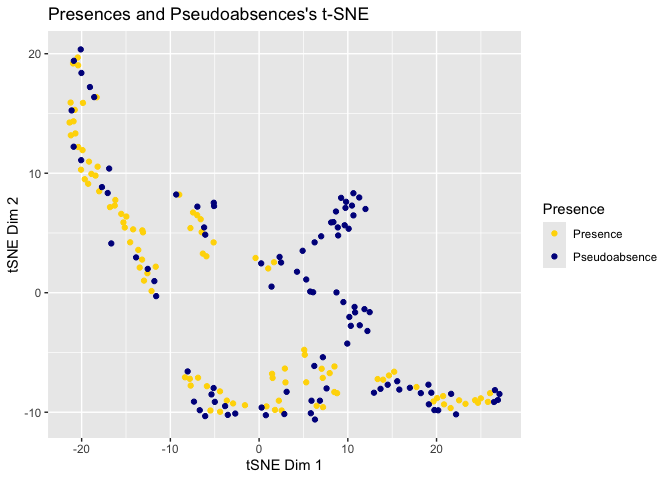


    $Colossoma.macropomum[[2]]

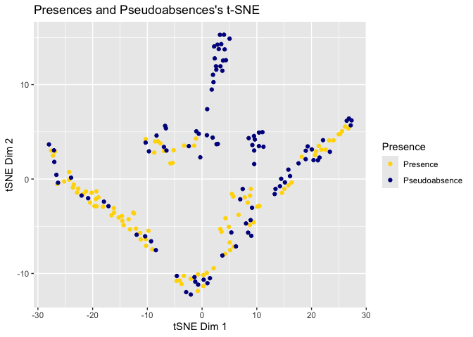


    $Colossoma.macropomum[[3]]

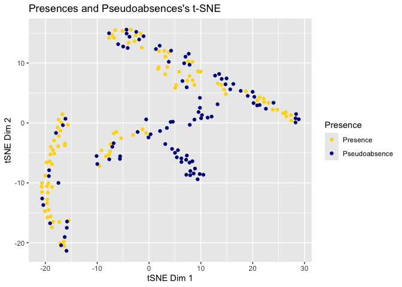


    $Colossoma.macropomum[[4]]

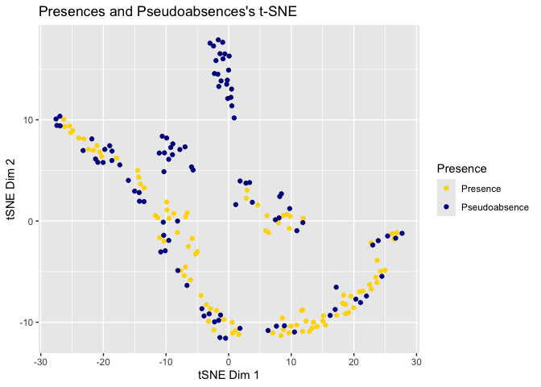


    $Colossoma.macropomum[[5]]

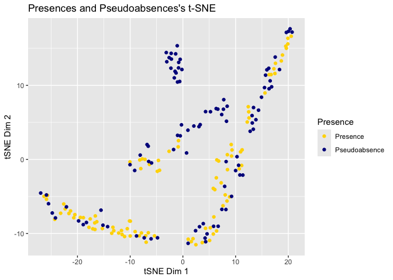


    $Colossoma.macropomum[[6]]

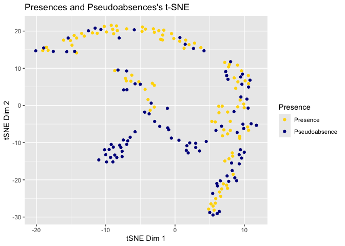


    $Colossoma.macropomum[[7]]

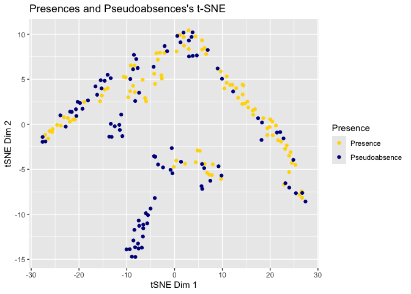


    $Colossoma.macropomum[[8]]

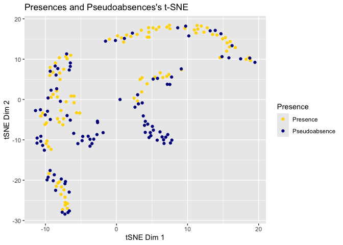


    $Colossoma.macropomum[[9]]

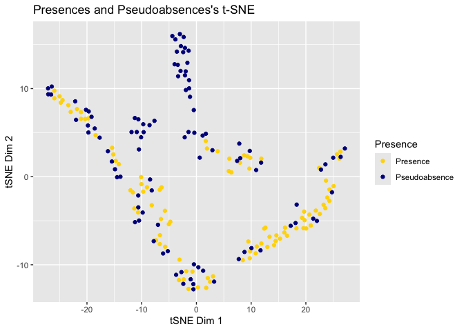


    $Colossoma.macropomum[[10]]

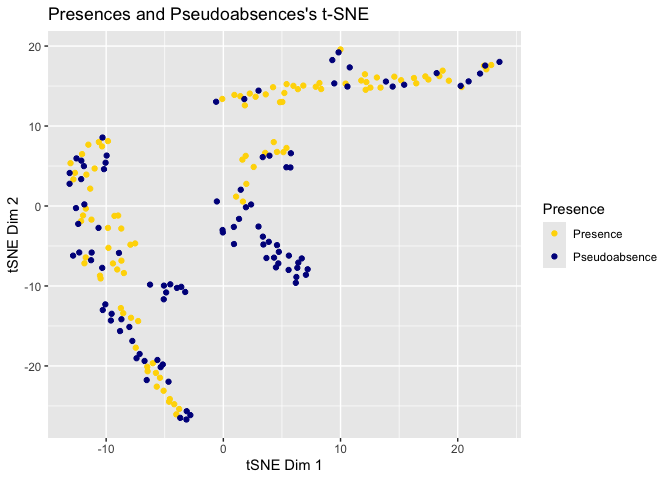


    $Mylossoma.aureum
    $Mylossoma.aureum[[1]]

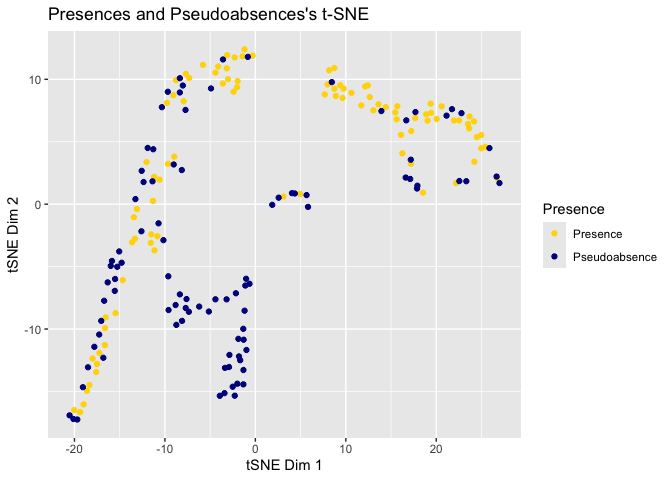


    $Mylossoma.aureum[[2]]

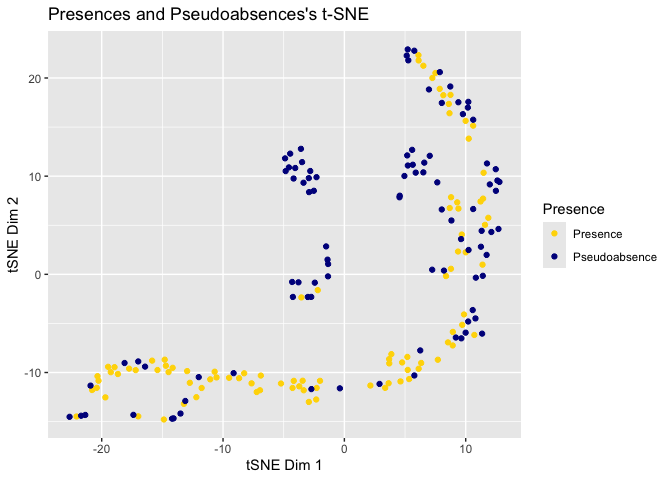


    $Mylossoma.aureum[[3]]

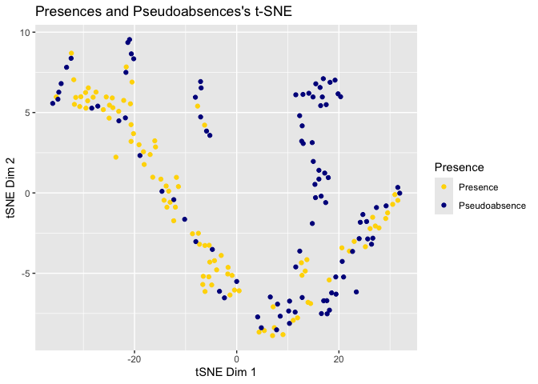


    $Mylossoma.aureum[[4]]

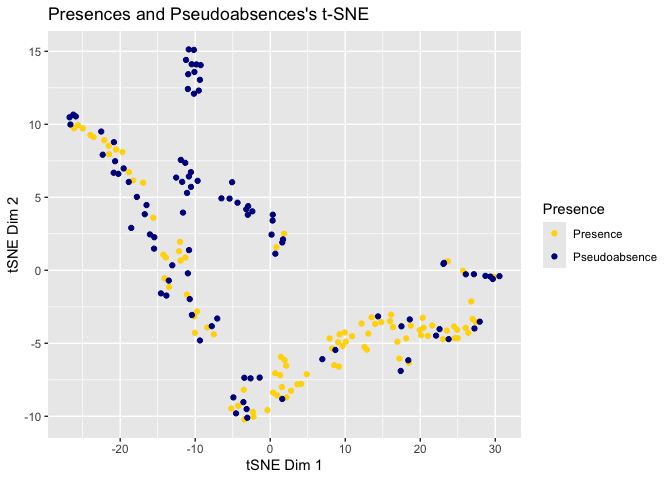


    $Mylossoma.aureum[[5]]


    $Mylossoma.aureum[[6]]

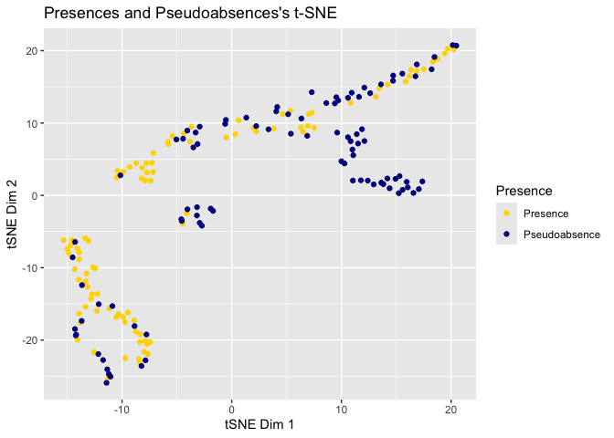


    $Mylossoma.aureum[[7]]

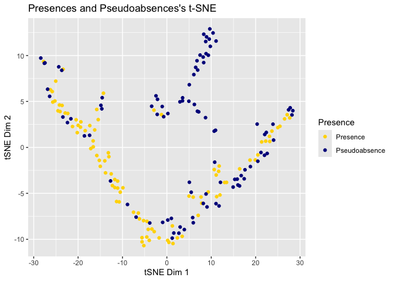


    $Mylossoma.aureum[[8]]

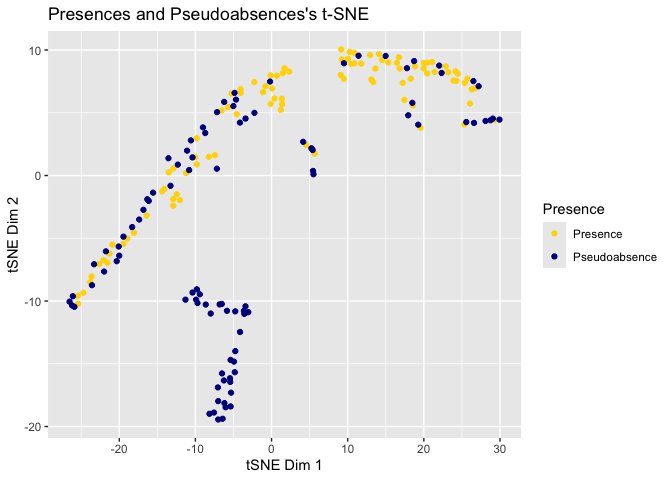


    $Mylossoma.aureum[[9]]


    $Mylossoma.aureum[[10]]

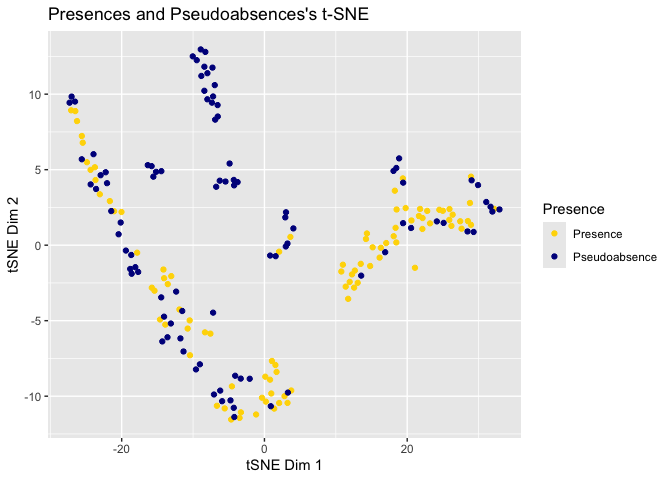

## Processing

With the occurrences and predictors data put together, we can pass to
the modeling. As the name suggests, this package uses the `caret`
package underlying its modeling procedure. For those who are not
familiar, `caret` is the easiest way to perform Machine Learning
analysis in R. It works by setting a modeling wrapper to pass multiple
packages and can provide a lot of automation regarding algorithms
fine-tuning, data spliting, pre-processing methods and predictions.
These automated functions from `caret` can be altered using the `ctrl`
argument in `train_sdm` function. See `?caret::trainControl` for all
options available.

Note that, when you are using an algorithm for the first time, caret
will ask you to install the relevant packages to properly run the
algorithm.

``` r
i <- train_sdm(i, algo = c("svmLinear2", "mda", "nnet", "nb", "kknn"), variables_selected = "vif")
i
# Under development stacked method:
# i <- train_sdm(i,  algo=list(c('svmLinear2', 'fda'),c('svmLinear2')), #variables_selected='vif')
```

Check mean validation metrics:

``` r
mean_validation_metrics(i)
```

    $Colossoma.macropomum
    # A tibble: 5 × 5
      algo         ROC Sensitivity Specificity   TSS
      <chr>      <dbl>       <dbl>       <dbl> <dbl>
    1 kknn       0.951       0.968       0.912 0.881
    2 mda        0.925       0.974       0.731 0.705
    3 nb         0.984       0.970       0.949 0.919
    4 nnet       0.985       0.983       0.895 0.878
    5 svmLinear2 0.980       0.991       0.859 0.850

    $Mylossoma.aureum
    # A tibble: 5 × 5
      algo         ROC Sensitivity Specificity   TSS
      <chr>      <dbl>       <dbl>       <dbl> <dbl>
    1 kknn       0.939       0.963       0.905 0.868
    2 mda        0.930       0.984       0.738 0.722
    3 nb         0.988       0.949       0.959 0.908
    4 nnet       0.961       0.978       0.871 0.849
    5 svmLinear2 0.977       0.987       0.825 0.813

See Variable importance:

``` r
varImp_sdm(i)
```

    $Colossoma.macropomum
                 mean        sd
    bio18   0.6194174  1.259301
    bio4    6.1040612 11.524897
    bio8  100.0000000  0.000000

    $Mylossoma.aureum
               mean     sd
    bio18   0.00000  0.000
    bio4   20.85387 15.458
    bio8  100.00000  0.000

## Prediction

Now that we have our models, we can make predictions in new scenarios.
The function `predict_sdm` incorporates also the prediction of ensembles
(`ensembles=TRUE` is standard), as well as the prediction on current
data (obtained from predictors data; `add.current=TRUE` is standard).

``` r
i <- predict_sdm(i)
```

    bio01 bio02 bio03 bio04 bio05 bio06 bio07 bio08 bio09 bio10 bio11 bio12 bio13 bio14 bio15 bio16 bio17 bio18 bio19 
    bio1 bio2 bio3 bio4 bio5 bio6 bio7 bio8 bio9 bio10 bio11 bio12 bio13 bio14 bio15 bio16 bio17 bio18 bio19[1] "Projecting: 1/5"
    [1] "Projecting: 2/5"
    [1] "Projecting: 3/5"
    [1] "Projecting: 4/5"
    [1] "Projecting: 5/5"
    [1] "Ensembling..."
    [1] "mi_ssp126_10_2030.tif"
    [1] "Colossoma.macropomum"
    [1] "Mylossoma.aureum"
    [1] "mi_ssp126_10_2090.tif"
    [1] "Colossoma.macropomum"
    [1] "Mylossoma.aureum"
    [1] "mi_ssp585_10_2030.tif"
    [1] "Colossoma.macropomum"
    [1] "Mylossoma.aureum"
    [1] "mi_ssp585_10_2090.tif"
    [1] "Colossoma.macropomum"
    [1] "Mylossoma.aureum"
    [1] "current"
    [1] "Colossoma.macropomum"
    [1] "Mylossoma.aureum"

``` r
i
```

                caretSDM           
    ...............................
    Class                         : input_sdm
    --------  Occurrences  --------
    Species Names                 : Colossoma.macropomum Mylossoma.aureum 
    Number of presences           : 98 95 
    Pseudoabsence methods         :
        Method to obtain PAs      : bioclim 
        Number of PA sets         : 10 
        Number of PAs in each set : 98 95 
    Data Cleaning                 : NAs, Capitals, Centroids, Geographically Duplicated, Identical Lat/Long, Institutions, Invalid, Non-terrestrial, Duplicated Cell (grid) 
    --------  Predictors  ---------
    Number of Predictors          : 19 
    Predictors Names              : bio1, bio10, bio11, bio12, bio13, bio14, bio15, bio16, bio17, bio18, bio19, bio2, bio3, bio4, bio5, bio6, bio7, bio8, bio9 
    Extent                        : -7658800 -4658800 -2526520 673480.4 (xmin, xmax, ymin, ymax)
    EPSG                          : EPSG:6933 
    Resolution                    : 1e+05 1e+05 (x, y)
    Area (VIF)                    : all
    Selected Variables (VIF)      : bio18, bio4, bio8 
    ---------  Scenarios  ---------
    Scenarios Names               : mi_ssp126_10_2030.tif mi_ssp126_10_2090.tif mi_ssp585_10_2030.tif mi_ssp585_10_2090.tif 
    Number of Scenarios           : 4 
    -----------  Models  ----------
    Algorithms Names              : svmLinear2 mda nnet nb kknn 
    Variables Names               : bio18 bio4 bio8 
    Model Validation              :
        Method                    : repeatedcv 
        Number                    : 4 
        Metrics                   :
    $Colossoma.macropomum
    # A tibble: 5 × 5
      algo         ROC Sensitivity Specificity   TSS
      <chr>      <dbl>       <dbl>       <dbl> <dbl>
    1 kknn       0.951       0.968       0.912 0.881
    2 mda        0.925       0.974       0.731 0.705
    3 nb         0.984       0.970       0.949 0.919
    4 nnet       0.985       0.983       0.895 0.878
    5 svmLinear2 0.980       0.991       0.859 0.850

    $Mylossoma.aureum
    # A tibble: 5 × 5
      algo         ROC Sensitivity Specificity   TSS
      <chr>      <dbl>       <dbl>       <dbl> <dbl>
    1 kknn       0.939       0.963       0.905 0.868
    2 mda        0.930       0.984       0.738 0.722
    3 nb         0.988       0.949       0.959 0.908
    4 nnet       0.961       0.978       0.871 0.849
    5 svmLinear2 0.977       0.987       0.825 0.813

    --------  Predictions  --------
    Ensembles                     :
        Methods                   : mean_occ_prob wmean_AUC committee_avg 
    Thresholds                    :
        Method                    : threshold: 0.9 
        Criteria                  : 0.9 

``` r
x2 <- Sys.time()
x1-x2
```

    Time difference of -4.888336 mins

## Mapping

To generate maps in caretSDM we can simply plot the input_sdm object.
The plot function will look for ensembles, predictions, models and
occurrences to be ploted, in this order. In this way, if only
occurrences are available, it will plot the occurrences. If ensembles
are available, it will plot the ensembles. You can specify what to plot
using the `what` argument.

``` r
plot(i$predictions)
```

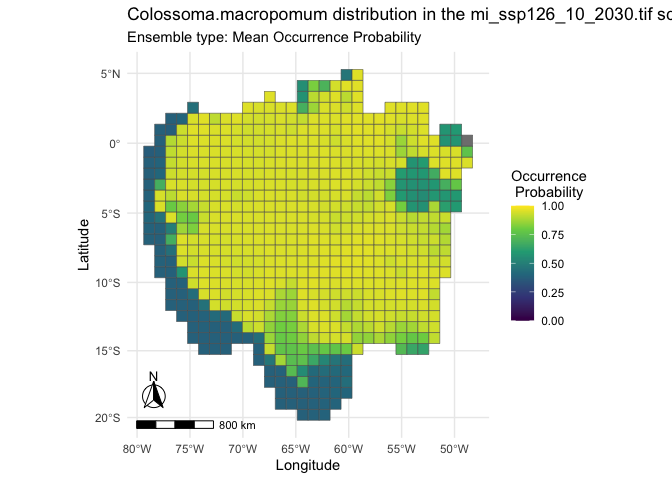

Alternatively, one could retrieve caretSDM data to its favorite class to
work on:

``` r
st <- sdm_as_stars(i)
st
```

    stars object with 1 dimensions and 2 attributes
    attribute(s):
                         Min.     1st Qu.      Median       Mean     3rd Qu.
    cell_id        15.0000000 344.0000000 526.0000000 515.805513 697.0000000
    mean_occ_prob   0.3604229   0.8318479   0.9279315   0.823077   0.9399644
                          Max.
    cell_id        950.0000000
    mean_occ_prob    0.9478292
    dimension(s):
             from  to                       refsys point
    geometry    1 653 WGS 84 / NSIDC EASE-Grid ... FALSE
                                                                    values
    geometry POLYGON ((-6258800 -25265...,...,POLYGON ((-5758800 573480...

``` r
plot(st["mean_occ_prob"])
```


``` r
ter <- sdm_as_terra(i)
```

    [1] "spp not detected. Using spp=Colossoma.macropomum"
    [1] "scen not detected. Using scen=mi_ssp126_10_2030.tif"
    [1] "ens not detected. Using ens=mean_occ_prob"

``` r
ter
```

    class       : SpatRaster 
    dimensions  : 263, 247, 1  (nrow, ncol, nlyr)
    resolution  : 12171.61, 12171.61  (x, y)
    extent      : -7658800, -4652411, -2527654, 673480.4  (xmin, xmax, ymin, ymax)
    coord. ref. : WGS 84 / NSIDC EASE-Grid 2.0 Global (EPSG:6933) 
    source(s)   : memory
    name        :     layer 
    min value   : 0.3604229 
    max value   : 0.9478292 

``` r
r <- sdm_as_raster(i)
```

    [1] "spp not detected. Using spp=Colossoma.macropomum"
    [1] "scen not detected. Using scen=mi_ssp126_10_2030.tif"
    [1] "ens not detected. Using ens=mean_occ_prob"

``` r
r
```

    class      : RasterLayer 
    dimensions : 263, 247, 64961  (nrow, ncol, ncell)
    resolution : 12171.61, 12171.61  (x, y)
    extent     : -7658800, -4652411, -2527654, 673480.4  (xmin, xmax, ymin, ymax)
    crs        : +proj=cea +lat_ts=30 +lon_0=0 +x_0=0 +y_0=0 +datum=WGS84 +units=m +no_defs 
    source     : memory
    names      : layer 
    values     : 0.3604229, 0.9478292  (min, max)

## An alternative approach

We implemented a different approach to users that want to use shape
variables. This is implemented mostly thinking in HydroSHEDS database,
which is particularly important for continental aquatic environments
modeling.

``` r
library(stars) 
library(tibble) 
library(dplyr) 
library(caretSDM) 
x3 <- Sys.time()
## Import occurrence data
occ_data <- read.csv('input_data/spp_data.csv')

## Amazon shapefile
amazon <- read_sf('input_data/Amazon/AmazonHydroRivers4.shp') 
amazon <- select(amazon, c(LENGTH_KM, CATCH_SKM, DIST_UP_KM, UPLAND_SKM))
## Enter bioclimatic variables
bioc <- read_stars(list.files('~/Documents/Mapas/Rasters/WorldClim 2.1/current_5m', full.names = T), along = "band", normalize_path = F)

# Change bioclimatic names
bioc <- set_band_names(bioc, sort(paste0('bio', 1:19))) 

# Create sdm_area object
sa <- sdm_area(amazon, cell_size = 100000, epsg = 6933) 

# Add the predictors
sa <- add_predictors(sa, bioc, variables_selected=c('bio1', 'bio12'))

# Import scenarios
scen <- read_stars(list.files("~/Documents/GitHub/caretSDM/input_data/WorldClim_data_future", full.names = T)) 

# Change names from variable of scenarios to match predictors
scen <- set_band_names(scen, paste0('bio', 1:19))

# Add scenarios
sa <- add_scenarios(sa, scen, variables_selected=c('bio1', 'bio12'))

# Follow with the same SDM workflow:
i_sa <- input_sdm(occurrences(occ_data), sa) |>
          data_clean() |>
          vif_predictors() |>
          pseudoabsences(method = "bioclim", variables_selected=c("bio1", "bio12", "LENGTH_KM")) |>
          train_sdm(algo = c("svmLinear2", "mda", "nnet", "nb", "kknn"), variables_selected=c("bio1", "bio12", "LENGTH_KM")) |>
          predict_sdm(th=0.9) 

x4 <- Sys.time()
```

``` r
x4-x3
```

    Time difference of 4.326232 mins

``` r
plot(i_sa$predictions, scenario='current')
```

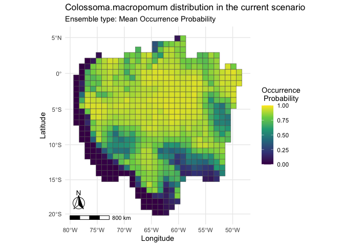
