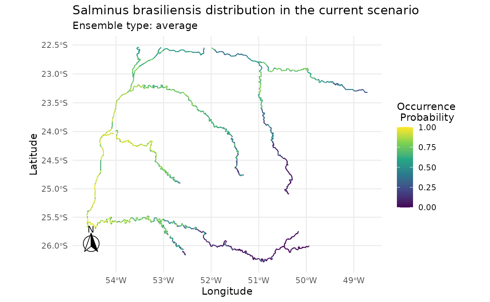

# 1. Concatenate functions in caretSDM

In caretSDM we always use one central object through out the framework,
the `input_sdm` object. This allows us to concatenate functions, which
can be very useful when running SDMs for the first couple of times. Here
we provide a functioning way to easily run your framework with only
three objects.

``` r

# Open library
library(caretSDM)
#> Registered S3 methods overwritten by 'ggpp':
#>   method                  from   
#>   heightDetails.titleGrob ggplot2
#>   widthDetails.titleGrob  ggplot2
set.seed(1)
```

``` r

# Build sdm_area object
sa <- sdm_area(rivs,
  cell_size = 25000,
  output_crs = 6933,
  gdal = T,
  lines_as_sdm_area = TRUE
) |>
  add_predictors(bioc) |>
  add_scenarios() |>
  select_predictors(c("LENGTH_KM", "DIST_DN_KM", "bio1", "bio4", "bio12"))
#> ! Making grid over study area is an expensive task. Please, be patient!
#> ℹ Using GDAL to make the grid and resample the variables.
#> Linking to GEOS 3.12.1, GDAL 3.8.4, PROJ 9.4.0; sf_use_s2() is TRUE
#> 
#> ! Making grid over the study area is an expensive task. Please, be patient!
#> ℹ Using GDAL to make the grid and resample the variables.

# Build occurrences_sdm object
oc <- occurrences_sdm(salm, occ_crs = 6933)

# Merge sdm_area and occurrences_sdm and perform pre-processing, processing and projecting.
i <- input_sdm(oc, sa) |>
  data_clean() |>
  multicollinearity_sdm("vifcor") |>
  pseudoabsences(method = "bioclim", variables_selected = "vif") |>
  train_sdm(
    algo = c("naive_bayes", "kknn"),
    ctrl = caret::trainControl(
      method = "repeatedcv",
      number = 4,
      repeats = 1,
      classProbs = TRUE,
      returnResamp = "all",
      summaryFunction = summary_sdm,
      savePredictions = "all"
    ),
    variables_selected = "vif"
  ) |>
  predict_sdm(th = 0.7) |>
  ensemble_sdm() |>
  suppressWarnings()
#> Cell_ids identified, removing duplicated cell_id.
#> Testing country capitals
#> Removed 0 records.
#> Testing country centroids
#> Removed 0 records.
#> Testing duplicates
#> Removed 0 records.
#> Testing equal lat/lon
#> Removed 0 records.
#> Testing biodiversity institutions
#> Removed 0 records.
#> Testing coordinate validity
#> Removed 0 records.
#> Testing sea coordinates
#> Reading ne_110m_land.zip from naturalearth...Removed 0 records.
#> Loading required package: ggplot2
#> Loading required package: lattice
#> Ensemble function: average
#>   current
```

``` r

i
#>              caretSDM           
#> ................................
#> Class                          : input_sdm
#> 
#> =========== Overview ===========
#> Focal Taxon                    : Salminus brasiliensis 
#> Spatial extent                 : -5269920.54541171, -3240235.69291754, -4700000, -2803133.9792114  (xmin,xmax,ymin,ymax)
#> Temporal extent                : Current
#> Observation type               : Presence-absence (pseudo-absence) 
#> Predictor names                : LENGTH_KM, DIST_DN_KM, bio1, bio4, bio12 
#> Modelling algorithms           : naive_bayes, kknn 
#> Model complexity (tuneLength)  : 1 
#> Model averaging                : average 
#> Software                       : caretSDM v1.9.7, R version 4.6.1 (2026-06-24)
#> 
#> ============= Data =============
#> -- Biodiversity data --
#> Taxon names                    : Salminus brasiliensis 
#> Sample size                    : 22 
#> (Pseudo)Absence data method    : bioclim 
#> Number of PA sets              : 10 
#> PAs per set                    : 22 
#> PA-to-presence ratio           : 1 
#> Data cleaning                  : NAs, Capitals, Centroids, Geographically Duplicated, Identical Lat/Long, Institutions, Invalid, Non-terrestrial, Duplicated Cell (grid) 
#> -- Data partitioning --
#> Training/validation method     : repeatedcv 
#> Number of folds/repeats        : 4 
#> -- Predictor variables --
#> Number of predictors           : 5 
#> Predictor names                : LENGTH_KM, DIST_DN_KM, bio1, bio4, bio12 
#> Spatial extent                 : -5269920.54541171, -3240235.69291754, -4700000, -2803133.9792114  (xmin,xmax,ymin,ymax)
#> Spatial resolution             : (25000, 25000) 
#> Coordinate reference system    : EPSG:6933 ( EPSG: 6933 ) 
#> -- Transfer data --
#> Number of scenarios            : 1 
#> Scenario names                 : current 
#> Temporal extent                : Current
#> 
#> ============= Model ============
#> -- Multicollinearity --
#> Variable selection method      : vif 
#> Selected variables             : LENGTH_KM, DIST_DN_KM, bio1 
#> -- Model settings --
#> Predictors used                : LENGTH_KM, DIST_DN_KM, bio1 
#> Model hyperparameters          :
#>                  species        algorithm                           parameters
#> 1  Salminus brasiliensis  naive_bayes_pa1 laplace=0, usekernel=FALSE, adjust=1
#> 2  Salminus brasiliensis         kknn_pa1   kmax=7, distance=2, kernel=optimal
#> 3  Salminus brasiliensis  naive_bayes_pa2  laplace=0, usekernel=TRUE, adjust=1
#> 4  Salminus brasiliensis         kknn_pa2   kmax=9, distance=2, kernel=optimal
#> 5  Salminus brasiliensis  naive_bayes_pa3  laplace=0, usekernel=TRUE, adjust=1
#> 6  Salminus brasiliensis         kknn_pa3   kmax=5, distance=2, kernel=optimal
#> 7  Salminus brasiliensis  naive_bayes_pa4  laplace=0, usekernel=TRUE, adjust=1
#> 8  Salminus brasiliensis         kknn_pa4   kmax=9, distance=2, kernel=optimal
#> 9  Salminus brasiliensis  naive_bayes_pa5  laplace=0, usekernel=TRUE, adjust=1
#> 10 Salminus brasiliensis         kknn_pa5   kmax=9, distance=2, kernel=optimal
#> 11 Salminus brasiliensis  naive_bayes_pa6  laplace=0, usekernel=TRUE, adjust=1
#> 12 Salminus brasiliensis         kknn_pa6   kmax=9, distance=2, kernel=optimal
#> 13 Salminus brasiliensis  naive_bayes_pa7 laplace=0, usekernel=FALSE, adjust=1
#> 14 Salminus brasiliensis         kknn_pa7   kmax=9, distance=2, kernel=optimal
#> 15 Salminus brasiliensis  naive_bayes_pa8  laplace=0, usekernel=TRUE, adjust=1
#> 16 Salminus brasiliensis         kknn_pa8   kmax=5, distance=2, kernel=optimal
#> 17 Salminus brasiliensis  naive_bayes_pa9 laplace=0, usekernel=FALSE, adjust=1
#> 18 Salminus brasiliensis         kknn_pa9   kmax=9, distance=2, kernel=optimal
#> 19 Salminus brasiliensis naive_bayes_pa10  laplace=0, usekernel=TRUE, adjust=1
#> 20 Salminus brasiliensis        kknn_pa10   kmax=9, distance=2, kernel=optimal
#> -- Threshold selection --
#> Threshold method               : threshold 
#> Threshold criteria             : 0.7 
#> 
#> ========== Assessment ==========
#> -- Performance statistics --
#> Cross-validation metrics       :
#> $`Salminus brasiliensis`
#>          algo       ROC       TSS Sensitivity Specificity
#> 1        kknn 0.7600972 0.3641667    0.736625     0.63165
#> 2 naive_bayes 0.7784722 0.4150000    0.760850     0.67335
#> 
#> 
#> ========== Prediction ==========
#> Prediction layers              : current 
#> Prediction unit                : Occurrence Probability 
#> Ensemble method                : average 
#> Ensemble names                 :
```

``` r

plot(i)
```


