# 9. Comparing Pseudoabsence Methods in Species Distribution Modelling

------------------------------------------------------------------------

## Overview

This document compares four **pseudoabsence generation strategies** for
modelling the distribution of *Araucaria angustifolia* (Brazilian pine),
a critically endangered conifer endemic to the Atlantic Forest and
Southern Cone. Pseudoabsences — locations assumed to be unoccupied — are
required by most SDM algorithms that expect both presence and absence
records. Their placement profoundly influences model performance and
spatial predictions.

The three strategies evaluated here are:

| Strategy | Key assumption |
|----|----|
| **Random** | Absences can occur anywhere in the study area |
| **Environmental constraint (BIOCLIM/SRE)** | Absences are drawn from regions outside a surface range envelope |
| **Geographic constraint** | Absences must be separated from presences by a minimum distance |

All other modelling decisions (algorithms, cross-validation scheme,
predictor selection) are held constant so that observed differences in
the final maps are attributable solely to the pseudoabsence approach.

------------------------------------------------------------------------

## 1 · Setup

### 1.1 Load package

``` r

library(caretSDM)
library(ggplot2)
```

### 1.2 Load built-in data

`caretSDM` ships with occurrence records and a set of bioclimatic
predictors for *A. angustifolia*. We load them here and take a quick
look at their structure.

``` r

# Occurrence records: a data.frame with columns lon, lat
head(occ)
```

    ##                    species decimalLongitude decimalLatitude
    ## 327 Araucaria angustifolia         -4700678        -3065133
    ## 405 Araucaria angustifolia         -4711827        -3146727
    ## 404 Araucaria angustifolia         -4711885        -3147170
    ## 310 Araucaria angustifolia         -4717665        -3142767
    ## 49  Araucaria angustifolia         -4726011        -3148963
    ## 124 Araucaria angustifolia         -4727265        -3148517

``` r

# Build occurrences_sdm object
oc <- occurrences_sdm(occ, occ_crs = 6933)
```

``` r

# Bioclimatic data covering the species' range retrieved using the following code:
WorldClim_data("current", variable = "bioc", resolution = 10)

# Import bioclimatic data
bioc <- raster::stack(list.files("current", pattern = ".tif", full.names = T)[c(1, 14, 4)])
names(bioc) <- c("bio1", "bio4", "bio12")

# Build sdm_area object
sa <- sdm_area(bioc,
  output_crs = 4326,
  crop_by = buffer_sdm(occ, size = 500000, occ_crs = 6933)
) |>
  add_scenarios()
```

------------------------------------------------------------------------

## 2 · Standardised modelling workflow

A helper function encapsulates the entire pipeline — from constructing
the `sdm_area` object through to a final continuous suitability map. The
only argument that changes across runs is `pseudoabsence_method`, which
controls how pseudoabsences are generated.

``` r

# Build workflow function
run_sdm <- function(pseudoabsence_method, ...) {
  set.seed(1)
  # Merge sdm_area and occurrences_sdm and perform pre-processing, processing and projecting.
  i <- input_sdm(oc, sa) |>
    data_clean() |>
    multicollinearity_sdm(method = "vifcor", th = 0.5) |>
    pseudoabsences(
      method = pseudoabsence_method,
      variables_selected = "vif", ...
    ) |>
    train_sdm(
      algo = c("naive_bayes", "kknn", "svmRadial", "nnet", "rf", "fda", "glm"),
      ctrl = caret::trainControl(
        method = "repeatedcv",
        number = 4,
        repeats = 10,
        classProbs = TRUE,
        returnResamp = "all",
        summaryFunction = summary_sdm,
        savePredictions = "all"
      ),
      variables_selected = "vif"
    ) |>
    predict_sdm(th = 0.9) |>
    ensemble_sdm()
  return(i)
}
```

------------------------------------------------------------------------

## 3 · Run models with each pseudoabsence strategy

Each call below is identical except for `pseudoabsence_method`. The
geographic constraint is applied as a custom method, with a 2-degree
buffer around presences. The random and Bioclim (SRE) methods are built
into `caretSDM` and can be invoked by name.

``` r

# Run workflow with random pseudoabsences
sdm_random <- run_sdm(pseudoabsence_method = "random")

# Run workflow with pseudoabsences obtained outside a bioclim (SRE) envelope
sdm_bioclim <- run_sdm(pseudoabsence_method = "bioclim")

# Run workflow with a custom pseudoabsences method, creating a 2-degree-wide buffer.
buffer_pa_custom <- function(env_sf, occ_sf, buffer_dist = 2) {
  sf::sf_use_s2(FALSE) # Disable s2 geometry for buffering
  # Create buffer around occurrence points
  buffer <- sf::st_buffer(occ_sf, dist = buffer_dist)

  # Union buffers into a single geometry
  buffer_union <- sf::st_union(buffer)

  # Identify cells outside the buffer
  outside_buffer <- sf::st_difference(env_sf, buffer_union)[, 1]

  # Randomly extract cell_ids outside the buffer
  pa_ids_sample <- sample(outside_buffer$cell_id, nrow(occ_sf))

  return(pa_ids_sample)
}
sdm_buffer <- run_sdm(pseudoabsence_method = buffer_pa_custom)
```

------------------------------------------------------------------------

## 4 · Evaluate model performance

Cross-validated performance metrics (ROC/AUC) are extracted for each
run. Because all other settings are fixed, differences in these metrics
reflect the influence of pseudoabsence placement on model calibration.

``` r

# Extract cross-validated metrics stored inside each sdm object
perf_random <- get_validation_metrics(sdm_random)[[1]] |>
  as.data.frame() |>
  dplyr::mutate(method = "Random") |>
  dplyr::select(c("method", "algo", "ROC", "ROCSD"))

perf_bioclim <- get_validation_metrics(sdm_bioclim)[[1]] |>
  as.data.frame() |>
  dplyr::mutate(method = "Environmental Constrain") |>
  dplyr::select(c("method", "algo", "ROC", "ROCSD"))


perf_buffer <- get_validation_metrics(sdm_buffer)[[1]] |>
  as.data.frame() |>
  dplyr::mutate(method = "Geographical Constrain") |>
  dplyr::select(c("method", "algo", "ROC", "ROCSD"))

perf_all <- dplyr::bind_rows(perf_random, perf_bioclim, perf_buffer)

# Show mean values:
# Extract cross-validated metrics stored inside each sdm object
mean_perf_random <- mean_validation_metrics(sdm_random)[[1]] |>
  as.data.frame() |>
  dplyr::mutate(method = "Random") |>
  dplyr::select(c("method", "algo", "ROC", "ROCSD"))

mean_perf_bioclim <- mean_validation_metrics(sdm_bioclim)[[1]] |>
  as.data.frame() |>
  dplyr::mutate(method = "Environmental Constrain") |>
  dplyr::select(c("method", "algo", "ROC", "ROCSD"))


mean_perf_buffer <- mean_validation_metrics(sdm_buffer)[[1]] |>
  as.data.frame() |>
  dplyr::mutate(method = "Geographical Constrain") |>
  dplyr::select(c("method", "algo", "ROC", "ROCSD"))

mean_perf_all <- dplyr::bind_rows(mean_perf_random, mean_perf_bioclim, mean_perf_buffer)
mean_perf_all
```

    ##                     method        algo       ROC       ROCSD
    ## 1                   Random         fda 0.8754993 0.085439303
    ## 2                   Random         glm 0.7199502 0.063634574
    ## 3                   Random        kknn 0.8642331 0.051282920
    ## 4                   Random naive_bayes 0.8791250 0.048858554
    ## 5                   Random        nnet 0.7423152 0.121096985
    ## 6                   Random          rf 0.8759032 0.045148396
    ## 7                   Random   svmRadial 0.9002474 0.044029839
    ## 8  Environmental Constrain         fda 0.9938096 0.081485119
    ## 9  Environmental Constrain         glm 0.7735754 0.055487551
    ## 10 Environmental Constrain        kknn 0.9730556 0.024289331
    ## 11 Environmental Constrain naive_bayes 0.9960180 0.009451948
    ## 12 Environmental Constrain        nnet 0.8558365 0.156385356
    ## 13 Environmental Constrain          rf 0.9965006 0.006377251
    ## 14 Environmental Constrain   svmRadial 0.9985168 0.002974778
    ## 15  Geographical Constrain         fda 0.9334746 0.083782513
    ## 16  Geographical Constrain         glm 0.7661502 0.056351037
    ## 17  Geographical Constrain        kknn 0.9310052 0.043564110
    ## 18  Geographical Constrain naive_bayes 0.9410717 0.035163885
    ## 19  Geographical Constrain        nnet 0.8244594 0.160101410
    ## 20  Geographical Constrain          rf 0.9490086 0.030377988
    ## 21  Geographical Constrain   svmRadial 0.9545815 0.029159831

``` r

# Visualise ROC/AUC distributions across folds per method and algorithm
ggplot(perf_all, aes(x = algo, y = ROC, fill = method)) +
  geom_boxplot(alpha = 0.75, outlier.size = 1.2) +
  geom_hline(yintercept = 0.9, linetype = "dashed", colour = "grey40") +
  scale_fill_manual(values = c(
    "Random" = "#4DA6C8",
    "Environmental Constrain" = "#E07B54",
    "Geographical Constrain" = "#6DBF67"
  )) +
  labs(
    title    = expression(italic("Araucaria angustifolia") ~ "— ROC/AUC by pseudoabsence method"),
    subtitle = "Dashed line: ROC/AUC = 0.9 (commonly used good-model threshold)",
    x        = "Algorithm",
    y        = "Validation Metric (ROC/AUC)",
    fill     = "Pseudoabsence method"
  ) +
  theme_bw(base_size = 12) +
  theme(legend.position = "bottom")
```

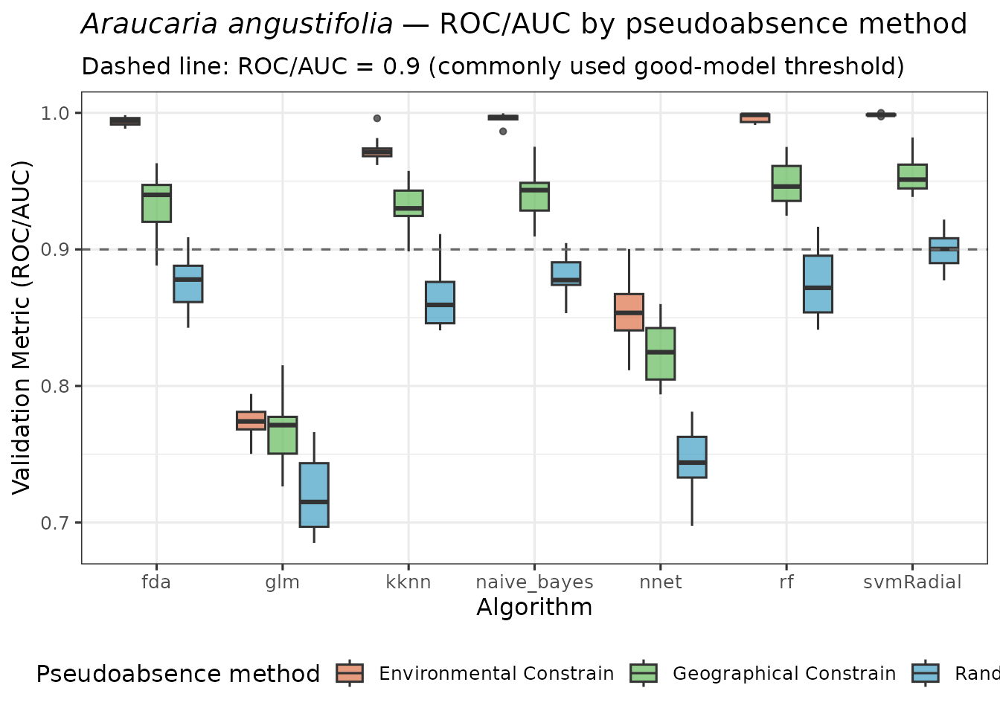

------------------------------------------------------------------------

## 5 · Visualise suitability maps and pseudoabsence data

Ensemble predictions for each method are plotted side by side so that
spatial differences in predicted suitability can be assessed visually.

``` r

plot_ensembles(sdm_random)
```

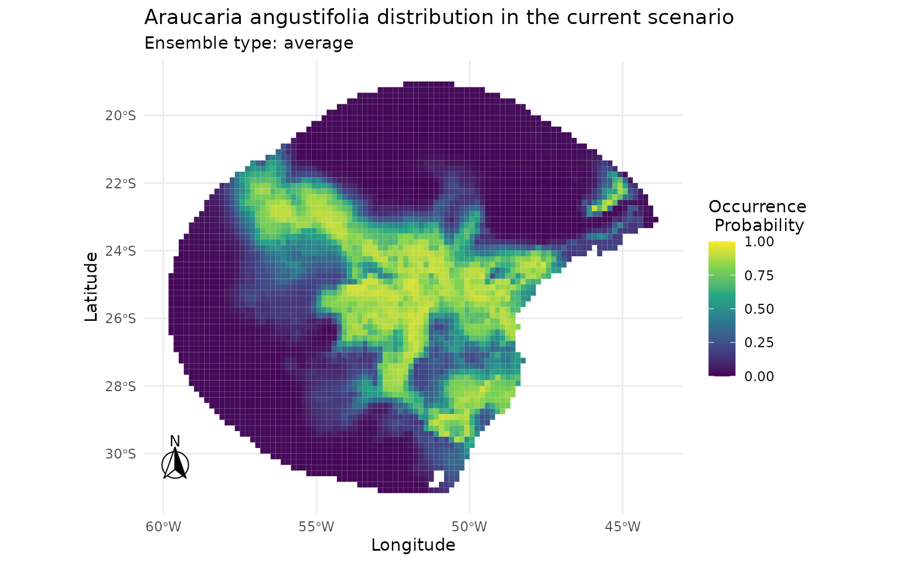

``` r

plot_occurrences(sdm_random)
```

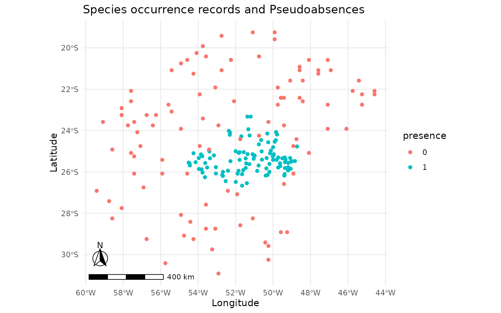

``` r

plot_ensembles(sdm_bioclim)
```

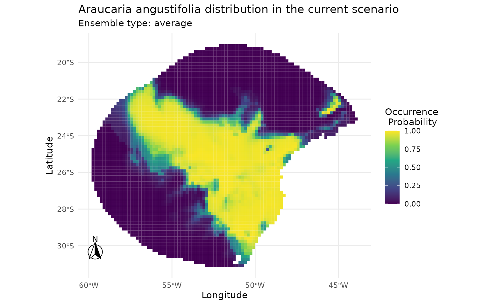

``` r

plot_occurrences(sdm_bioclim)
```

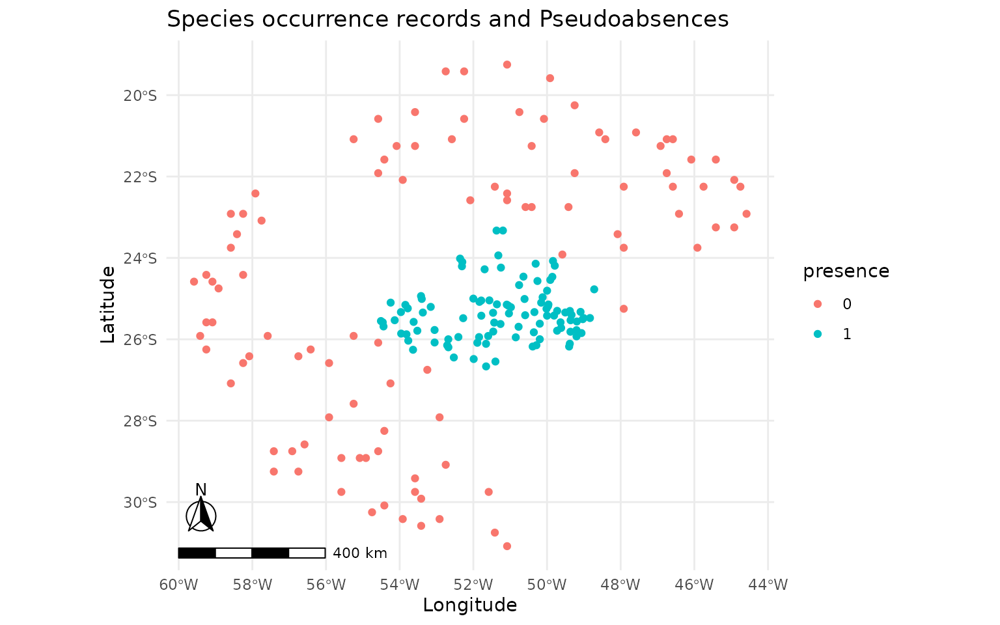

``` r

plot_ensembles(sdm_buffer)
```

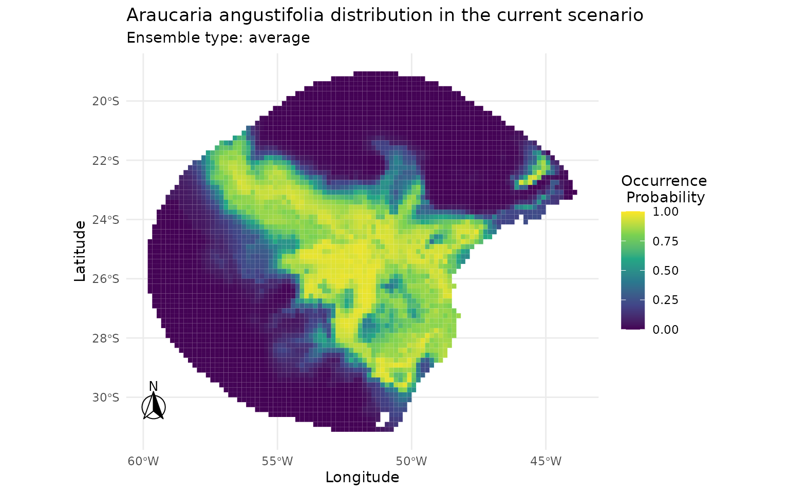

``` r

plot_occurrences(sdm_buffer)
```

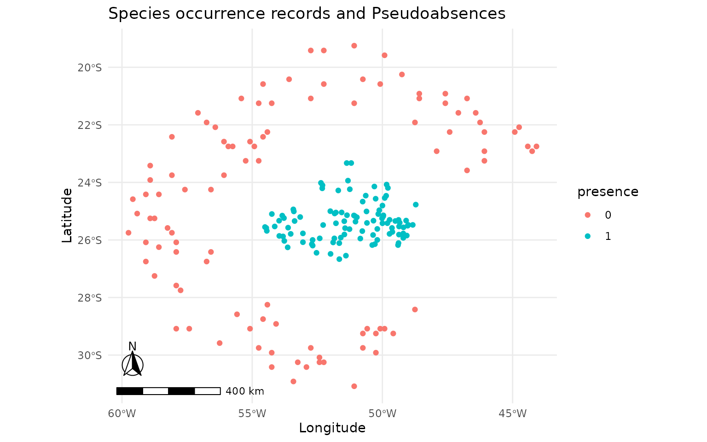

------------------------------------------------------------------------

## 6 · Quantitative comparison of predictions

### 6.1 Pearson correlation matrix

Prediction values are extracted from all three rasters and organised
into a single data frame. Only cells with complete data (no NAs) are
retained. Pearson correlations between the three prediction surfaces
quantify the degree of agreement. High correlations suggest that the
choice of pseudoabsence method has limited impact on the spatial
structure of the final map; low correlations flag meaningful sensitivity
to this decision.

``` r

pred_vals <- data.frame(
  random = get_ensembles(sdm_random)[1, 1][[1]][, "average"],
  bioclim = get_ensembles(sdm_bioclim)[1, 1][[1]][, "average"],
  buffer = get_ensembles(sdm_buffer)[1, 1][[1]][, "average"]
)
cor_mat <- cor(pred_vals, method = "pearson") |>
  as.table() |>
  as.data.frame()
```

``` r

ggplot2::ggplot(cor_mat, aes(Var1, Var2, fill = Freq)) +
  geom_tile(color = "black") +
  geom_text(aes(label = round(Freq, 2))) +
  scale_fill_gradient2(
    low = "#154360", mid = "#1ABC9C", high = "#FFC300",
    midpoint = 0.95, limits = c(0.9, 1)
  ) +
  coord_fixed() +
  theme_minimal() +
  ylab("") +
  xlab("")
```

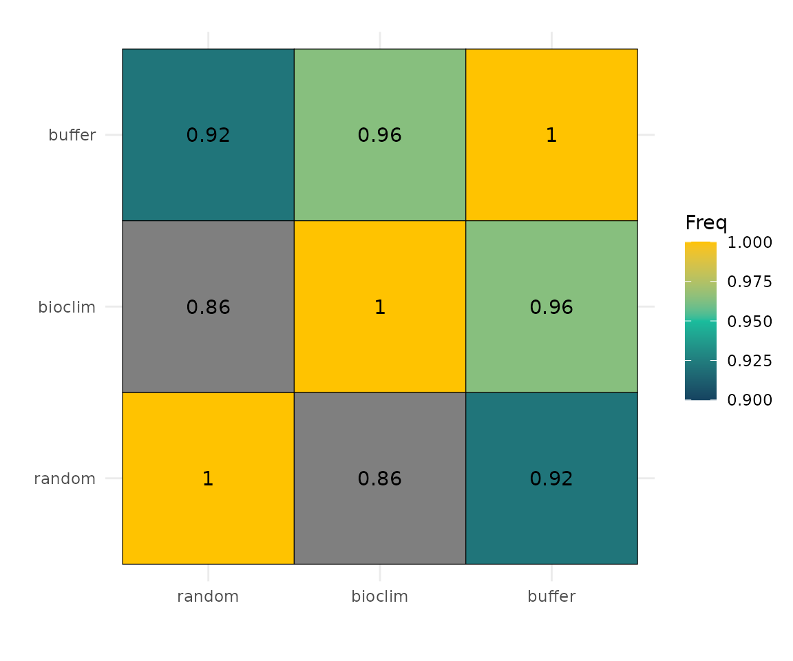

### 6.2 Scatter plots

Pairwise scatter plots reveal where predictions agree and where they
diverge. Points above or below the 1:1 diagonal indicate cells where one
method predicts higher suitability than the other.

``` r

ggplot(pred_vals, aes(x = random, y = bioclim)) +
  geom_hex(bins = 60) +
  geom_abline(slope = 1, intercept = 0, colour = "red", linetype = "dashed") +
  scale_fill_viridis_c(option = "plasma", name = "Count") +
  annotate("text",
    x = 0.7, y = 0.1,
    label = paste0("r = ", round(cor_mat[2, 3], 3)),
    hjust = 0, size = 4, colour = "black",
    fontface = "bold"
  ) +
  labs(title = "Random vs. Environmental Constrain", x = "Random", y = "Environmental Constrain") +
  theme_minimal(base_size = 11)
```

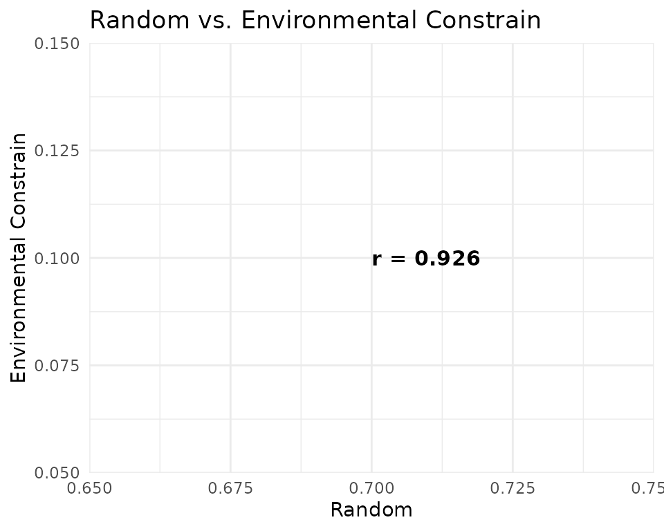

``` r

ggplot(pred_vals, aes(x = random, y = buffer)) +
  geom_hex(bins = 60) +
  geom_abline(slope = 1, intercept = 0, colour = "red", linetype = "dashed") +
  scale_fill_viridis_c(option = "plasma", name = "Count") +
  annotate("text",
    x = 0.7, y = 0.1,
    label = paste0("r = ", round(cor_mat[3, 3], 3)),
    hjust = 0, size = 4, colour = "black",
    fontface = "bold"
  ) +
  labs(title = "Random vs. Geographical Constrain", x = "Random", y = "Geographical Constrain") +
  theme_minimal(base_size = 11)
```

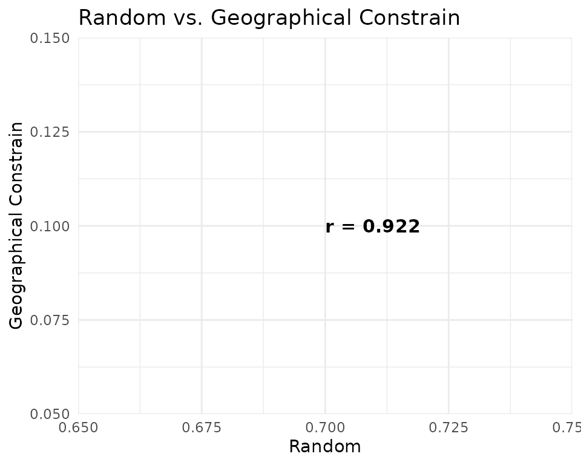

``` r

ggplot(pred_vals, aes(x = bioclim, y = buffer)) +
  geom_hex(bins = 60) +
  geom_abline(slope = 1, intercept = 0, colour = "red", linetype = "dashed") +
  scale_fill_viridis_c(option = "plasma", name = "Count") +
  annotate("text",
    x = 0.7, y = 0.1,
    label = paste0("r = ", round(cor_mat[4, 3], 3)),
    hjust = 0, size = 4, colour = "black",
    fontface = "bold"
  ) +
  labs(
    title = "Environmental Constrain vs. Geographical Constrain",
    x = "Environmental Constrain", y = "Geographical Constrain"
  ) +
  theme_minimal(base_size = 11)
```

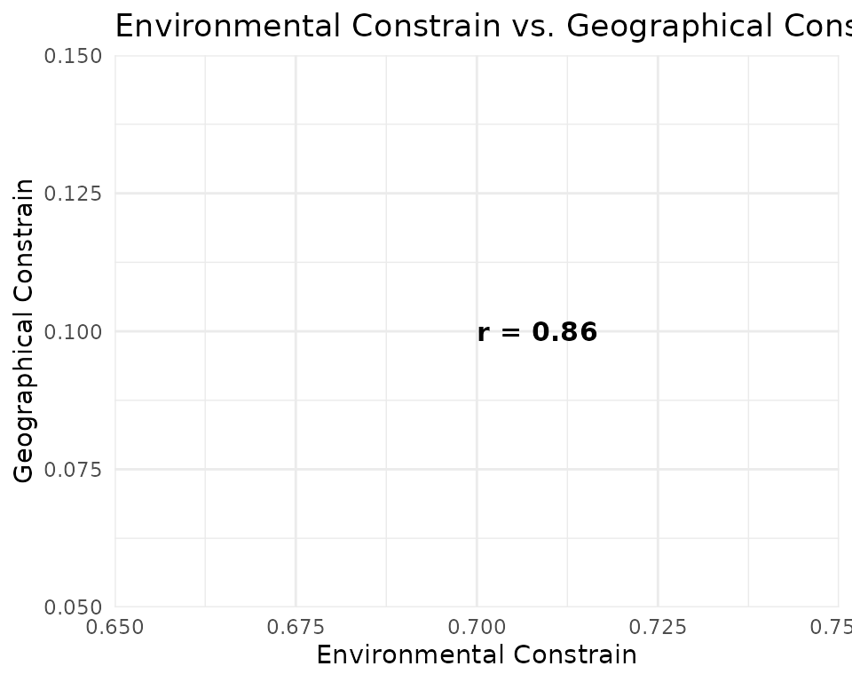

------------------------------------------------------------------------

## 7 · Discussion

**Performance differences.** Bioclim (SRE), the Environmental Constrain
method, tend to generate more ecologically realistic pseudoabsences
because they avoid placing pseudoabsence points in areas environmentally
similar to presences. This commonly results in inflated but potentially
biased ROC/AUC scores compared to the random approach. The same happens
with the buffer method, which retrieves pseudoabsences very far from
presences, yelding drastically different environmental information.

**Spatial congruence.** Pearson correlations between prediction surfaces
reveal that the three strategies converge on similar spatial patterns,
producing similar maps. High correlation (r \> 0.95) suggests the
spatial signal is robust to pseudoabsence choice.

**Predictions differences.** Bioclim (SRE), probably due to its more
extreme approach, produces the most divergent predictions, with a larger
number of cells predicted as highly suitable (values \> 0.7) compared to
the other two methods. The random method, by contrast, yields more
conservative predictions with fewer highly suitable cells. The buffer
method produces intermediate predictions, with a moderate number of
highly suitable cells.

------------------------------------------------------------------------

## Session information

``` r

sessionInfo()
```

    ## R version 4.6.0 (2026-04-24)
    ## Platform: x86_64-pc-linux-gnu
    ## Running under: Ubuntu 24.04.4 LTS
    ## 
    ## Matrix products: default
    ## BLAS:   /usr/lib/x86_64-linux-gnu/openblas-pthread/libblas.so.3 
    ## LAPACK: /usr/lib/x86_64-linux-gnu/openblas-pthread/libopenblasp-r0.3.26.so;  LAPACK version 3.12.0
    ## 
    ## locale:
    ##  [1] LC_CTYPE=C.UTF-8       LC_NUMERIC=C           LC_TIME=C.UTF-8       
    ##  [4] LC_COLLATE=C.UTF-8     LC_MONETARY=C.UTF-8    LC_MESSAGES=C.UTF-8   
    ##  [7] LC_PAPER=C.UTF-8       LC_NAME=C              LC_ADDRESS=C          
    ## [10] LC_TELEPHONE=C         LC_MEASUREMENT=C.UTF-8 LC_IDENTIFICATION=C   
    ## 
    ## time zone: UTC
    ## tzcode source: system (glibc)
    ## 
    ## attached base packages:
    ## [1] stats     graphics  grDevices utils     datasets  methods   base     
    ## 
    ## other attached packages:
    ## [1] earth_5.3.5    plotmo_3.7.0   plotrix_3.8-14 Formula_1.2-5  caret_7.0-1   
    ## [6] lattice_0.22-9 ggplot2_4.0.3  caretSDM_1.9.6
    ## 
    ## loaded via a namespace (and not attached):
    ##   [1] RColorBrewer_1.1-3      ECDFniche_0.5           jsonlite_2.0.0         
    ##   [4] wk_0.9.5                magrittr_2.0.5          farver_2.1.2           
    ##   [7] CoordinateCleaner_3.0.1 rmarkdown_2.31          fs_2.1.0               
    ##  [10] ragg_1.5.2              vctrs_0.7.3             kknn_1.4.1             
    ##  [13] terra_1.9-27            htmltools_0.5.9         polynom_1.4-1          
    ##  [16] curl_7.1.0              raster_3.6-32           s2_1.1.11              
    ##  [19] pROC_1.19.0.1           sass_0.4.10             parallelly_1.47.0      
    ##  [22] KernSmooth_2.23-26      bslib_0.11.0            htmlwidgets_1.6.4      
    ##  [25] naivebayes_1.0.0        desc_1.4.3              plyr_1.8.9             
    ##  [28] httr2_1.2.2             lubridate_1.9.5         stars_0.7-2            
    ##  [31] cachem_1.1.0            whisker_0.4.1           igraph_2.3.2           
    ##  [34] lifecycle_1.0.5         iterators_1.0.14        pkgconfig_2.0.3        
    ##  [37] Matrix_1.7-5            R6_2.6.1                fastmap_1.2.0          
    ##  [40] future_1.70.0           digest_0.6.39           textshaping_1.0.5      
    ##  [43] labeling_0.4.3          randomForest_4.7-1.2    timechange_0.4.0       
    ##  [46] httr_1.4.8              abind_1.4-8             compiler_4.6.0         
    ##  [49] proxy_0.4-29            withr_3.0.2             S7_0.2.2               
    ##  [52] backports_1.5.1         DBI_1.3.0               ecospat_4.1.3          
    ##  [55] MASS_7.3-65             lava_1.9.1              rappdirs_0.3.4         
    ##  [58] classInt_0.4-11         ggpp_0.6.0              gtools_3.9.5           
    ##  [61] oai_0.4.0               ModelMetrics_1.2.2.2    tools_4.6.0            
    ##  [64] units_1.0-1             otel_0.2.0              rgbif_3.8.5            
    ##  [67] future.apply_1.20.2     nnet_7.3-20             glue_1.8.1             
    ##  [70] nlme_3.1-169            grid_4.6.0              sf_1.1-1               
    ##  [73] stringdist_0.9.17       checkmate_2.3.4         reshape2_1.4.5         
    ##  [76] generics_0.1.4          recipes_1.3.3           maxnet_0.1.4           
    ##  [79] gtable_0.3.6            class_7.3-23            tidyr_1.3.2            
    ##  [82] dismo_1.3-16            data.table_1.18.4       sp_2.2-1               
    ##  [85] xml2_1.5.2              foreach_1.5.2           pillar_1.11.1          
    ##  [88] stringr_1.6.0           ggspatial_1.1.10        splines_4.6.0          
    ##  [91] dplyr_1.2.1             survival_3.8-6          tidyselect_1.2.1       
    ##  [94] lemon_0.5.2             knitr_1.51              gridExtra_2.3          
    ##  [97] stats4_4.6.0            xfun_0.58               hardhat_1.4.3          
    ## [100] checkCLI_1.0            timeDate_4052.112       stringi_1.8.7          
    ## [103] lazyeval_0.2.3          yaml_2.3.12             evaluate_1.0.5         
    ## [106] codetools_0.2-20        kernlab_0.9-33          tibble_3.3.1           
    ## [109] cli_3.6.6               usdm_2.1-7              rpart_4.1.27           
    ## [112] systemfonts_1.3.2       jquerylib_0.1.4         Rcpp_1.1.1-1.1         
    ## [115] globals_0.19.1          rnaturalearth_1.2.0     parallel_4.6.0         
    ## [118] pkgdown_2.2.0           gower_1.0.2             mda_0.5-5              
    ## [121] listenv_0.10.1          viridisLite_0.4.3       ipred_0.9-15           
    ## [124] scales_1.4.0            prodlim_2026.03.11      e1071_1.7-17           
    ## [127] purrr_1.2.2             geosphere_1.6-8         rlang_1.2.0
