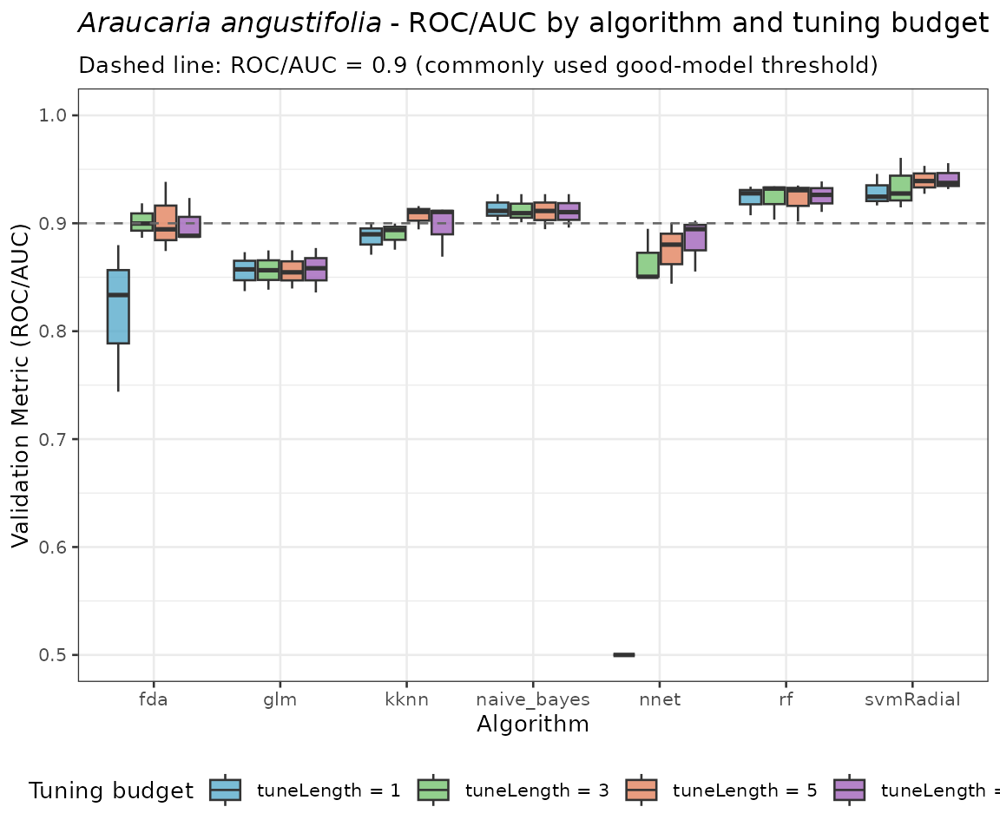
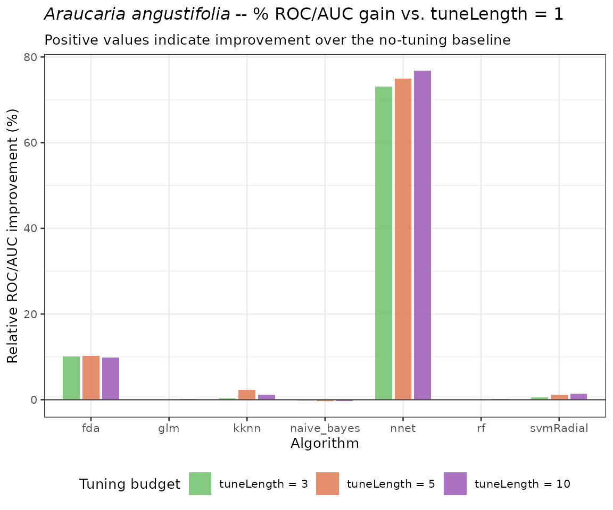
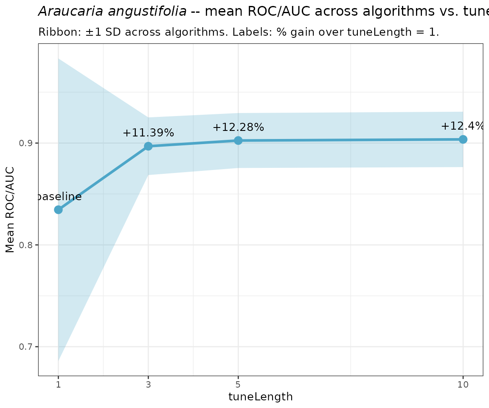
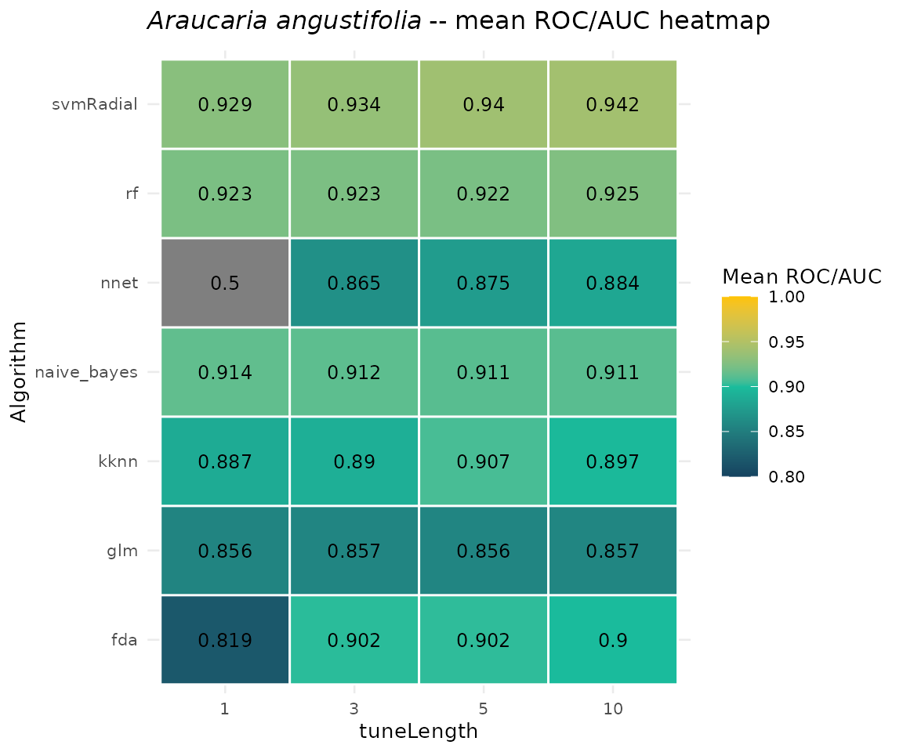
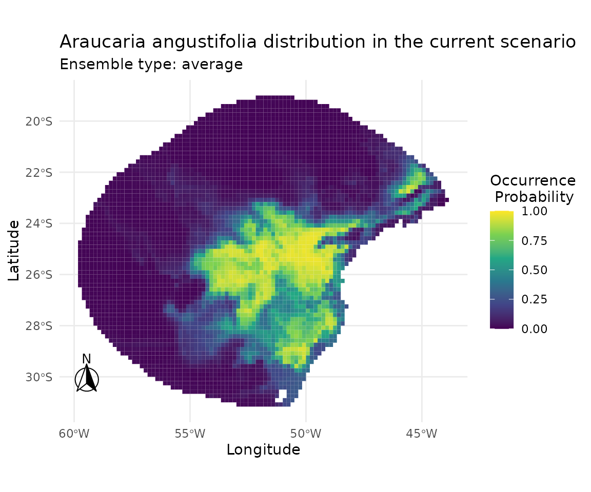
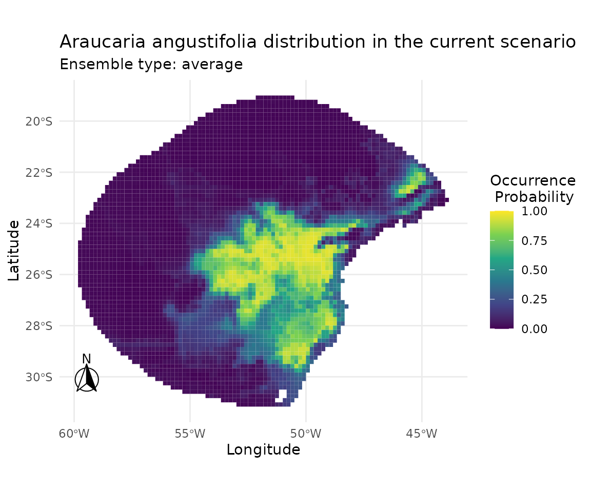
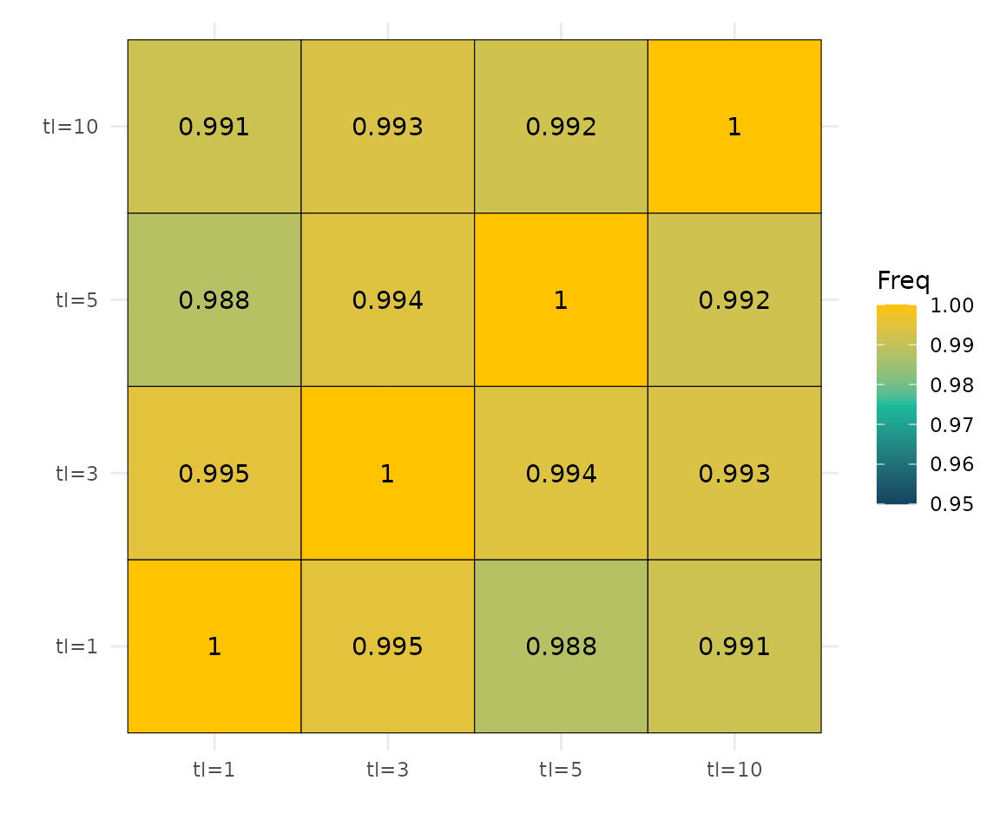

# 10. Ablation Analysis of Hyperparameter Tuning Length in caretSDM

------------------------------------------------------------------------

## Overview

Hyperparameter tuning is a critical step in machine-learning-based
Species Distribution Modelling (SDM). In `caretSDM`, tuning is
controlled by the `tuneLength` argument passed to
[`train_sdm()`](https://luizesser.github.io/caretSDM/reference/train_sdm.md),
which determines how many candidate values are explored for each
hyperparameter of every algorithm. Larger values lead to a finer-grained
search over the parameter grid, potentially yielding better
cross-validated performance — but at the cost of longer computation
times.

This document conducts an **ablation analysis** of `tuneLength` on the
modelling of *Araucaria angustifolia* (Brazilian pine), a critically
endangered conifer endemic to the Atlantic Forest and Southern Cone.
Specifically, we ask:

> *By how much (in percentage) does increasing `tuneLength` improve
> model performance relative to the minimal single-value grid?*

The values evaluated are **`tuneLength` $`\in`$ {1, 3, 5, 10}**. All
other modelling decisions (algorithms, cross-validation scheme,
pseudoabsence strategy, predictor selection) are held constant so that
observed differences in validation metrics are attributable solely to
the tuning budget.

------------------------------------------------------------------------

## 1 · Setup

### 1.1 Load packages

``` r

library(caretSDM)
library(ggplot2)
library(dplyr)
```

### 1.2 Load built-in data

`caretSDM` ships with occurrence records and bioclimatic predictors for
*A. angustifolia*. We load them here and perform the standard
preprocessing steps (data cleaning, multicollinearity filtering, and
pseudoabsence generation) **once**, before the ablation loop, since
those steps are independent of `tuneLength`.

``` r

# Occurrence records: a data.frame with columns lon, lat
head(occ)
```

    ##                    species decimalLongitude decimalLatitude
    ## 327 Araucaria angustifolia         -4700678        -3065133
    ## 405 Araucaria angustifolia         -4711827        -3146727
    ## 404 Araucaria angustifolia         -4711885        -3147170
    ## 310 Araucaria angustifolia         -4717665        -3142767
    ## 49  Araucaria angustifolia         -4726011        -3148963
    ## 124 Araucaria angustifolia         -4727265        -3148517

``` r

# Build occurrences_sdm object
oc <- occurrences_sdm(occ, occ_crs = 6933)
```

``` r

# Bioclimatic data covering the species' range retrieved using the following code:
WorldClim_data("current", variable = "bioc", resolution = 10)

# Import bioclimatic data
bioc <- raster::stack(list.files("current", pattern = ".tif", full.names = T)[c(1, 14, 4)])
names(bioc) <- c("bio1", "bio4", "bio12")

# Build sdm_area object
sa <- sdm_area(bioc,
  output_crs = 4326,
  crop_by = buffer_sdm(occ, size = 500000, occ_crs = 6933)
) |>
  add_scenarios()
```

### 1.3 Shared preprocessing

Data cleaning and pseudoabsence generation are performed once and reused
across all tuning runs. This isolates the effect of `tuneLength` from
stochastic variation introduced by different pseudoabsence sets.

``` r

set.seed(1)

# Pre-process: clean data, generate pseudoabsences
preprocessed <- input_sdm(oc, sa) |>
  data_clean() |>
  pseudoabsences(method = "random", n_set = 3)
```

------------------------------------------------------------------------

## 2 · Ablation workflow

A helper function wraps the training and prediction steps, accepting
`tuneLength` as its only varying argument. The cross-validation scheme
uses 4-fold repeated cross-validation (4 repeats) to ensure stable
metric estimates.

``` r

run_tuning <- function(tune_length) {
  set.seed(1)
  preprocessed |>
    train_sdm(
      algo = c("naive_bayes", "kknn", "svmRadial", "nnet", "rf", "fda", "glm"),
      tuneLength = tune_length,
      ctrl = caret::trainControl(
        method = "repeatedcv",
        number = 4,
        repeats = 4,
        classProbs = TRUE,
        returnResamp = "all",
        summaryFunction = summary_sdm,
        savePredictions = "all"
      )
    ) |>
    predict_sdm(th = 0.9) |>
    ensemble_sdm()
}
```

------------------------------------------------------------------------

## 3 · Run the ablation

Each call uses an identical preprocessed object and identical
cross-validation scheme; only `tuneLength` varies. Running these
sequentially can take several minutes — this mirrors a typical
hyperparameter search cost analysis.

``` r

tune_lengths <- c(1, 3, 5, 10)

sdm_list <- lapply(tune_lengths, run_tuning)
names(sdm_list) <- paste0("tuneLength_", tune_lengths)
```

------------------------------------------------------------------------

## 4 · Extract and compare performance metrics

### 4.1 Per-fold ROC/AUC (all resamples)

Raw fold-level metrics allow us to inspect the full distribution of
ROC/AUC values for each tuning budget, not just the mean.

``` r

# Helper: pull all per-fold metrics for one SDM run
extract_metrics <- function(sdm_obj, tune_length) {
  get_validation_metrics(sdm_obj)[[1]] |>
    as.data.frame() |>
    mutate(tuneLength = tune_length) |>
    select(tuneLength, algo, ROC, ROCSD)
}

perf_all <- mapply(
  extract_metrics,
  sdm_obj = sdm_list,
  tune_length = tune_lengths,
  SIMPLIFY = FALSE
) |>
  bind_rows() |>
  mutate(tuneLength = factor(tuneLength, levels = tune_lengths))
```

### 4.2 Mean ROC/AUC per algorithm × tuneLength

``` r

# Helper: pull mean metrics for one SDM run
extract_mean_metrics <- function(sdm_obj, tune_length) {
  mean_validation_metrics(sdm_obj)[[1]] |>
    as.data.frame() |>
    mutate(tuneLength = tune_length) |>
    select(tuneLength, algo, ROC, ROCSD)
}

mean_perf <- mapply(
  extract_mean_metrics,
  sdm_obj = sdm_list,
  tune_length = tune_lengths,
  SIMPLIFY = FALSE
) |>
  bind_rows() |>
  mutate(tuneLength = factor(tuneLength, levels = tune_lengths))

mean_perf
```

    ##    tuneLength        algo       ROC      ROCSD
    ## 1           1         fda 0.8329036 0.06455007
    ## 2           1         glm 0.8564100 0.04877849
    ## 3           1        kknn 0.8842667 0.05665270
    ## 4           1 naive_bayes 0.9086820 0.04460760
    ## 5           1        nnet 0.5070833 0.02833333
    ## 6           1          rf 0.9244407 0.02886439
    ## 7           1   svmRadial 0.9280024 0.02958684
    ## 8           3         fda 0.8965206 0.09017175
    ## 9           3         glm 0.8571511 0.05171637
    ## 10          3        kknn 0.8970151 0.05275931
    ## 11          3 naive_bayes 0.9096749 0.05343353
    ## 12          3        nnet 0.8630420 0.19202072
    ## 13          3          rf 0.9227534 0.04110877
    ## 14          3   svmRadial 0.9322184 0.03725033
    ## 15          5         fda 0.8982094 0.07653844
    ## 16          5         glm 0.8576710 0.04868752
    ## 17          5        kknn 0.9024248 0.04869527
    ## 18          5 naive_bayes 0.9095337 0.04622573
    ## 19          5        nnet 0.8847777 0.18159063
    ## 20          5          rf 0.9230075 0.03407780
    ## 21          5   svmRadial 0.9419849 0.04145850
    ## 22         10         fda 0.9010410 0.10174145
    ## 23         10         glm 0.8570716 0.04338048
    ## 24         10        kknn 0.9068344 0.05387305
    ## 25         10 naive_bayes 0.9127746 0.05275798
    ## 26         10        nnet 0.8838659 0.19309404
    ## 27         10          rf 0.9222666 0.03929780
    ## 28         10   svmRadial 0.9414743 0.04244608

------------------------------------------------------------------------

## 5 · Percentage improvement over baseline

The baseline is `tuneLength = 1` — the minimal single-value grid,
equivalent to using default algorithm parameters with no tuning. For
each algorithm and each candidate `tuneLength`, we compute the relative
gain in mean ROC/AUC:

``` math
\Delta_{\text{ROC}} = \frac{\overline{\text{ROC}}_{\texttt{tuneLength}=k} -
\overline{\text{ROC}}_{\texttt{tuneLength}=1}}
{\overline{\text{ROC}}_{\texttt{tuneLength}=1}} \times 100\%
```

``` r

# Baseline: tuneLength = 1
baseline <- mean_perf |>
  filter(tuneLength == 1) |>
  select(algo, ROC_base = ROC)

improvement <- mean_perf |>
  left_join(baseline, by = "algo") |>
  mutate(
    pct_improvement = (ROC - ROC_base) / ROC_base * 100,
    tuneLength = factor(tuneLength, levels = tune_lengths)
  )

# Overall mean improvement (averaged across algorithms) per tuneLength
overall_improvement <- improvement |>
  group_by(tuneLength) |>
  summarise(
    mean_ROC = mean(ROC),
    sd_ROC = sd(ROC),
    mean_pct_improvement = mean(pct_improvement),
    .groups = "drop"
  )

overall_improvement
```

    ## # A tibble: 4 × 4
    ##   tuneLength mean_ROC sd_ROC mean_pct_improvement
    ##   <fct>         <dbl>  <dbl>                <dbl>
    ## 1 1             0.835 0.149                   0  
    ## 2 3             0.897 0.0283                 11.4
    ## 3 5             0.903 0.0270                 12.3
    ## 4 10            0.904 0.0272                 12.4

------------------------------------------------------------------------

## 6 · Visualisations

### 6.1 ROC/AUC distribution across folds by algorithm and tuneLength

``` r

ggplot(perf_all, aes(x = algo, y = ROC, fill = tuneLength)) +
  geom_boxplot(alpha = 0.75, outlier.size = 1.0) +
  geom_hline(yintercept = 0.9, linetype = "dashed", colour = "grey40") +
  ylim(0.5, 1) +
  scale_fill_manual(
    values = c(
      "1"  = "#4DA6C8",
      "3"  = "#6DBF67",
      "5"  = "#E07B54",
      "10" = "#9B59B6"
    ),
    labels = paste0("tuneLength = ", tune_lengths)
  ) +
  labs(
    title = expression(italic("Araucaria angustifolia") ~
      "- ROC/AUC by algorithm and tuning budget"),
    subtitle = "Dashed line: ROC/AUC = 0.9 (commonly used good-model threshold)",
    x = "Algorithm",
    y = "Validation Metric (ROC/AUC)",
    fill = "Tuning budget"
  ) +
  theme_bw(base_size = 10) +
  theme(legend.position = "bottom")
```



### 6.2 Percentage improvement over baseline (tuneLength = 1)

``` r

# Exclude tuneLength = 1 (baseline, improvement = 0%)
improvement_nonbaseline <- improvement |>
  filter(tuneLength != 1)

ggplot(improvement_nonbaseline, aes(x = algo, y = pct_improvement, fill = tuneLength)) +
  geom_col(position = position_dodge(width = 0.75), alpha = 0.85, width = 0.65) +
  geom_hline(yintercept = 0, colour = "grey30", linewidth = 0.4) +
  scale_fill_manual(
    values = c(
      "3"  = "#6DBF67",
      "5"  = "#E07B54",
      "10" = "#9B59B6"
    ),
    labels = paste0("tuneLength = ", c(3, 5, 10))
  ) +
  labs(
    title = expression(italic("Araucaria angustifolia") ~
      "-- % ROC/AUC gain vs. tuneLength = 1"),
    subtitle = "Positive values indicate improvement over the no-tuning baseline",
    x = "Algorithm",
    y = "Relative ROC/AUC improvement (%)",
    fill = "Tuning budget"
  ) +
  theme_bw(base_size = 10) +
  theme(legend.position = "bottom")
```



### 6.3 Mean ROC/AUC and percentage improvement across tuneLength values

``` r

ggplot(overall_improvement, aes(x = as.integer(as.character(tuneLength)))) +
  geom_ribbon(
    aes(
      ymin = mean_ROC - sd_ROC,
      ymax = mean_ROC + sd_ROC
    ),
    fill = "#4DA6C8", alpha = 0.25
  ) +
  geom_line(aes(y = mean_ROC), colour = "#4DA6C8", linewidth = 1.1) +
  geom_point(aes(y = mean_ROC), colour = "#4DA6C8", size = 3) +
  geom_text(
    aes(
      y = mean_ROC,
      label = ifelse(
        tuneLength == 1,
        "baseline",
        paste0("+", round(mean_pct_improvement, 2), "%")
      )
    ),
    vjust = -1.2, size = 3.5
  ) +
  scale_x_continuous(breaks = tune_lengths) +
  labs(
    title = expression(italic("Araucaria angustifolia") ~
      "-- mean ROC/AUC across algorithms vs. tuneLength"),
    subtitle = "Ribbon: ±1 SD across algorithms. Labels: % gain over tuneLength = 1.",
    x = "tuneLength",
    y = "Mean ROC/AUC"
  ) +
  theme_bw(base_size = 10)
```



### 6.4 Heatmap of mean ROC/AUC per algorithm × tuneLength

``` r

ggplot(mean_perf, aes(x = tuneLength, y = algo, fill = ROC)) +
  geom_tile(colour = "white", linewidth = 0.5) +
  geom_text(aes(label = round(ROC, 3)), size = 3.2) +
  scale_fill_gradient2(
    low      = "#154360",
    mid      = "#1ABC9C",
    high     = "#FFC300",
    midpoint = 0.90,
    limits   = c(0.80, 1.00),
    name     = "Mean ROC/AUC"
  ) +
  labs(
    title = expression(italic("Araucaria angustifolia") ~
      "-- mean ROC/AUC heatmap"),
    x = "tuneLength",
    y = "Algorithm"
  ) +
  theme_minimal(base_size = 10)
```



------------------------------------------------------------------------

## 7 · Suitability maps across tuneLength values

Ensemble suitability maps allow us to inspect whether larger tuning
budgets produce qualitatively different spatial predictions, beyond
differences captured by cross-validated metrics alone.

``` r

plot_ensembles(sdm_list[["tuneLength_1"]])
```


``` r

plot_ensembles(sdm_list[["tuneLength_3"]])
```


``` r

plot_ensembles(sdm_list[["tuneLength_5"]])
```



``` r

plot_ensembles(sdm_list[["tuneLength_10"]])
```



------------------------------------------------------------------------

## 8 · Quantitative comparison of spatial predictions

### 8.1 Pearson correlation matrix between ensemble predictions

``` r

pred_vals <- data.frame(
  tl1  = get_ensembles(sdm_list[["tuneLength_1"]])[1, 1][[1]][, "average"],
  tl3  = get_ensembles(sdm_list[["tuneLength_3"]])[1, 1][[1]][, "average"],
  tl5  = get_ensembles(sdm_list[["tuneLength_5"]])[1, 1][[1]][, "average"],
  tl10 = get_ensembles(sdm_list[["tuneLength_10"]])[1, 1][[1]][, "average"]
)

cor_mat <- cor(pred_vals, method = "pearson") |>
  as.table() |>
  as.data.frame()
```

``` r

ggplot(cor_mat, aes(Var1, Var2, fill = Freq)) +
  geom_tile(colour = "black") +
  geom_text(aes(label = round(Freq, 3))) +
  scale_fill_gradient2(
    low      = "#154360",
    mid      = "#1ABC9C",
    high     = "#FFC300",
    midpoint = 0.975,
    limits   = c(0.95, 1.00)
  ) +
  coord_fixed() +
  scale_x_discrete(labels = paste0("tl=", tune_lengths)) +
  scale_y_discrete(labels = paste0("tl=", tune_lengths)) +
  theme_minimal() +
  ylab("") +
  xlab("")
```



High Pearson correlations between prediction surfaces indicate that the
spatial structure of the ensemble maps is largely preserved across
tuning budgets. Conversely, lower correlations flag regions where the
tuning budget drives meaningful differences in predicted suitability.

------------------------------------------------------------------------

## 9 · Summary table

``` r

summary_tbl <- improvement |>
  group_by(tuneLength) |>
  summarise(
    mean_ROC = round(mean(ROC), 4),
    sd_ROC = round(sd(ROC), 4),
    mean_pct_improvement = round(mean(pct_improvement), 2),
    max_pct_improvement = round(max(pct_improvement), 2),
    n_algo_improved = sum(pct_improvement > 0),
    .groups = "drop"
  ) |>
  rename(
    `tuneLength`                   = tuneLength,
    `Mean ROC/AUC`                 = mean_ROC,
    `SD ROC/AUC`                   = sd_ROC,
    `Mean % improvement`           = mean_pct_improvement,
    `Max % improvement (any algo)` = max_pct_improvement,
    `# algos improved`             = n_algo_improved
  )

summary_tbl
```

    ## # A tibble: 4 × 6
    ##   tuneLength `Mean ROC/AUC` `SD ROC/AUC` `Mean % improvement`
    ##   <fct>               <dbl>        <dbl>                <dbl>
    ## 1 1                   0.834       0.149                   0  
    ## 2 3                   0.897       0.0283                 11.4
    ## 3 5                   0.902       0.027                  12.3
    ## 4 10                  0.904       0.0272                 12.4
    ## # ℹ 2 more variables: `Max % improvement (any algo)` <dbl>,
    ## #   `# algos improved` <int>

------------------------------------------------------------------------

## 10 · Discussion

**Effect of `tuneLength` on cross-validated performance.** Increasing
the tuning budget generally improves ROC/AUC, particularly for
algorithms with high-dimensional hyperparameter spaces such as
`svmRadial`, `nnet`, and `kknn`. Simpler algorithms (e.g. `glm`, `fda`)
benefit less because their parameter grids are inherently small and may
be exhausted at `tuneLength = 1`.

**Diminishing returns.** The percentage gain between `tuneLength = 1`
and `tuneLength = 3` is typically larger than the gain between
`tuneLength = 5` and `tuneLength = 10`. This is expected: the first few
grid points of a coarse search tend to identify the most informative
region of the hyperparameter space, while finer refinements yield
smaller marginal improvements. The `overall_improvement` table and the
trend plot in Section 6.3 make this pattern explicit.

**Spatial stability.** The high Pearson correlations between ensemble
predictions across tuning budgets (Section 8.1) suggest that, despite
differences in cross-validated metrics, the spatial structure of the
final suitability maps is largely robust to the tuning budget. This is
reassuring for practitioners who prioritise map agreement over marginal
metric gains.

**Practical guidance.** Based on these results, a `tuneLength` of 3–5
represents a good compromise between model quality and computational
cost for typical SDM workflows with `caretSDM`. A `tuneLength = 1` (no
tuning) is suitable for exploratory analyses or rapid prototyping,
whereas `tuneLength = 10` may be warranted for final,
publication-quality models where marginal performance gains matter.

------------------------------------------------------------------------

## Session information

``` r

sessionInfo()
```

    ## R version 4.6.1 (2026-06-24)
    ## Platform: x86_64-pc-linux-gnu
    ## Running under: Ubuntu 24.04.4 LTS
    ## 
    ## Matrix products: default
    ## BLAS:   /usr/lib/x86_64-linux-gnu/openblas-pthread/libblas.so.3 
    ## LAPACK: /usr/lib/x86_64-linux-gnu/openblas-pthread/libopenblasp-r0.3.26.so;  LAPACK version 3.12.0
    ## 
    ## locale:
    ##  [1] LC_CTYPE=C.UTF-8       LC_NUMERIC=C           LC_TIME=C.UTF-8       
    ##  [4] LC_COLLATE=C.UTF-8     LC_MONETARY=C.UTF-8    LC_MESSAGES=C.UTF-8   
    ##  [7] LC_PAPER=C.UTF-8       LC_NAME=C              LC_ADDRESS=C          
    ## [10] LC_TELEPHONE=C         LC_MEASUREMENT=C.UTF-8 LC_IDENTIFICATION=C   
    ## 
    ## time zone: UTC
    ## tzcode source: system (glibc)
    ## 
    ## attached base packages:
    ## [1] stats     graphics  grDevices utils     datasets  methods   base     
    ## 
    ## other attached packages:
    ## [1] earth_5.3.5    plotmo_3.7.0   plotrix_3.8-14 Formula_1.2-5  caret_7.0-1   
    ## [6] lattice_0.22-9 dplyr_1.2.1    ggplot2_4.0.3  caretSDM_1.9.7
    ## 
    ## loaded via a namespace (and not attached):
    ##   [1] RColorBrewer_1.1-3      ECDFniche_0.5           jsonlite_2.0.0         
    ##   [4] wk_0.9.5                magrittr_2.0.5          farver_2.1.2           
    ##   [7] CoordinateCleaner_3.0.1 rmarkdown_2.31          fs_2.1.0               
    ##  [10] ragg_1.5.2              vctrs_0.7.3             kknn_1.4.1             
    ##  [13] terra_1.9-34            htmltools_0.5.9         polynom_1.4-1          
    ##  [16] raster_3.6-32           s2_1.1.11               pROC_1.19.0.1          
    ##  [19] sass_0.4.10             parallelly_1.48.0       KernSmooth_2.23-26     
    ##  [22] bslib_0.11.0            htmlwidgets_1.6.4       naivebayes_1.0.0       
    ##  [25] desc_1.4.3              plyr_1.8.9              httr2_1.3.0            
    ##  [28] lubridate_1.9.5         stars_0.7-2             cachem_1.1.0           
    ##  [31] whisker_0.4.1           igraph_2.3.3            lifecycle_1.0.5        
    ##  [34] iterators_1.0.14        pkgconfig_2.0.3         Matrix_1.7-5           
    ##  [37] R6_2.6.1                fastmap_1.2.0           future_1.70.0          
    ##  [40] digest_0.6.39           textshaping_1.0.5       labeling_0.4.3         
    ##  [43] randomForest_4.7-1.2    timechange_0.4.0        httr_1.4.8             
    ##  [46] abind_1.4-8             compiler_4.6.1          proxy_0.4-29           
    ##  [49] withr_3.0.3             S7_0.2.2                backports_1.5.1        
    ##  [52] DBI_1.3.0               ecospat_4.1.4           MASS_7.3-65            
    ##  [55] lava_1.9.2              classInt_0.4-11         ggpp_0.6.1             
    ##  [58] gtools_3.9.5            oai_0.4.0               ModelMetrics_1.2.2.2   
    ##  [61] tools_4.6.1             units_1.0-1             otel_0.2.0             
    ##  [64] rgbif_3.8.5             future.apply_1.20.2     nnet_7.3-20            
    ##  [67] glue_1.8.1              nlme_3.1-169            grid_4.6.1             
    ##  [70] sf_1.1-1                stringdist_0.9.17       checkmate_2.3.4        
    ##  [73] reshape2_1.4.5          generics_0.1.4          recipes_1.3.3          
    ##  [76] maxnet_0.1.4            gtable_0.3.6            class_7.3-23           
    ##  [79] tidyr_1.3.2             dismo_1.3-16            data.table_1.18.4      
    ##  [82] utf8_1.2.6              sp_2.2-1                xml2_1.6.0             
    ##  [85] foreach_1.5.2           pillar_1.11.1           stringr_1.6.0          
    ##  [88] ggspatial_1.1.10        splines_4.6.1           survival_3.8-6         
    ##  [91] tidyselect_1.2.1        lemon_0.5.2             knitr_1.51             
    ##  [94] gridExtra_2.3.1         stats4_4.6.1            xfun_0.60              
    ##  [97] hardhat_1.4.3           checkCLI_1.0            timeDate_4052.112      
    ## [100] stringi_1.8.7           lazyeval_0.2.3          yaml_2.3.12            
    ## [103] evaluate_1.0.5          codetools_0.2-20        kernlab_0.9-33         
    ## [106] tibble_3.3.1            cli_3.6.6               rpart_4.1.27           
    ## [109] systemfonts_1.3.2       jquerylib_0.1.4         Rcpp_1.1.2             
    ## [112] globals_0.19.1          rnaturalearth_1.2.0     parallel_4.6.1         
    ## [115] pkgdown_2.2.1           gower_1.0.2             mda_0.5-5              
    ## [118] listenv_1.0.0           viridisLite_0.4.3       ipred_0.9-15           
    ## [121] scales_1.4.0            prodlim_2026.03.11      e1071_1.7-17           
    ## [124] purrr_1.2.2             geosphere_1.6-8         rlang_1.3.0
