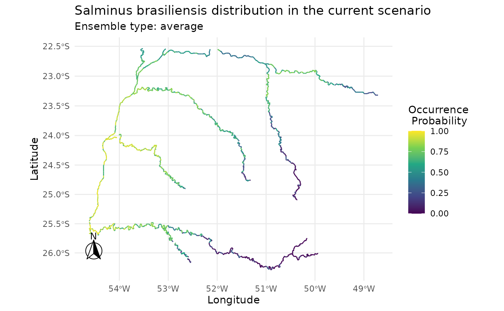

# 1. Concatenate functions in caretSDM

In caretSDM we always use one central object through out the framework,
the `input_sdm` object. This allows us to concatenate functions, which
can be very useful when running SDMs for the first couple of times. Here
we provide a functioning way to easily run your framework with only
three objects.

``` r
# Open library
library(caretSDM)
set.seed(1)
```

``` r
# Build sdm_area object
sa <- sdm_area(rivs, 
               cell_size = 25000, 
               crs = 6933, 
               gdal = T,
               lines_as_sdm_area = TRUE) |> 
  add_predictors(bioc) |> 
  add_scenarios() |> 
  select_predictors(c("LENGTH_KM", "DIST_DN_KM","bio1", "bio4", "bio12"))
#> ! Making grid over study area is an expensive task. Please, be patient!
#> ℹ Using GDAL to make the grid and resample the variables.
#> Linking to GEOS 3.12.1, GDAL 3.8.4, PROJ 9.4.0; sf_use_s2() is TRUE
#> 
#> ! Making grid over the study area is an expensive task. Please, be patient!
#> ℹ Using GDAL to make the grid and resample the variables.

# Build occurrences_sdm object
oc <- occurrences_sdm(salm, crs = 6933)

# Merge sdm_area and occurrences_sdm and perform pre-processing, processing and projecting.
i <- input_sdm(oc, sa) |> 
  data_clean() |> 
  vif_predictors() |> 
  pseudoabsences(method = "bioclim", variables_selected = "vif") |> 
  train_sdm(algo = c("naive_bayes", "kknn"), 
            ctrl = caret::trainControl(method = "repeatedcv", 
                                       number = 4, 
                                       repeats = 1, 
                                       classProbs = TRUE, 
                                       returnResamp = "all", 
                                       summaryFunction = summary_sdm, 
                                       savePredictions = "all"), 
            variables_selected = "vif") |> 
  predict_sdm(th = 0.7) |> 
  ensemble_sdm() |>
  suppressWarnings()
#> Cell_ids identified, removing duplicated cell_id.
#> Testing country capitals
#> Removed 0 records.
#> Testing country centroids
#> Removed 0 records.
#> Testing duplicates
#> Removed 0 records.
#> Testing equal lat/lon
#> Removed 0 records.
#> Testing biodiversity institutions
#> Removed 0 records.
#> Testing coordinate validity
#> Removed 0 records.
#> Testing sea coordinates
#> Reading ne_110m_land.zip from naturalearth...Removed 0 records.
#> Loading required package: ggplot2
#> Loading required package: lattice
#> Ensemble function: average
#>   current
```

``` r
i
#>             caretSDM           
#> ...............................
#> Class                         : input_sdm
#> --------  Occurrences  --------
#> Species Names                 : Salminus brasiliensis 
#> Number of presences           : 22 
#> Pseudoabsence methods         :
#>     Method to obtain PAs      : bioclim 
#>     Number of PA sets         : 10 
#>     Number of PAs in each set : 22 
#> Data Cleaning                 : NAs, Capitals, Centroids, Geographically Duplicated, Identical Lat/Long, Institutions, Invalid, Non-terrestrial, Duplicated Cell (grid) 
#> --------  Predictors  ---------
#> Number of Predictors          : 5 
#> Predictors Names              : LENGTH_KM, DIST_DN_KM, bio1, bio4, bio12 
#> Variable Selection            : vif 
#> Selected Variables            : LENGTH_KM, DIST_DN_KM, bio1 
#> ---------  Scenarios  ---------
#> Number of Scenarios           : 1 
#> Scenarios Names               : current 
#> -----------  Models  ----------
#> Algorithms Names              : naive_bayes kknn 
#> Variables Names               : LENGTH_KM DIST_DN_KM bio1 
#> Model Validation              :
#>     Method                    : repeatedcv 
#>     Number                    : 4 
#>     Metrics                   :
#> $`Salminus brasiliensis`
#>          algo       ROC       TSS Sensitivity Specificity
#> 1        kknn 0.7600972 0.3641667    0.736625     0.63165
#> 2 naive_bayes 0.7784722 0.4150000    0.760850     0.67335
#> 
#> --------  Predictions  --------
#> Thresholds                    :
#>     Method                    : threshold 
#>     Criteria                  : 0.7 
#> ---------  Ensembles  ---------
#> Ensembles                     :
#>     Methods                   : average
```

``` r
plot(i)
```


