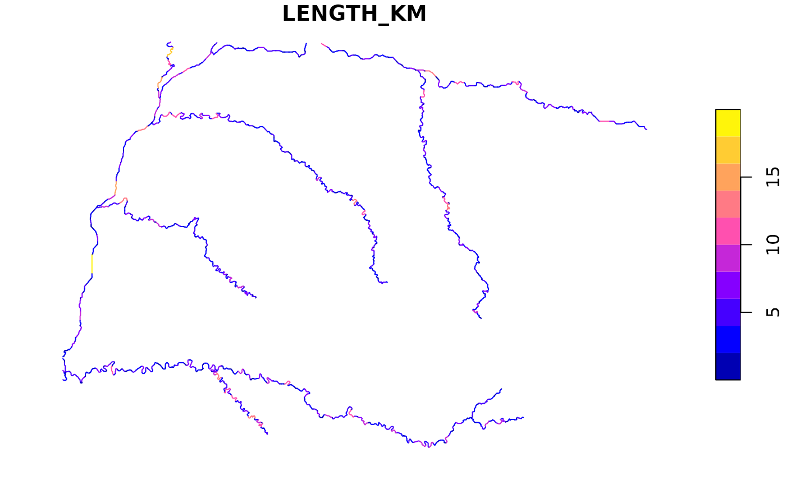
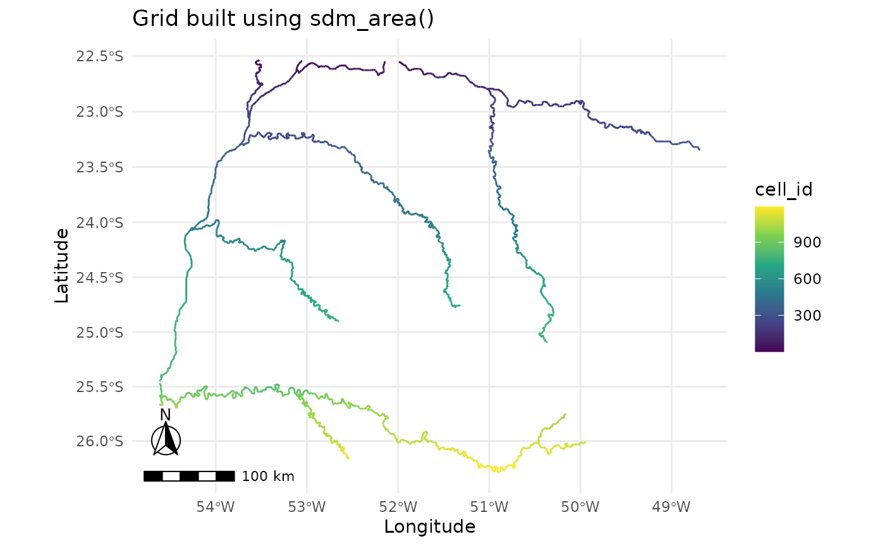
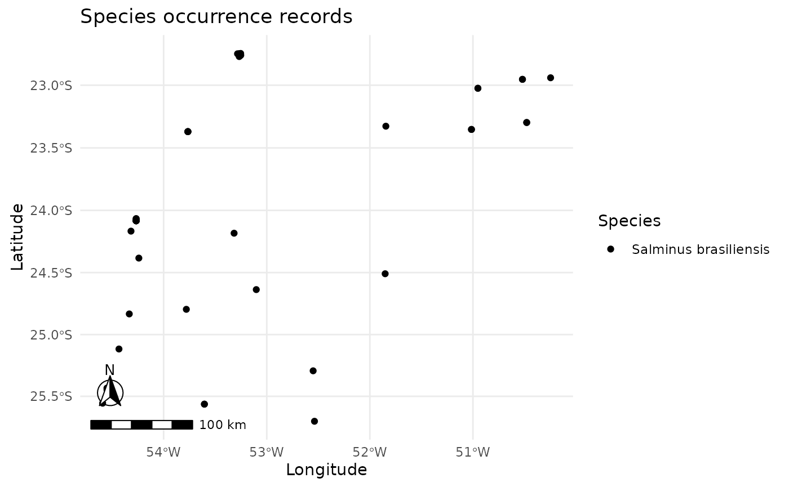
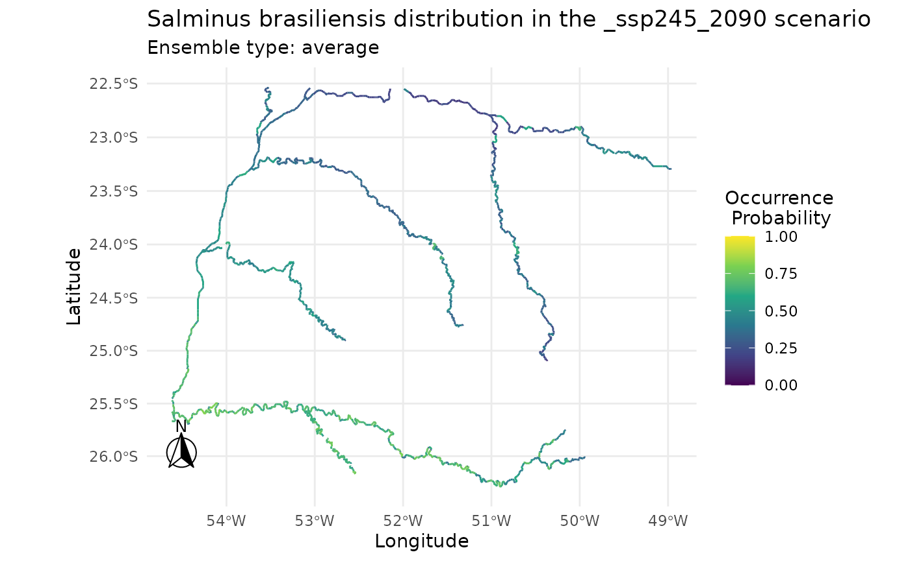
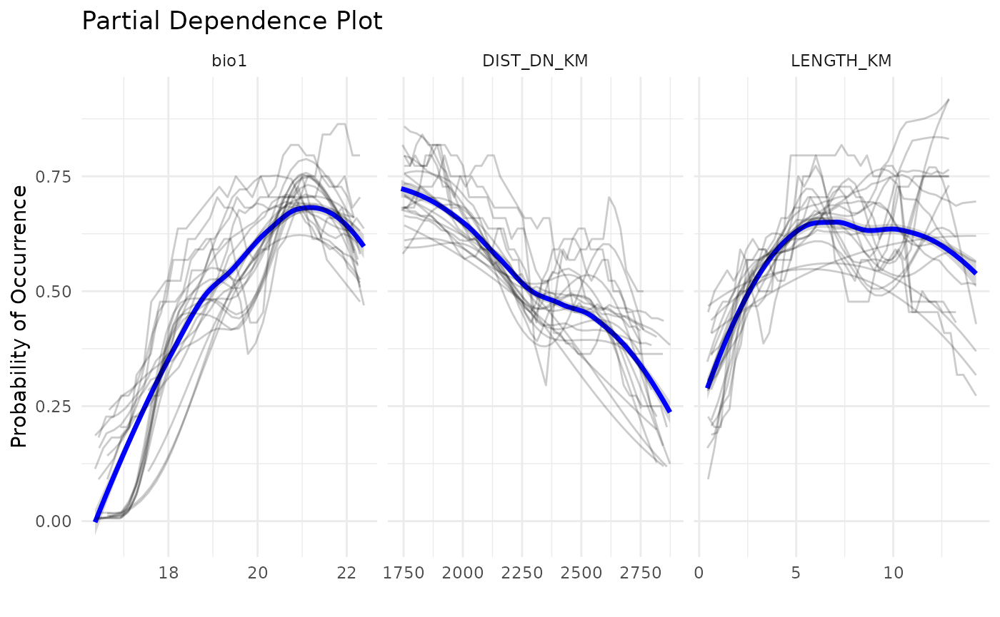

# 4. Modeling Species Distributions in Continental Water Bodies

## Introduction

`caretSDM` is a R package that uses the powerful `caret` package as the
main engine to obtain Species Distribution Models. One of its main
attributes is the strong geoprocessing underlying its functions provided
by `stars` package. Here we show how to model species distributions
using `caretSDM` through the function `sdm_area` with lines as predictor
variables. We will also show how to apply a VIF routine in predictors
and scenarios to avoid multicolinearity. The aim of this modeling will
be to obtain the current and future distribution of *Salminus
brasiliensis*, a key fish species from South Brazil.

First, we need to open our library.

``` r
library(caretSDM)
start_time <- Sys.time()
set.seed(1)
```

## Pre-Processing

To obtain models, we will need climatic data and species records. To
easily obtain these data, we have two functions: `WorldClim_data`
function downloads climatic variables from WorldClim 2.1, a widely used
open-source database; in the same way, `GBIF_data` function downloads
species records from GBIF, also a widely used open-source database. You
can read more about them by running in the console
[`?GBIF_data`](https://luizesser.github.io/caretSDM/reference/GBIF_data.md)
and
[`?WorldClim_data`](https://luizesser.github.io/caretSDM/reference/WorldClim_data.md).

### Obtaining species records

A easy way to get species data using `caretSDM` is the function
`GBIF_data`, which retrieves species records from GBIF. Understandably,
there are other sources of species data available, as well as our own
data that can be the result of field work. In this sense, one can import
to R it’s own data in multiple ways, but be sure that the table must
always have three columns: species, decimalLongitude and
decimalLatitude. `GBIF_data` function can retrieve the data ready to be
included in caretSDM, thus if you have any doubt on how to format your
own data, use `GBIF_data` function with the parameter `as_df = TRUE` to
retrieve an example table. As standard, `GBIF_data` function sets
`as_df = FALSE`, which makes the function return a `occurrences` object
(more about that further below). An example code for this step would be:

``` r
salm <- GBIF_data(c("Salminus brasiliensis"), as_df = TRUE)
```

But we already have a `salm` object included in the package, which is
the same output, but with filtered records to match our study area. Note
that coordinates are in a metric CRS (EPSG: 6933).

``` r
salm |> head()
#>                 species decimalLongitude decimalLatitude
#> 1 Salminus brasiliensis         -5002956        -3034581
#> 2 Salminus brasiliensis         -5123570        -3049429
#> 3 Salminus brasiliensis         -5138591        -2830253
#> 4 Salminus brasiliensis         -5263273        -3143263
#> 5 Salminus brasiliensis         -5172118        -3156734
#> 6 Salminus brasiliensis         -5172118        -3156734
```

### Obtaining climatic data

For climatic data, we will first download and import current data, which
is used to build the models. `WorldClim_data` function has an argument
to set the directory in which you want to save the files. If you don’t
set it, files will be saved in your working directory (run
[`getwd()`](https://rdrr.io/r/base/getwd.html) to find out your working
directory) in the folder “input_data/WorldClim_data_current/”. If period
is set to “future”, then it is saved in
“input_data/WorldClim_data_future/”. We could run this script with a
smaller resolution, but as the aim here is to show how the package
works, we will use a resolution of 10 arc-minutes, which is very coarse,
but quicker to download and run.

``` r
# Download current bioclimatic variables
WorldClim_data(path = NULL, 
               period = "current", 
               variable = "bioc", 
               resolution = 10)

# Import current bioclimatic variables to R
bioc <- read_stars(list.files("input_data/WorldClim_data_current/", full.names = T), along = "band", normalize_path = F)
```

As in the previous section, we already have a `bioc` object included in
the package, which is the same output, but masked to match our study
area and with fewer variables.

``` r
bioc
#> stars object with 3 dimensions and 1 attribute
#> attribute(s):
#>              Min.  1st Qu.   Median     Mean 3rd Qu. Max. NA's
#> current  14.58698 21.19678 298.9147 622.9417  1353.5 2368 1845
#> dimension(s):
#>      from  to offset   delta refsys point              values x/y
#> x     747 798   -180  0.1667 WGS 84 FALSE                NULL [x]
#> y     670 706     90 -0.1667 WGS 84 FALSE                NULL [y]
#> band    1   3     NA      NA     NA    NA bio1 , bio4 , bio12
```

### Defining the study area

A important step on model building in Species Distribution Models, is
the definition of accessible area (the M in BAM diagram). This area can
be, in Geographical Information Systems terms, as an example, the
delimitation of a habitat (polygon) or a river basin network (lines).
Another broadly used approach is the use of buffers around presences.
The buffer size translates the potential distribution capabilities of a
species. To educational purposes, we will use a simple polygon of Parana
state river network that is available in caretSDM as the `rivs` object
(see [`?rivs`](https://luizesser.github.io/caretSDM/reference/rivs.md)
for more information on the data)..

``` r
rivs
#> Simple feature collection with 1031 features and 2 fields
#> Geometry type: LINESTRING
#> Dimension:     XY
#> Bounding box:  xmin: -54.61834 ymin: -26.28958 xmax: -48.68542 ymax: -22.53484
#> Geodetic CRS:  WGS 84
#> First 10 features:
#>    LENGTH_KM DIST_DN_KM                       geometry
#> 1       7.31     2189.9 LINESTRING (-53.52234 -22.5...
#> 2       4.21     2186.2 LINESTRING (-53.05304 -22.5...
#> 3       2.14     2200.3 LINESTRING (-52.92292 -22.5...
#> 4       3.45     2186.7 LINESTRING (-53.54792 -22.5...
#> 5       1.26     2184.9 LINESTRING (-53.07708 -22.5...
#> 6       3.75     2302.6 LINESTRING (-52.14375 -22.5...
#> 7       2.12     2202.7 LINESTRING (-52.90625 -22.5...
#> 8       2.54     2183.9 LINESTRING (-53.55625 -22.5...
#> 9       4.89     2195.6 LINESTRING (-52.94375 -22.5...
#> 10     11.24     2320.3 LINESTRING (-51.93542 -22.5...
```

``` r
rivs |> select_predictors(LENGTH_KM) |> plot()
```



The `sdm_area` function is responsible to create a grid to build models,
a key aspect of caretSDM workflow. With a grid built, modelers can pass
multiple rasters with different resolutions, CRSs and extents. The
package will be responsible to rescale, transform and crop every raster
to match the grid. The grid returned by the `sdm_area` function is from
`sdm_area` class, a class that will also keep the environmental/climatic
data (*i.e.* “predictor variables”, “covariates”, “explanatory
variables”, “features” or “control variables”). With this class we will
perform analysis using only the predictors. The grid is built using
mostly the first three arguments: (1) a shape from `sf` class, but
rasters from `stars`, `rasterStack` or `SpatRaster` class are also
allowed; (2) the cell size of the grid; and (3) the Coordinate Reference
System (CRS). Note that the cell size can be metric or not depending on
the CRS informed. It is important to inform a cell size bigger than the
coarser raster that will be used, otherwise rescaling process may return
empty cells. The rescaling can be performed using GDAL (quicker but less
precise) or the `stars` package (slower but more precise). The first
will address values to cells by calculating the mean (for continuous
variables) or the median (for categorical variables) of the values
falling within the cell. The approach using `stars` will do the same
thing, but weighting for the area of each value within the cell.
However, as we are using a river network as study area, *i.e.* a simple
features object with `LINESTRING` as geometry types, we can set the
argument `lines_as_sdm_area = TRUE`. This will chop lines within `rivs`
(hydrological predictors) given the grid cells built. In other words, if
a segment of line holds a hydrological information, but crosses between
two different cells, it will be splitted in two different lines both
with the same hydrological data, but different bioclimatic data. The use
of `lines_as_sdm_area = TRUE` takes more time to run, but is very
precise for continental water bodies modeling. For other arguments
meaning see
[`?sdm_area`](https://luizesser.github.io/caretSDM/reference/sdm_area.md).

``` r
sa <- sdm_area(rivs, 
               cell_size = 25000, 
               crs = 6933, 
               variables_selected = NULL,
               gdal = TRUE, 
               crop_by = NULL, 
               lines_as_sdm_area = TRUE)
#> ! Making grid over study area is an expensive task. Please, be patient!
#> ℹ Using GDAL to make the grid and resample the variables.
#> Linking to GEOS 3.12.1, GDAL 3.8.4, PROJ 9.4.0; sf_use_s2() is TRUE
sa
#>           caretSDM         
#> ...........................
#> Class                     : sdm_area
#> Extent                    : -5269921 -3240236 -4697475 -2803134 (xmin, xmax, ymin, ymax)
#> CRS                       : EPSG:6933 
#> Resolution                : (25000, 25000) (x, y)
#> Number of Predictors      : 2 
#> Predictors Names          : LENGTH_KM, DIST_DN_KM
```

Note that the function returned two predictor variables
(`Predictor Names` above). These “predictors” are actually columns
included in the `rivs` shape’s data table. One can filter these
variables using `select_predictors` function, but we will not do that
here, because these variables represent important predictor variables
that will be used to model species distribution. You can explore the
grid generated and stored in the `sdm_area` object using the functions
[`mapview_grid()`](https://luizesser.github.io/caretSDM/reference/plot_occurrences.md)
or
[`plot_grid()`](https://luizesser.github.io/caretSDM/reference/plot_occurrences.md).
Note that the function used here is the same to plot grids and lines.

``` r
plot_grid(sa)
```



Now that we have a study area, we can assign predictor variables to it.
To do that, we use the `add_predictors` function, which usually will
only use the fist two arguments, which are the `sdm_area` build in the
previous step and the `RasterStack`, `SpatRaster` or `stars` object with
predictors data. Note that `add_predictors` also has a `gdal` argument,
which works as the previous one in `sdm_area` function.

``` r
sa <- add_predictors(sa, 
                     bioc, 
                     variables_selected = NULL, 
                     gdal = TRUE) |> suppressWarnings()
#> ! Making grid over the study area is an expensive task. Please, be patient!
#> ℹ Using GDAL to make the grid and resample the variables.
sa
#>           caretSDM         
#> ...........................
#> Class                     : sdm_area
#> Extent                    : -5269921 -3240236 -4700000 -2803134 (xmin, xmax, ymin, ymax)
#> CRS                       : EPSG:6933 
#> Resolution                : (25000, 25000) (x, y)
#> Number of Predictors      : 5 
#> Predictors Names          : LENGTH_KM, DIST_DN_KM, bio1, bio4, bio12
```

Predictors variables are used to train the models. After training the
models, we need to project models into scenarios. Currently, we don’t
have any scenario in our `sdm_area` object. We can address the
predictors data as the current scenario by applying the function
`add_scenario` without considering any other argument. This happens
because the argument `pred_as_scen` is standarly set to `TRUE`.

``` r
add_scenarios(sa)
```

If we are aiming to project species distributions in other scenarios, we
can download data and add in the same way we did for current data.

``` r
WorldClim_data(path = NULL, 
               period = "future", 
               variable = "bioc",
               year = "2090",
               gcm = c("ca", "mi"),
               ssp = c("245","585"),
               resolution = 10)

scen <- read_stars(list.files("input_data/WorldClim_data_future/", full.names = T), along = "band", normalize_path = F)
```

As with current bioclimatic data, we have already included the `scen`
object in the package, which is the same output from above, but masked
to match our study area and with fewer variables (see
[`?scen`](https://luizesser.github.io/caretSDM/reference/scen.md) for
more information on the data).

``` r
scen
#> stars object with 3 dimensions and 4 attributes
#> attribute(s):
#>                 Min. 1st Qu. Median     Mean  3rd Qu.   Max. NA's
#> ca_ssp245_2090  18.4  26.100 296.50 570.0926 1188.975 2049.2 1908
#> ca_ssp585_2090  22.2  31.275 293.25 516.0384 1033.150 1862.2 1908
#> mi_ssp245_2090  16.3  23.000 314.65 660.9749 1426.800 2414.8 1908
#> mi_ssp585_2090  17.9  24.500 323.45 702.6153 1534.100 2585.0 1908
#> dimension(s):
#>      from  to offset   delta refsys point              values x/y
#> x     747 798   -180  0.1667 WGS 84 FALSE                NULL [x]
#> y     670 706     90 -0.1667 WGS 84 FALSE                NULL [y]
#> band    1   3     NA      NA     NA    NA bio1 , bio4 , bio12
```

Now we can add the current and future scenarios at once in our
`sdm_area` object. For the meaning on other parameters see the help file
at
[`?add_scenarios`](https://luizesser.github.io/caretSDM/reference/add_scenarios.md).
When adding scenarios, the function will test if all variables are
available in all scenarios, otherwise it will filter predictors. Note
that `scen` does not have the hydrological variables. These variables
are what we call “stationary” variables, meaning that they don’t change
despite climate change scenarios. For that, we must inform the function
which variables will be replicated between scenarios.

``` r
sa <- add_scenarios(sa, 
                    scen = scen, 
                    scenarios_names = NULL,
                    pred_as_scen = TRUE,
                    variables_selected = NULL, 
                    stationary = c("LENGTH_KM", "DIST_DN_KM"))
#> ! Making grid over the study area is an expensive task. Please, be patient!
#> ℹ Using GDAL to make the grid and resample the variables.
#> ! Making grid over the study area is an expensive task. Please, be patient!
#> ℹ Using GDAL to make the grid and resample the variables.
#> ! Making grid over the study area is an expensive task. Please, be patient!
#> ℹ Using GDAL to make the grid and resample the variables.
#> Reescaling data ■■■■■■■■■■■■■■■■■■■■■■■           75% | ETA:  1s
#> 
#> ! Making grid over the study area is an expensive task. Please, be patient!
#> ℹ Using GDAL to make the grid and resample the variables.
sa
#>           caretSDM         
#> ...........................
#> Class                     : sdm_area
#> Extent                    : -5269921 -3240236 -4700000 -2803134 (xmin, xmax, ymin, ymax)
#> CRS                       : EPSG:6933 
#> Resolution                : (25000, 25000) (x, y)
#> Number of Predictors      : 5 
#> Predictors Names          : LENGTH_KM, DIST_DN_KM, bio1, bio4, bio12 
#> Number of Scenarios      : 5 
#> Scenarios Names          : ca_ssp245_2090, ca_ssp585_2090, mi_ssp245_2090, mi_ssp585_2090, current
```

It is common that modelers need to subset variables that will inform
models. This can be due to statistical artifacts that are common in
quarter bioclimatic variables, or a causation subset, aiming for those
variables with causality effect on species distribution. The user may
also want to change scenarios names, predictors names or retrieve
predictors data. For that there are a myriad of functions that can be
found in the package, most of them under the help files of the functions
[`?add_predictors`](https://luizesser.github.io/caretSDM/reference/add_predictors.md)
and
[`?add_scenarios`](https://luizesser.github.io/caretSDM/reference/add_scenarios.md),
but also
[`?select_predictors`](https://luizesser.github.io/caretSDM/reference/tidyverse-methods.md).

### Defining the occurrences set in the study area

As `caretSDM` has a strong GIS background, it is necessary to explicitly
tell which CRS is your data in. This will assure that every GIS
transformation is correct. `occurrences_sdm` function creates a
occurrences class (*i.e.* “response variable”, “target” or “label”) that
will be used in occurrences’ transformations and functions, as
pseudoabsences generation. For a reference, GBIF data is in crs = 4326,
but our records stored in `salm` object is transformed to 6933 (see
[`?salm`](https://luizesser.github.io/caretSDM/reference/salm.md) for
more information on the data).

``` r
oc <- occurrences_sdm(salm, crs = 6933)
oc
#>         caretSDM       
#> .......................
#> Class                 : occurrences
#> Species Names         : Salminus brasiliensis 
#> Number of presences   : 46 
#> ================================
#> Data:
#> Simple feature collection with 6 features and 1 field
#> Geometry type: POINT
#> Dimension:     XY
#> Bounding box:  xmin: -5263273 ymin: -3156734 xmax: -5002956 ymax: -2830253
#> Projected CRS: WGS 84 / NSIDC EASE-Grid 2.0 Global
#>                 species                  geometry
#> 1 Salminus brasiliensis POINT (-5002956 -3034581)
#> 2 Salminus brasiliensis POINT (-5123570 -3049429)
#> 3 Salminus brasiliensis POINT (-5138591 -2830253)
#> 4 Salminus brasiliensis POINT (-5263273 -3143263)
#> 5 Salminus brasiliensis POINT (-5172118 -3156734)
#> 6 Salminus brasiliensis POINT (-5172118 -3156734)
```

``` r
plot_occurrences(oc)
```



### The `input_sdm` class

In `caretSDM` we use multiple classes to perform our analysis. Every
time we perform a new analysis, objects keep the information of what we
did. Ideally, the workflow will have only one object throughout it. The
`input_sdm` class is the key class in the workflow, where every function
will orbitate. That class puts occurrences, predictors, scenarios,
models and predictions together to perform analysis that are only
possible when two or more of these classes are available. First, we
create the object by informing the occurrences and the sdm_area. This
step assigns occurrences into a study area, excluding records outside
the study area or with NAs as predictors.

``` r
i <- input_sdm(oc, sa)
i
#>             caretSDM           
#> ...............................
#> Class                         : input_sdm
#> --------  Occurrences  --------
#> Species Names                 : Salminus brasiliensis 
#> Number of presences           : 46 
#> --------  Predictors  ---------
#> Number of Predictors          : 5 
#> Predictors Names              : LENGTH_KM, DIST_DN_KM, bio1, bio4, bio12 
#> ---------  Scenarios  ---------
#> Number of Scenarios           : 5 
#> Scenarios Names               : ca_ssp245_2090 ca_ssp585_2090 mi_ssp245_2090 mi_ssp585_2090 current
```

### Data cleaning routine

As the first step in our workflow with the `input_sdm` object, we will
clean our occurrences data by applying a group of functions from the
package `CoordinateCleaner`. In this function, we also provide a way to
check for environmental duplicates, by including a predictors object.
This function also checks for records in the sea if the species is
terrestrial, but note that this can be switched off if the studied
species is not terrestrial. The way `caretSDM` works, we can always
overwrite the main `input_sdm` object to update it. The function will
return a new object with all the previous information and the new
information obtained from the `data_clean` function, note that at the
end of the Data Cleaning information there is the Duplicated Cell method
(here actually a duplicated line). This method is only possible when we
have both the `occurrence` and `predictors` data.

``` r
i <- data_clean(i,
                capitals = TRUE,
                centroids = TRUE,
                duplicated = TRUE,
                identical = TRUE,
                institutions = TRUE,
                invalid = TRUE,
                terrestrial = TRUE)
#> Cell_ids identified, removing duplicated cell_id.
#> Testing country capitals
#> Removed 0 records.
#> Testing country centroids
#> Removed 0 records.
#> Testing duplicates
#> Removed 0 records.
#> Testing equal lat/lon
#> Removed 0 records.
#> Testing biodiversity institutions
#> Removed 0 records.
#> Testing coordinate validity
#> Removed 0 records.
#> Testing sea coordinates
#> Reading ne_110m_land.zip from naturalearth...
#> Removed 0 records.
```

### Removing multicolinearity from predictors’ data

There are two main methods in the SDM literature to consider
multicolinearity in predictors data. One is the use of PCA-axes, which
in `caretSDM` is performed using `pca_predictors`function. The other is
through the Variance Inflation Factor (VIF), which is performed using
`vif_predictors` function. There, users are able to perform variables
selection through `usdm` package. The function is a wrapper for
[`usdm::vifcor`](https://rdrr.io/pkg/usdm/man/vif.html), where variables
are kept given a maximum threshold of colinearity. The standard is 0.5.

``` r
i <- vif_predictors(i, 
                    th = 0.5, 
                    maxobservations = 5000, 
                    variables_selected = NULL)
```

To better visualize VIF results, users can run `vif_summary` functions,
which is very self-explanatory.

``` r
vif_summary(i)
#> 2 variables from the 5 input variables have collinearity problem: 
#>  
#> bio12 bio4 
#> 
#> After excluding the collinear variables, the linear correlation coefficients ranges between: 
#> min correlation ( DIST_DN_KM ~ LENGTH_KM ):  -0.03727042 
#> max correlation ( bio1 ~ DIST_DN_KM ):  -0.3014315 
#> 
#> ---------- VIFs of the remained variables -------- 
#>    Variables      VIF
#> 1  LENGTH_KM 1.007376
#> 2 DIST_DN_KM 1.100110
#> 3       bio1 1.106515
```

### Obtaining pseudoabsence data

Pseudoabsence data will be stored in the `occurrences` object (inside
the `input_sdm`). To generate them, you must inform some parameters.
Probably one of the most important arguments in this function is the
`method`. Currently, two methods are implemented: a “random”, which
takes random grid cells (or lines) as pseudoabsences; and a “bioclim”
method, which creates a Surface Range Envelope (SRE) using presence
records, binarizes the projection of the SRE using the `th` threshold
and then retrieves pseudoabsences outside the envelope. The number of
pseudoabsences created can be changed using the `n_pa` parameter. When
set to NULL, `n_pa` will be equal the number of occurrences (to avoid
imbalance issues). The number of sets of pseudoabsences is adjusted with
the `n_set` parameter in the function. The argument `variables_selected`
will inform which variables you want to use to build your
pseudoabsences/models. This can either be a vector of variables names or
a previously performed selection method.

``` r
i <- pseudoabsences(i, 
                    method = "bioclim", 
                    n_set = 10,
                    n_pa = NULL,
                    variables_selected = "vif",
                    th = 0) 
i
#>             caretSDM           
#> ...............................
#> Class                         : input_sdm
#> --------  Occurrences  --------
#> Species Names                 : Salminus brasiliensis 
#> Number of presences           : 22 
#> Pseudoabsence methods         :
#>     Method to obtain PAs      : bioclim 
#>     Number of PA sets         : 10 
#>     Number of PAs in each set : 22 
#> Data Cleaning                 : NAs, Capitals, Centroids, Geographically Duplicated, Identical Lat/Long, Institutions, Invalid, Non-terrestrial, Duplicated Cell (grid) 
#> --------  Predictors  ---------
#> Number of Predictors          : 5 
#> Predictors Names              : LENGTH_KM, DIST_DN_KM, bio1, bio4, bio12 
#> Variable Selection            : vif 
#> Selected Variables            : LENGTH_KM, DIST_DN_KM, bio1 
#> ---------  Scenarios  ---------
#> Number of Scenarios           : 5 
#> Scenarios Names               : ca_ssp245_2090 ca_ssp585_2090 mi_ssp245_2090 mi_ssp585_2090 current
```

## Processing

### Modeling species relationship with variables

With the occurrences and predictors data put together, we can pass to
the modeling. As the name suggests, `caretSDM` uses the `caret` package
underlying its modeling procedure. For those who are not familiar,
`caret` is the easiest way to perform Machine Learning analysis in R. It
works by setting a modeling wrapper to pass multiple packages and can
provide a lot of automation regarding algorithms fine-tuning, data
spliting, pre-processing methods and predictions. These automated
functions from `caret` can be altered using the `ctrl` argument in
`train_sdm` function. See
[`?caret::trainControl`](https://rdrr.io/pkg/caret/man/trainControl.html)
for all options available.

We show here how to use a repeated crossvalidation method, which is
defined through
[`caret::trainControl`](https://rdrr.io/pkg/caret/man/trainControl.html).

Note that, when you are using an algorithm for the first time, caret
will ask you to install the relevant packages to properly run the
algorithm.

``` r
ctrl_sdm <- caret::trainControl(method = "repeatedcv", 
                                number = 4, 
                                repeats = 1, 
                                classProbs = TRUE,
                                returnResamp = "all", 
                                summaryFunction = summary_sdm, 
                                savePredictions = "all")

i <- train_sdm(i, 
               algo = c("naive_bayes", "kknn"), 
               variables_selected = "vif", 
               ctrl=ctrl_sdm) |> suppressWarnings()
#> Loading required package: ggplot2
#> Loading required package: lattice
i
#>             caretSDM           
#> ...............................
#> Class                         : input_sdm
#> --------  Occurrences  --------
#> Species Names                 : Salminus brasiliensis 
#> Number of presences           : 22 
#> Pseudoabsence methods         :
#>     Method to obtain PAs      : bioclim 
#>     Number of PA sets         : 10 
#>     Number of PAs in each set : 22 
#> Data Cleaning                 : NAs, Capitals, Centroids, Geographically Duplicated, Identical Lat/Long, Institutions, Invalid, Non-terrestrial, Duplicated Cell (grid) 
#> --------  Predictors  ---------
#> Number of Predictors          : 5 
#> Predictors Names              : LENGTH_KM, DIST_DN_KM, bio1, bio4, bio12 
#> Variable Selection            : vif 
#> Selected Variables            : LENGTH_KM, DIST_DN_KM, bio1 
#> ---------  Scenarios  ---------
#> Number of Scenarios           : 5 
#> Scenarios Names               : ca_ssp245_2090 ca_ssp585_2090 mi_ssp245_2090 mi_ssp585_2090 current 
#> -----------  Models  ----------
#> Algorithms Names              : naive_bayes kknn 
#> Variables Names               : LENGTH_KM DIST_DN_KM bio1 
#> Model Validation              :
#>     Method                    : repeatedcv 
#>     Number                    : 4 
#>     Metrics                   :
#> $`Salminus brasiliensis`
#>          algo       ROC       TSS Sensitivity Specificity
#> 1        kknn 0.7600972 0.3641667    0.736625     0.63165
#> 2 naive_bayes 0.7784722 0.4150000    0.760850     0.67335
```

## Post-Processing

### Predicting species distribution in given scenarios

Now that we have our models, we can make predictions in new scenarios.
The function `predict_sdm` incorporates also the prediction of ensembles
(`ensembles=TRUE` is standard). The function will only predict models
that passes a given validation threshold. This validation metric is set
using `metric` and `th` arguments. In the following example, metric is
set to be “ROC” and th is equal 0.9. This means that only models with
ROC \> 0.9 will be used in predictions and ensembles.

``` r
i <- predict_sdm(i,
                 metric = "ROC",
                 th = 0.7,
                 tp = "prob")
i
#>             caretSDM           
#> ...............................
#> Class                         : input_sdm
#> --------  Occurrences  --------
#> Species Names                 : Salminus brasiliensis 
#> Number of presences           : 22 
#> Pseudoabsence methods         :
#>     Method to obtain PAs      : bioclim 
#>     Number of PA sets         : 10 
#>     Number of PAs in each set : 22 
#> Data Cleaning                 : NAs, Capitals, Centroids, Geographically Duplicated, Identical Lat/Long, Institutions, Invalid, Non-terrestrial, Duplicated Cell (grid) 
#> --------  Predictors  ---------
#> Number of Predictors          : 5 
#> Predictors Names              : LENGTH_KM, DIST_DN_KM, bio1, bio4, bio12 
#> Variable Selection            : vif 
#> Selected Variables            : LENGTH_KM, DIST_DN_KM, bio1 
#> ---------  Scenarios  ---------
#> Number of Scenarios           : 5 
#> Scenarios Names               : ca_ssp245_2090 ca_ssp585_2090 mi_ssp245_2090 mi_ssp585_2090 current 
#> -----------  Models  ----------
#> Algorithms Names              : naive_bayes kknn 
#> Variables Names               : LENGTH_KM DIST_DN_KM bio1 
#> Model Validation              :
#>     Method                    : repeatedcv 
#>     Number                    : 4 
#>     Metrics                   :
#> $`Salminus brasiliensis`
#>          algo       ROC       TSS Sensitivity Specificity
#> 1        kknn 0.7600972 0.3641667    0.736625     0.63165
#> 2 naive_bayes 0.7784722 0.4150000    0.760850     0.67335
#> 
#> --------  Predictions  --------
#> Thresholds                    :
#>     Method                    : threshold 
#>     Criteria                  : 0.7
```

Finally, we can ensemble the predictions using:

``` r
i <- ensemble_sdm(i,
                  method = "average")
#> Ensemble function: average
#>   current
#>   ca_ssp245_2090
#>   ca_ssp585_2090
#>   mi_ssp245_2090
#>   mi_ssp585_2090
i
#>             caretSDM           
#> ...............................
#> Class                         : input_sdm
#> --------  Occurrences  --------
#> Species Names                 : Salminus brasiliensis 
#> Number of presences           : 22 
#> Pseudoabsence methods         :
#>     Method to obtain PAs      : bioclim 
#>     Number of PA sets         : 10 
#>     Number of PAs in each set : 22 
#> Data Cleaning                 : NAs, Capitals, Centroids, Geographically Duplicated, Identical Lat/Long, Institutions, Invalid, Non-terrestrial, Duplicated Cell (grid) 
#> --------  Predictors  ---------
#> Number of Predictors          : 5 
#> Predictors Names              : LENGTH_KM, DIST_DN_KM, bio1, bio4, bio12 
#> Variable Selection            : vif 
#> Selected Variables            : LENGTH_KM, DIST_DN_KM, bio1 
#> ---------  Scenarios  ---------
#> Number of Scenarios           : 5 
#> Scenarios Names               : ca_ssp245_2090 ca_ssp585_2090 mi_ssp245_2090 mi_ssp585_2090 current 
#> -----------  Models  ----------
#> Algorithms Names              : naive_bayes kknn 
#> Variables Names               : LENGTH_KM DIST_DN_KM bio1 
#> Model Validation              :
#>     Method                    : repeatedcv 
#>     Number                    : 4 
#>     Metrics                   :
#> $`Salminus brasiliensis`
#>          algo       ROC       TSS Sensitivity Specificity
#> 1        kknn 0.7600972 0.3641667    0.736625     0.63165
#> 2 naive_bayes 0.7784722 0.4150000    0.760850     0.67335
#> 
#> --------  Predictions  --------
#> Thresholds                    :
#>     Method                    : threshold 
#>     Criteria                  : 0.7 
#> ---------  Ensembles  ---------
#> Ensembles                     :
#>     Methods                   : average
```

In the above print, it is possible to see the “Methods” under the
“Ensembles” section, which informs which ensemble types were made: mean
occurrence probability (`average`; a simple mean between GCMs), mean
occurrence probability weighted by AUC/ROC (`weighted_average`; AUC/ROC
values are used as weights), and the majority rule, or the committee
average (`committee_average`; the sum of binaries).

Besides the AUC/ROC metric, users can get every available metric by
model using the following code before commit to “ROC”:

``` r
get_validation_metrics(i)
#> $`Salminus brasiliensis`
#>              algo       ROC       TSS Sensitivity Specificity Pos Pred Value
#> m1.2         kknn 0.5966667 0.1166667     0.69175     0.42500        0.54950
#> m2.2         kknn 0.7333333 0.3916667     0.75825     0.63325        0.65625
#> m3.2         kknn 0.8158333 0.4500000     0.81650     0.63350        0.69625
#> m4.2         kknn 0.6725000 0.2500000     0.71650     0.53325        0.61450
#> m5.2         kknn 0.8640278 0.4500000     0.80825     0.64175        0.69375
#> m6.2         kknn 0.7712500 0.4416667     0.71675     0.72500        0.77400
#> m7.2         kknn 0.6993056 0.3583333     0.58325     0.77500        0.78125
#> m8.2         kknn 0.9393056 0.4833333     0.81650     0.66650        0.77075
#> m9.2         kknn 0.7337500 0.3333333     0.81675     0.55825        0.63225
#> m10.2        kknn 0.7750000 0.3666667     0.64175     0.72500        0.78550
#> m1.1  naive_bayes 0.7452778 0.4583333     0.82500     0.63325        0.70725
#> m2.1  naive_bayes 0.7808333 0.4083333     0.72500     0.68350        0.72025
#> m3.1  naive_bayes 0.7616667 0.3416667     0.74175     0.69150        0.69175
#> m4.1  naive_bayes 0.7186111 0.3750000     0.77500     0.60000        0.66500
#> m5.1  naive_bayes 0.7919444 0.4583333     0.82500     0.73350        0.71250
#> m6.1  naive_bayes 0.8269444 0.4583333     0.78350     0.67500        0.72300
#> m7.1  naive_bayes 0.6750000 0.2333333     0.60850     0.62500        0.74275
#> m8.1  naive_bayes 0.8536111 0.5500000     0.81650     0.73325        0.76450
#> m9.1  naive_bayes 0.8377778 0.4583333     0.78325     0.67500        0.69950
#> m10.1 naive_bayes 0.7930556 0.4083333     0.72500     0.68350        0.72025
#>       Neg Pred Value Precision  Recall      F1 Prevalence Detection Rate
#> m1.2       0.6125000   0.54950 0.69175 0.60250        0.5        0.34225
#> m2.2       0.8332500   0.65625 0.75825 0.67200        0.5        0.37925
#> m3.2       0.7667500   0.69625 0.81650 0.74900        0.5        0.40900
#> m4.2       0.6500000   0.61450 0.71650 0.65925        0.5        0.36125
#> m5.2       0.7875000   0.69375 0.80825 0.74275        0.5        0.40425
#> m6.2       0.7202500   0.77400 0.71675 0.72125        0.5        0.35825
#> m7.2       0.6562500   0.78125 0.58325 0.64375        0.5        0.29075
#> m8.2       0.7933333   0.77075 0.81650 0.76900        0.5        0.41125
#> m9.2       0.7750000   0.63225 0.81675 0.70650        0.5        0.40925
#> m10.2      0.6605000   0.78550 0.64175 0.67475        0.5        0.31975
#> m1.1       0.8160000   0.70725 0.82500 0.74900        0.5        0.41300
#> m2.1       0.7035000   0.72025 0.72500 0.71025        0.5        0.36125
#> m3.1       0.7167500   0.69175 0.74175 0.69050        0.5        0.37075
#> m4.1       0.7542500   0.66500 0.77500 0.70725        0.5        0.38750
#> m5.1       0.7917500   0.71250 0.82500 0.74900        0.5        0.41075
#> m6.1       0.7917500   0.72300 0.78350 0.74075        0.5        0.39025
#> m7.1       0.5787500   0.74275 0.60850 0.57150        0.5        0.29575
#> m8.1       0.7957500   0.76450 0.81650 0.78675        0.5        0.40850
#> m9.1       0.8265000   0.69950 0.78325 0.71525        0.5        0.39175
#> m10.1      0.7035000   0.72025 0.72500 0.71025        0.5        0.36125
#>       Detection Prevalence Balanced Accuracy Accuracy   Kappa AccuracyLower
#> m1.2               0.63250           0.55825  0.55125 0.11150       0.24425
#> m2.2               0.56125           0.69575  0.69675 0.39100       0.37075
#> m3.2               0.61600           0.72500  0.72375 0.44800       0.39050
#> m4.2               0.59300           0.62500  0.62850 0.25150       0.31125
#> m5.2               0.58350           0.72500  0.72500 0.45000       0.39275
#> m6.2               0.49575           0.72100  0.72100 0.44150       0.39875
#> m7.2               0.44875           0.67925  0.67800 0.35750       0.35200
#> m8.2               0.60225           0.74175  0.74225 0.48200       0.42000
#> m9.2               0.65350           0.66675  0.66450 0.33375       0.34475
#> m10.2              0.48000           0.68325  0.68200 0.36600       0.35275
#> m1.1               0.69075           0.72925  0.72600 0.45575       0.39150
#> m2.1               0.57075           0.70400  0.69875 0.40100       0.37175
#> m3.1               0.57075           0.67100  0.67100 0.34175       0.34725
#> m4.1               0.58750           0.68750  0.68750 0.37500       0.35450
#> m5.1               0.59300           0.72925  0.72800 0.45475       0.39225
#> m6.1               0.55250           0.72925  0.72800 0.45625       0.39225
#> m7.1               0.50000           0.61650  0.59075 0.22600       0.28325
#> m8.1               0.54175           0.77500  0.77500 0.55000       0.43825
#> m9.1               0.59125           0.72900  0.72975 0.45825       0.39725
#> m10.1              0.54350           0.70400  0.69875 0.40100       0.37175
#>       AccuracyUpper AccuracyNull AccuracyPValue McnemarPValue Positive Negative
#> m1.2        0.82775       0.5225        0.58000       0.71450      5.5      5.5
#> m2.2        0.91800       0.5225        0.25200       0.46675      5.5      5.5
#> m3.2        0.93500       0.5225        0.20400       0.90425      5.5      5.5
#> m4.2        0.87900       0.5225        0.52225       1.00000      5.5      5.5
#> m5.2        0.93325       0.5000        0.30150       0.84275      5.5      5.5
#> m6.2        0.92175       0.5000        0.27400       0.87000      5.5      5.5
#> m7.2        0.90775       0.5225        0.37475       0.77425      5.5      5.5
#> m8.2        0.93250       0.5225        0.22150       0.76850      5.5      5.5
#> m9.2        0.88875       0.5225        0.39225       0.82500      5.5      5.5
#> m10.2       0.91075       0.5225        0.28250       0.71625      5.5      5.5
#> m1.1        0.93650       0.5225        0.36250       0.71625      5.5      5.5
#> m2.1        0.91875       0.5225        0.33675       0.92075      5.5      5.5
#> m3.1        0.89675       0.5000        0.27750       0.87000      5.5      5.5
#> m4.1        0.91425       0.5000        0.35800       0.77425      5.5      5.5
#> m5.1        0.93775       0.5225        0.20075       1.00000      5.5      5.5
#> m6.1        0.93775       0.5225        0.33900       0.82500      5.5      5.5
#> m7.1        0.84825       0.5450        0.57950       0.61050      5.5      5.5
#> m8.1        0.95750       0.5000        0.20400       0.90425      5.5      5.5
#> m9.1        0.93375       0.5225        0.25125       0.90425      5.5      5.5
#> m10.1       0.91875       0.5225        0.28300       0.87000      5.5      5.5
#>       True Positive False Positive True Negative False Negative        CBI
#> m1.2           3.75           2.00          2.25           3.25 0.26366667
#> m2.2           4.25           1.25          3.50           2.00        NaN
#> m3.2           4.50           1.00          3.50           2.25 0.44700000
#> m4.2           4.00           2.00          3.00           2.50 0.29900000
#> m5.2           4.50           1.50          3.50           2.50 0.45725000
#> m6.2           4.00           2.00          4.00           1.50        NaN
#> m7.2           3.25           2.25          4.25           1.75 0.03033333
#> m8.2           4.50           1.00          3.75           2.00 0.45250000
#> m9.2           4.50           1.75          3.00           2.75 0.31066667
#> m10.2          3.50           2.00          4.00           1.75 0.20266667
#> m1.1           4.50           1.00          3.50           3.00 0.36800000
#> m2.1           4.00           1.50          3.75           2.25 0.21075000
#> m3.1           4.00           2.00          3.75           2.25 0.15350000
#> m4.1           4.25           1.75          3.25           2.50 0.55025000
#> m5.1           4.50           1.75          4.00           2.00 0.28075000
#> m6.1           4.25           1.75          3.75           2.25 0.33925000
#> m7.1           3.25           2.50          3.25           2.25 0.08775000
#> m8.1           4.50           1.50          4.00           2.00 0.46825000
#> m9.1           4.25           1.25          3.75           2.25 0.34550000
#> m10.1          4.00           1.50          3.75           2.00 0.39725000
#>         pAUC Omission_10pct      ROCSD     TSSSD SensitivitySD SpecificitySD
#> m1.2  0.5530        0.09175 0.20809542 0.3048983    0.26300618    0.21313376
#> m2.2  0.5000        0.08350 0.17266967 0.2833333    0.38040187    0.21592186
#> m3.2     NaN        0.18350 0.08629729 0.1815571    0.01905256    0.16781835
#> m4.2     NaN        0.13350 0.18327019 0.3645139    0.20887716    0.20531825
#> m5.2     NaN        0.18350 0.15459250 0.2202692    0.16413079    0.19520651
#> m6.2     NaN        0.09175 0.19696775 0.3939355    0.19145648    0.37857925
#> m7.2  0.5000        0.08350 0.20660393 0.2671870    0.18544249    0.26299556
#> m8.2     NaN        0.18350 0.02338783 0.3615809    0.16440702    0.45125344
#> m9.2     NaN        0.14175 0.22550509 0.3569417    0.21335944    0.22707488
#> m10.2    NaN        0.14175 0.09077853 0.2160247    0.12585276    0.32015621
#> m1.1     NaN        0.18350 0.22082966 0.2775555    0.21335944    0.22043744
#> m2.1  0.6840        0.18350 0.22249983 0.3661613    0.13452261    0.26324197
#> m3.1     NaN        0.18350 0.27816029 0.3614528    0.22043744    0.23950574
#> m4.1     NaN        0.18350 0.15468905 0.2544056    0.24568883    0.19520651
#> m5.1     NaN        0.18350 0.11892653 0.1934099    0.15975685    0.07678759
#> m6.1     NaN        0.18350 0.10692244 0.2183694    0.15736264    0.26159065
#> m7.1  0.6315        0.18350 0.21666667 0.3579779    0.32237556    0.47871355
#> m8.1     NaN        0.18350 0.04734407 0.1478237    0.26294280    0.17320508
#> m9.1     NaN        0.18350 0.11386721 0.2250514    0.31462504    0.18544249
#> m10.1    NaN        0.18350 0.13991289 0.2859358    0.10996666    0.27433435
#>       Pos Pred ValueSD Neg Pred ValueSD PrecisionSD   RecallSD       F1SD
#> m1.2        0.12496533       0.31191612  0.12496533 0.26300618 0.14802365
#> m2.2        0.13753394       0.23570232  0.13753394 0.38040187 0.25865679
#> m3.2        0.10887110       0.06650000  0.10887110 0.01905256 0.06991423
#> m4.2        0.18661279       0.18544249  0.18661279 0.20887716 0.18990699
#> m5.2        0.11364381       0.16520190  0.11364381 0.16413079 0.11185519
#> m6.2        0.27846364       0.20788198  0.27846364 0.19145648 0.15867866
#> m7.2        0.25769410       0.14433757  0.25769410 0.18544249 0.14393835
#> m8.2        0.20830006       0.06870468  0.20830006 0.16440702 0.12179765
#> m9.2        0.16719126       0.26299556  0.16719126 0.21335944 0.17039268
#> m10.2       0.24768327       0.06575966  0.24768327 0.12585276 0.05583532
#> m1.1        0.13924200       0.24994449  0.13924200 0.21335944 0.14716544
#> m2.1        0.20788198       0.22043744  0.20788198 0.13452261 0.15280598
#> m3.1        0.15885108       0.25163913  0.15885108 0.22043744 0.17665480
#> m4.1        0.09600347       0.22544826  0.09600347 0.24568883 0.14354413
#> m5.1        0.10108247       0.14424141  0.10108247 0.15975685 0.12018874
#> m6.1        0.14274774       0.15936828  0.14274774 0.15736264 0.06452906
#> m7.1        0.30513972       0.34543306  0.30513972 0.32237556 0.24438017
#> m8.1        0.09429210       0.18384232  0.09429210 0.26294280 0.12615434
#> m9.1        0.09774584       0.21542748  0.09774584 0.31462504 0.18944898
#> m10.1       0.21613807       0.14159449  0.21613807 0.10996666 0.11415596
#>       PrevalenceSD Detection RateSD Detection PrevalenceSD Balanced AccuracySD
#> m1.2    0.03674235       0.11464547             0.17777608          0.15263764
#> m2.2    0.03674235       0.19374962             0.27546733          0.14155888
#> m3.2    0.03674235       0.03779771             0.07338653          0.09088087
#> m4.2    0.03674235       0.11998160             0.10810180          0.18212999
#> m5.2    0.00000000       0.08209090             0.11785125          0.10996666
#> m6.2    0.00000000       0.09577186             0.18340915          0.19687390
#> m7.2    0.03674235       0.09092992             0.18574602          0.13362479
#> m8.2    0.03674235       0.09821193             0.28582089          0.18082657
#> m9.2    0.03674235       0.11117966             0.12538075          0.17836736
#> m10.2   0.03674235       0.06051653             0.21804950          0.10811529
#> m1.1    0.03674235       0.13037478             0.16781215          0.13867107
#> m2.1    0.03674235       0.08838693             0.10846505          0.18319207
#> m3.1    0.00000000       0.10996666             0.17191737          0.18056762
#> m4.1    0.00000000       0.12286714             0.18179934          0.12723567
#> m5.1    0.03674235       0.08846986             0.07911332          0.09694457
#> m6.1    0.03674235       0.07461177             0.16635805          0.10916807
#> m7.1    0.05196152       0.16614251             0.35192518          0.17887519
#> m8.1    0.00000000       0.13155069             0.21367167          0.07366139
#> m9.1    0.03674235       0.16131413             0.20911141          0.11256702
#> m10.1   0.03674235       0.04787048             0.15203618          0.14284490
#>       AccuracySD   KappaSD AccuracyLowerSD AccuracyUpperSD AccuracyNullSD
#> m1.2  0.14648635 0.2998850      0.10181192      0.11799258     0.02598076
#> m2.2  0.14036233 0.2811773      0.13614055      0.07237403     0.02598076
#> m3.2  0.09109839 0.1812494      0.09361446      0.04138438     0.02598076
#> m4.2  0.18152755 0.3646664      0.16816956      0.10121718     0.02598076
#> m5.2  0.10996666 0.2204374      0.11079523      0.06018513     0.00000000
#> m6.2  0.19687390 0.3940296      0.17900163      0.11269243     0.00000000
#> m7.2  0.14237626 0.2765610      0.13162320      0.07426080     0.02598076
#> m8.2  0.17791267 0.3570593      0.17539859      0.08324462     0.02598076
#> m9.2  0.18272840 0.3562989      0.16038365      0.09476418     0.02598076
#> m10.2 0.11112455 0.2193034      0.10338722      0.05846580     0.02598076
#> m1.1  0.15070722 0.2853505      0.13386311      0.08727161     0.02598076
#> m2.1  0.18340847 0.3660501      0.15953683      0.10595400     0.02598076
#> m3.1  0.18056762 0.3616117      0.13765506      0.11889912     0.00000000
#> m4.1  0.12723567 0.2543729      0.10102970      0.07769384     0.00000000
#> m5.1  0.09686072 0.1925173      0.08564413      0.05453134     0.02598076
#> m6.1  0.11004393 0.2180688      0.09103616      0.07142070     0.02598076
#> m7.1  0.18903152 0.3433958      0.15588751      0.11979253     0.00000000
#> m8.1  0.07366139 0.1480743      0.06850000      0.03771383     0.00000000
#> m9.1  0.11254147 0.2232956      0.10206330      0.06081324     0.02598076
#> m10.1 0.13801781 0.2789875      0.12882126      0.07238036     0.02598076
#>       AccuracyPValueSD McnemarPValueSD PositiveSD NegativeSD True PositiveSD
#> m1.2         0.2723594       0.4082854  0.5773503  0.5773503       1.2909944
#> m2.2         0.2591345       0.3601975  0.5773503  0.5773503       2.2173558
#> m3.2         0.1463546       0.1915000  0.5773503  0.5773503       0.5773503
#> m4.2         0.3494027       0.1915000  0.5773503  0.5773503       1.5000000
#> m5.2         0.1644009       0.3145000  0.5773503  0.5773503       1.2909944
#> m6.2         0.3769624       0.2600000  0.5773503  0.5773503       1.4142136
#> m7.2         0.2906182       0.3150856  0.5773503  0.5773503       1.2583057
#> m8.2         0.2866979       0.4630000  0.5773503  0.5773503       1.0000000
#> m9.2         0.3461647       0.4084820  0.5773503  0.5773503       1.2909944
#> m10.2        0.1582108       0.3606183  0.5773503  0.5773503       0.5773503
#> m1.1         0.3301439       0.3632230  0.5773503  0.5773503       1.2909944
#> m2.1         0.3602114       0.2600000  0.5773503  0.5773503       1.1547005
#> m3.1         0.3583746       0.3013309  0.5773503  0.5773503       1.0000000
#> m4.1         0.2295183       0.2666063  0.5773503  0.5773503       1.2583057
#> m5.1         0.1358440       0.2600000  0.5773503  0.5773503       0.9574271
#> m6.1         0.2042809       0.3760000  0.5773503  0.5773503       0.5000000
#> m7.1         0.3695993       0.4497559  0.5773503  0.5773503       1.8257419
#> m8.1         0.1267728       0.3070293  0.5773503  0.5773503       1.8257419
#> m9.1         0.1620625       0.2828726  0.5773503  0.5773503       1.7078251
#> m10.1        0.2686162       0.3346594  0.5773503  0.5773503       0.8164966
#>       False PositiveSD True NegativeSD False NegativeSD     CBISD     pAUCSD
#> m1.2         1.4142136       0.9574271        1.5000000 0.3203316         NA
#> m2.2         1.8929694       1.2909944        1.1547005        NA         NA
#> m3.2         0.0000000       1.0000000        0.8164966        NA         NA
#> m4.2         0.9574271       1.4142136        1.0000000        NA         NA
#> m5.2         0.8164966       0.8164966        1.2909944 0.3360372         NA
#> m6.2         1.0000000       2.1602469        1.9148542        NA         NA
#> m7.2         0.9574271       1.5000000        1.5000000 0.5027529         NA
#> m8.2         0.8164966       2.5000000        2.2173558 0.2174080         NA
#> m9.2         1.1547005       0.9574271        1.5000000        NA         NA
#> m10.2        0.8164966       1.8257419        1.7320508 0.3655742         NA
#> m1.1         1.1547005       1.2909944        1.1547005 0.5312730         NA
#> m2.1         0.5773503       1.5000000        1.2583057 0.3847298         NA
#> m3.1         1.4142136       1.2583057        1.5000000 0.6102040         NA
#> m4.1         1.2583057       0.8164966        1.2909944 0.3030461         NA
#> m5.1         0.9574271       0.5773503        0.5773503 0.1402735         NA
#> m6.1         0.9574271       1.5000000        1.5000000 0.3285375         NA
#> m7.1         1.9148542       2.3629078        2.8722813 0.2508718 0.07424621
#> m8.1         1.2909944       0.8164966        1.1547005 0.4131573         NA
#> m9.1         1.8929694       1.2583057        0.9574271 0.2520271         NA
#> m10.1        0.5773503       1.2909944        1.6329932 0.1678293         NA
#>       Omission_10pctSD
#> m1.2        0.10679693
#> m2.2        0.09641749
#> m3.2        0.01905256
#> m4.2        0.09641749
#> m5.2        0.09577186
#> m6.2        0.10679693
#> m7.2        0.09641749
#> m8.2        0.01905256
#> m9.2        0.10679693
#> m10.2       0.10679693
#> m1.1        0.01905256
#> m2.1        0.01905256
#> m3.1        0.01905256
#> m4.1        0.01905256
#> m5.1        0.01905256
#> m6.1        0.01905256
#> m7.1        0.01905256
#> m8.1        0.01905256
#> m9.1        0.01905256
#> m10.1       0.01905256
```

Otherwise, the mean validation metric values per algorithm can also be
obtained with the following code:

``` r
mean_validation_metrics(i)
#> $`Salminus brasiliensis`
#> # A tibble: 2 × 59
#>   algo       ROC   TSS Sensitivity Specificity `Pos Pred Value` `Neg Pred Value`
#>   <chr>    <dbl> <dbl>       <dbl>       <dbl>            <dbl>            <dbl>
#> 1 kknn     0.760 0.364       0.737       0.632            0.695            0.726
#> 2 naive_b… 0.778 0.415       0.761       0.673            0.715            0.748
#> # ℹ 52 more variables: Precision <dbl>, Recall <dbl>, F1 <dbl>,
#> #   Prevalence <dbl>, `Detection Rate` <dbl>, `Detection Prevalence` <dbl>,
#> #   `Balanced Accuracy` <dbl>, Accuracy <dbl>, Kappa <dbl>,
#> #   AccuracyLower <dbl>, AccuracyUpper <dbl>, AccuracyNull <dbl>,
#> #   AccuracyPValue <dbl>, McnemarPValue <dbl>, Positive <dbl>, Negative <dbl>,
#> #   `True Positive` <dbl>, `False Positive` <dbl>, `True Negative` <dbl>,
#> #   `False Negative` <dbl>, CBI <dbl>, pAUC <dbl>, Omission_10pct <dbl>, …
```

After building predictions, it is possible to ensemble GCMs using
`gcms_ensembles` function and informing in the parameter `gcms` which
part of `scenarios_names(i)` should be used to ensemble gcms. In this
example, scenarios names are:
`c("ca_ssp245_2090", "ca_ssp585_2090", "mi_ssp245_2090", "mi_ssp585_2090")`.
Thus, if we set the parameter to `c("ca", "mi")` the function searches
through scenarios names for `"ca"` and `"mi"` and remove these parts of
scenarios names. What remains, in the example, is:
`c("_ssp245_2090", "_ssp585_2090", "_ssp245_2090", "_ssp585_2090")`.
Then, the function ensembles scenarios with the same new names (note
that, by removing the gcms abbreviation, the remaining name repeats
itself two times). At the end, ensembles will be named after the new
names generated in this last step and are included in object `i`
scenarios.

``` r
i <- gcms_ensembles(i, gcms = c("ca", "mi"))
#> New names:
#> New names:
#> • `cell_id` -> `cell_id...1`
#> • `average` -> `average...2`
#> • `cell_id` -> `cell_id...3`
#> • `average` -> `average...4`
i
#>             caretSDM           
#> ...............................
#> Class                         : input_sdm
#> --------  Occurrences  --------
#> Species Names                 : Salminus brasiliensis 
#> Number of presences           : 22 
#> Pseudoabsence methods         :
#>     Method to obtain PAs      : bioclim 
#>     Number of PA sets         : 10 
#>     Number of PAs in each set : 22 
#> Data Cleaning                 : NAs, Capitals, Centroids, Geographically Duplicated, Identical Lat/Long, Institutions, Invalid, Non-terrestrial, Duplicated Cell (grid) 
#> --------  Predictors  ---------
#> Number of Predictors          : 5 
#> Predictors Names              : LENGTH_KM, DIST_DN_KM, bio1, bio4, bio12 
#> Variable Selection            : vif 
#> Selected Variables            : LENGTH_KM, DIST_DN_KM, bio1 
#> ---------  Scenarios  ---------
#> Number of Scenarios           : 5 
#> Scenarios Names               : ca_ssp245_2090 ca_ssp585_2090 mi_ssp245_2090 mi_ssp585_2090 current 
#> -----------  Models  ----------
#> Algorithms Names              : naive_bayes kknn 
#> Variables Names               : LENGTH_KM DIST_DN_KM bio1 
#> Model Validation              :
#>     Method                    : repeatedcv 
#>     Number                    : 4 
#>     Metrics                   :
#> $`Salminus brasiliensis`
#>          algo       ROC       TSS Sensitivity Specificity
#> 1        kknn 0.7600972 0.3641667    0.736625     0.63165
#> 2 naive_bayes 0.7784722 0.4150000    0.760850     0.67335
#> 
#> --------  Predictions  --------
#> Thresholds                    :
#>     Method                    : threshold 
#>     Criteria                  : 0.7 
#> ---------  Ensembles  ---------
#> Ensembles                     :
#>     Methods                   : average
```

Note that now the “Ensembles” has two scenarios called \_ssp245_2090 and
\_ssp585_2090, which are the GCM’s ensembles that we have calculated.

### Plotting results

To plot results, we prepared plot and mapview functions. Here we present
only the plot versions due to mapview limitations for markdown, but we
encourage users to use the mapview alternatives every time it is
possible. To do that, simply alternate the “plot” portion of functions
to “mapview”. As an example, `plot_occurrences` has its counterpart
function `mapview_occurrences` with the same set of arguments an
functioning. For plot_predictions, we can set some parameters to control
what is being plotted. Probably the most important parameter is the
`scenario`, which user can change to plot every different scenario
projected. If you are modeling more than one species you can inform the
correct species to be plotted using the `spp_name` parameter and if you
are wealling to debate separate projections you can plot them informing
the model `id` (see row names of `get_validation_metrics` above to
retrieve models ids).

``` r
plot_ensembles(i,
               scenario = "current",
               ensemble_type = "average")
```


``` r
plot_ensembles(i,
               scenario = "_ssp245_2090",
               ensemble_type = "average")
```



Another plot widely used in SDM studies is the Partial Dependence Plot,
which informs the response curves to each variable. In `caretSDM` these
plots can be plotted using the `pdp_sdm` function.

``` r
pdp_sdm(i)
#> `geom_smooth()` using method = 'loess' and formula = 'y ~ x'
```



### Writting results

To export `caretSDM` objects and outputs from R you can use the write
functions. For all possibilities see the help file
[`?write_ensembles`](https://luizesser.github.io/caretSDM/reference/write_ensembles.md).
We encourage users to use standard path configuration, which organizes
outputs in a straightforward fashion. Common functions are the
following:

``` r
write_occurrences(i, path = "results/occurrences.csv", grid = FALSE)
write_pseudoabsences(i, path = "results/pseudoabsences", ext = ".csv", centroid = FALSE)
write_grid(i, path = "results/grid_study_area.gpkg", centroid = FALSE)
write_ensembles(i, path = "results/ensembles", ext = ".tif")
```

## Conclusion

This vignette demonstrates how to build Species Distribution Models with
lines as predictor variables using `caretSDM`. This vignette aimed to
continental aquatic environments highlights the use of the package using
a line simplefeature in the `sdm_area`. Alternative to that can be seen
in vignettes(“Araucaria”, “caretSDM”) where we build SDMs for a tree
species using a grid simplefeatures instead of lines.

``` r
end_time <- Sys.time()
end_time - start_time
#> Time difference of 37.57906 secs
```
