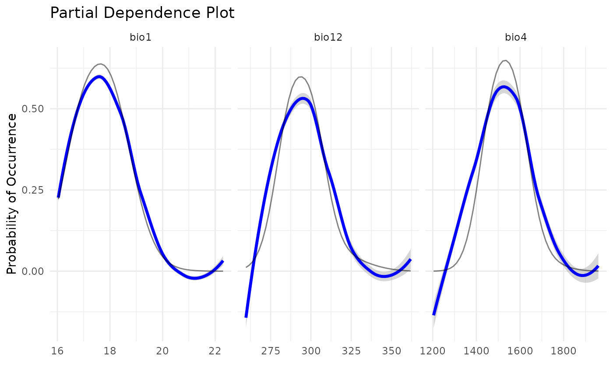
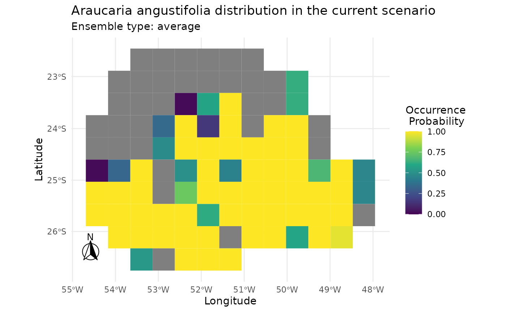
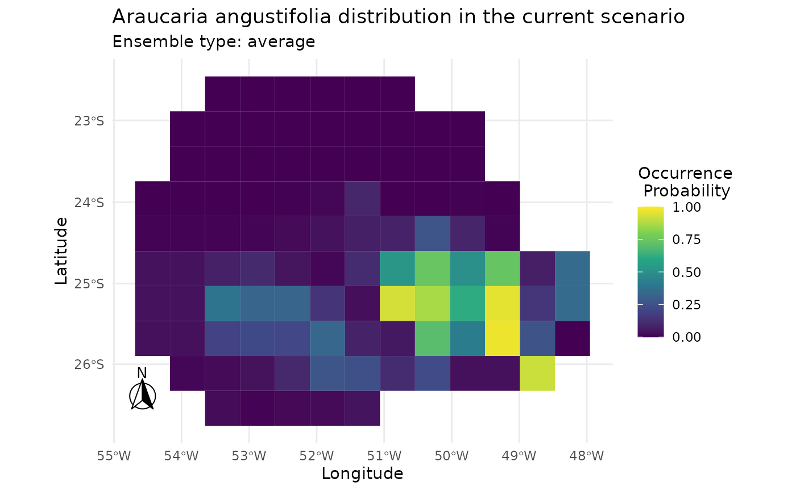

# Adding New Algorithms to caretSDM

## Introduction

The `caretSDM` package leverages the robust `caret` package as its core
engine for Species Distribution Modeling (SDM). This integration means
that `caretSDM` is not limited to its pre-configured algorithms. Any
modeling algorithm that can be used with `caret`’s `train` function can
also be seamlessly integrated into the `caretSDM` workflow.

This vignette will guide you through the process of adding a new, custom
algorithm to `caretSDM`. We will use the **Mahalanobis Distance** model,
a classic algorithm for presence-only SDMs, as our working example. The
process involves creating a list object that contains all the necessary
components for `caret` to train, tune, and predict from the model.

For a deeper dive into creating custom models for `caret`, we highly
recommend consulting the official `caret` documentation: [Using Your Own
Model in
train](https://topepo.github.io/caret/using-your-own-model-in-train.html).

First, let’s load the `caretSDM` library to set up our environment.

``` r
library(caretSDM)
library(dismo)
#> Loading required package: raster
#> Loading required package: sp
set.seed(1)
```

## The Custom Model Structure

To add a new algorithm, you need to create a list in R that contains
specific named elements. The `caret` package uses this list to
understand how to handle your model. Here are the key components of this
list, which we will define for our Mahalanobis Distance example.

### The Components of the List

The core of a custom model is a list that we’ll call `mahal.dist`. This
list bundles together everything `caret` needs.

- **`label`**: A simple character string for the model’s name.
- **`library`**: A character vector listing the R packages required to
  run the model. For Mahalanobis Distance, we need the `dismo` package.
- **`type`**: A character vector indicating the type of prediction
  problem. For SDM, this will typically be `"Classification"`.
- **`parameters`**: A data frame that defines the model’s tuning
  parameters. Each row represents a parameter and should include columns
  for its `parameter` name, its `class` (e.g., “numeric”, “logical”),
  and a descriptive `label`.
- **`grid`**: A function that generates a data frame of tuning parameter
  combinations for `caret` to test.
- **`fit`**: The main function that trains your model. It takes the
  predictor data (`x`), the response variable (`y`), and other
  arguments, and returns a fitted model object.
- **`predict`**: A function that uses the fitted model from `fit` to
  make predictions on new data.
- **`prob`**: A function that generates class probabilities (e.g.,
  probability of presence and pseudo-absence) for new data. This is
  crucial for evaluating models using metrics like AUC/ROC.
- **`levels`**: A function that returns the class levels. For
  `caretSDM`, this will be `"presence"` and `"pseudoabsence"`.

You can find these informations for any method by substituting the
“METHOD” below for the desired algorithm name (see also the `algorithms`
object):

``` r
caret::getModelInfo("METHOD", regex = FALSE)[[1]]
```

See how the list is built for nayve_bayes algorithm:

``` r
caret::getModelInfo("naive_bayes", regex = FALSE)[[1]]
#> $label
#> [1] "Naive Bayes"
#> 
#> $library
#> [1] "naivebayes"
#> 
#> $loop
#> NULL
#> 
#> $type
#> [1] "Classification"
#> 
#> $parameters
#>   parameter   class                label
#> 1   laplace numeric   Laplace Correction
#> 2 usekernel logical    Distribution Type
#> 3    adjust numeric Bandwidth Adjustment
#> 
#> $grid
#> function (x, y, len = NULL, search = "grid") 
#> expand.grid(usekernel = c(TRUE, FALSE), laplace = 0, adjust = 1)
#> 
#> $fit
#> function (x, y, wts, param, lev, last, classProbs, ...) 
#> {
#>     if (param$usekernel) {
#>         out <- naivebayes::naive_bayes(x, y, usekernel = TRUE, 
#>             laplace = param$laplace, adjust = param$adjust, ...)
#>     }
#>     else out <- naivebayes::naive_bayes(x, y, usekernel = FALSE, 
#>         laplace = param$laplace, ...)
#>     out
#> }
#> 
#> $predict
#> function (modelFit, newdata, submodels = NULL) 
#> {
#>     if (!is.data.frame(newdata)) 
#>         newdata <- as.data.frame(newdata, stringsAsFactors = TRUE)
#>     predict(modelFit, newdata)
#> }
#> 
#> $prob
#> function (modelFit, newdata, submodels = NULL) 
#> {
#>     if (!is.data.frame(newdata)) 
#>         newdata <- as.data.frame(newdata, stringsAsFactors = TRUE)
#>     as.data.frame(predict(modelFit, newdata, type = "prob"), 
#>         stringsAsFactors = TRUE)
#> }
#> 
#> $predictors
#> function (x, ...) 
#> if (hasTerms(x)) predictors(x$terms) else names(x$tables)
#> 
#> $tags
#> [1] "Bayesian Model"
#> 
#> $levels
#> function (x) 
#> x$levels
#> 
#> $sort
#> function (x) 
#> x[order(x[, 1]), ]
```

Naturally, some elements are particular to each method, but some
elements are common to every algorithm implemented. Let’s see how these
components come together in our example.

### Example 1: An algorithm from a package

Here is the complete code for creating the `algo` list for the
Mahalanobis Distance using the `dismo` package. This structure can be
changed to include new algorithms into caretSDM.

``` r
mahal.dismo <- list(
  label = "Mahalanobis Distance",
  library = "dismo",
  loop = NULL,
  type = c("Classification", "Regression"),
  levels = function(x) c("presence", "pseudoabsence"),
  parameters = data.frame(
    parameter = c("abs"),
    class = c("logical"),
    label = c("Absolute absence")
  ),
  grid = function(x, y, len = NULL, search = "grid") {
    # We define a simple grid that will test both TRUE and FALSE for the 'abs' parameter.
    if (search == "grid") {
      out <- expand.grid(abs = c(TRUE, FALSE))
    } else {
      out <- expand.grid(abs = c(TRUE, FALSE))
    }
    return(out)
  },
  fit = function(x, y, wts, param, lev, last, classProbs, ...) {
    # The 'fit' function uses 'dismo::mahal'. 
    # It's trained only on presence data.
    model <- dismo::mahal(x = x[y == "presence", ])
    # We return the model and the tuning parameter value.
    result <- list(model = model, abs = param$abs)
    return(result)
  },
  predict = function(modelFit, newdata, preProc = NULL, submodels = NULL) {
    # 'predict' generates predictions for new data.
    pred <- predict(modelFit$model, newdata)
    # The output is converted to probabilities for both classes.
    pred <- data.frame(presence = pred, pseudoabsence = 1 - pred)
    # The 'abs' parameter determines the binarization type.
    if (modelFit$abs) {
      pred <- as.factor(ifelse(pred$presence > 0, "presence", "pseudoabsence"))
    } else {
      pred <- as.factor(colnames(pred)[apply(pred, 1, which.max)])
    }
    return(pred)
  },
  prob = function(modelFit, newdata, preProc = NULL, submodels = NULL) {
    # 'prob' calculates the class probabilities.
    prob <- predict(modelFit$model, newdata)
    # It must return a data frame with column names matching the class levels.
    prob <- data.frame(presence = prob, pseudoabsence = 1 - prob)
    return(prob)
  },
  predictors = function(x, ...) {
    names(x$model@centroid)  
    },
  varImp = NULL,
  tags = c("Distance")
)
```

### Example 2: A custom made algorithm

Alternatively, the user can built its own algorithm and implement it
through the same method. Here I show the code for a custom Mahalanobis
Distance.

``` r
# Define a custom Mahalanobis model
mahal.custom <- list(
  label = "Mahalanobis Distance Classifier",
  library = NULL,
  type = "Classification",
  parameters = data.frame(
    parameter = c("abs"),
    class = c("logical"),
    label = c("Absolute Binarization")
  ),  
  grid = function(x, y, len = NULL, search = "grid") {
    # We define a simple grid that will test both TRUE and FALSE 
    # for the 'abs' parameter. Here, search can be anything that 
    # the output is the same. But in other implementations the user
    # may want to change when search is not "grid".
    if (search == "grid") {
      out <- expand.grid(abs = c(TRUE, FALSE))
    } else {
      out <- expand.grid(abs = c(TRUE, FALSE))
    }
    return(out)
  },
  fit = function(x, y, wts, param, lev, last, classProbs, ...) {
    # The 'fit' function is trained only on presence data.
    # It calculates and stores the mean vector and inverse covariance matrix.
    presence_data <- x[y == "presence", , drop = FALSE]
    
    if (nrow(presence_data) < 2) {
      stop("Not enough 'presence' data points to calculate covariance.")
    }
    
    # Calculate model parameters
    center_vec <- colMeans(presence_data, na.rm = TRUE)
    inv_cov_matrix <- solve(cov(presence_data))
    
    # The model object here is just a list of parameters.
    result <- list(
      center = center_vec,
      inv_cov = inv_cov_matrix,
      df = ncol(x), # Correction demonstrated by Etherington 2019.
      abs = param$abs,
      levels = lev # Retain data information dor consistency.
    )
    return(result)
  },
  # Prediction function (must match caret's expected signature)
  predict = function(modelFit, newdata, preProc = NULL, submodels = NULL) {
    # 'predict' generates class labels based on the probabilities.
    # 1. Get the probabilities by calling the 'prob' function.
    probs <- mahal.custom$prob(modelFit, newdata)
    
    # 2. The 'abs' parameter determines the binarization type.
    if (modelFit$abs) {
      # For "Absolute Binarization", we threshold the p-value.
      # A common choice is alpha = 0.05. If p-value >= 0.05, the point is
      # considered within the "presence" environment.
      pred <- ifelse(probs[, modelFit$levels[1]] >= 0.05,
                     modelFit$levels[1], # presence
                     modelFit$levels[2]) # pseudoabsence
    } else {
      # Standard method: assign the class with the highest probability.
      pred <- colnames(probs)[apply(probs, 1, which.max)]
    }
    
    # 3. Return a factor with the correct levels.
    pred <- factor(pred, levels = modelFit$levels)
    return(pred)
  },
  
  predictors = function(x, ...) {
    # This correctly extracts predictor names from the fitted model.
    names(x$center)
  },
  
  # Optional: Specify if probabilities are supported
  prob = function(modelFit, newdata, preProc = NULL, submodels = NULL) {
    # 'prob' calculates class probabilities using the fitted model.
    # 1. Calculate the squared Mahalanobis distance (D^2) for newdata.
    d2 <- stats::mahalanobis(x = newdata,
                             center = modelFit$center,
                             cov = modelFit$inv_cov,
                             inverted = TRUE) # Use inverted = TRUE for efficiency ######################
                             
    # 2. Convert distance to a p-value using the chi-squared distribution.
    # This p-value can be interpreted as the probability of "presence".
    p_presence <- 1 - pchisq(q = d2, df = modelFit$df)
    
    # 3. The output is a data frame of probabilities for both classes.
    prob_df <- data.frame(
      presence = p_presence,
      pseudoabsence = 1 - p_presence
    )
    colnames(prob_df) <- modelFit$levels # Ensure column names match levels
    return(prob_df)
  }
)
```

## Integrating the New Algorithm into `caretSDM`

With our `mahal.custom` list defined, we can now use it directly with
the `train_sdm` function. The process is the same as for any built-in
algorithm, but instead of providing the algorithm’s name as a string
(e.g., `"rf"`), we provide our `mahal.custom` list object.

Let’s walk through a minimal `caretSDM` workflow to see this in action.

### 1. Prepare a Minimal `input_sdm` Object

We’ll use data already included in the `caretSDM` package to create a
simple `input_sdm` object. This simulates the pre-processing steps of a
typical SDM analysis.

``` r
# Create an sdm_area object
sa <- sdm_area(parana, 
               cell_size = 50000, # Using a coarse resolution for speed
               crs = 6933)
#> ! Making grid over study area is an expensive task. Please, be patient!
#> ℹ Using GDAL to make the grid and resample the variables.

# Add predictors to the study area
sa <- add_predictors(sa, bioc)
#> ! Making grid over the study area is an expensive task. Please, be patient!
#> ℹ Using GDAL to make the grid and resample the variables.

# Format occurrences
oc <- occurrences_sdm(occ, crs = 6933)
oc <- join_area(oc, sa)

# Create the final input_sdm object
i <- input_sdm(oc, sa)

# Generate pseudoabsences
i <- pseudoabsences(i, 
                    method = "bioclim", 
                    n_set = 3)
```

### 2. Train the Model using `train_sdm`

Now, we will call `train_sdm` and pass our custom `mahal.dist` list to
the `algo` argument. We also need to define our training control
parameters using
[`caret::trainControl`](https://rdrr.io/pkg/caret/man/trainControl.html).

``` r
# Define training controls
ctrl_sdm <- caret::trainControl(method = "cv", 
                                number = 3, 
                                classProbs = TRUE,
                                summaryFunction = summary_sdm, 
                                savePredictions = "final")

# Train the model using our custom algorithm
# Note that 'algo' is now our list object instead of a string
i <- train_sdm(i, 
               algo = mahal.custom, 
               variables_selected = c("bio1", "bio4", "bio12"), # Using only two variables for simplicity
               ctrl = ctrl_sdm)
#> Loading required package: ggplot2
#> Loading required package: lattice
#> 
#> Attaching package: 'caret'
#> The following object is masked from 'package:caretSDM':
#> 
#>     predictors
#> Warning in auc.roc(roc_obj, partial.auc = c(1, 0.9), partial.auc.focus =
#> "specificity", : Partial AUC correction not defined for ROC curves below the
#> diagonal.
#> Warning in auc.roc(roc_obj, partial.auc = c(1, 0.9), partial.auc.focus =
#> "specificity", : Partial AUC correction not defined for ROC curves below the
#> diagonal.
#> Warning in auc.roc(roc_obj, partial.auc = c(1, 0.9), partial.auc.focus =
#> "specificity", : Partial AUC correction not defined for ROC curves below the
#> diagonal.
#> Warning in auc.roc(roc_obj, partial.auc = c(1, 0.9), partial.auc.focus =
#> "specificity", : Partial AUC correction not defined for ROC curves below the
#> diagonal.
#> Warning in auc.roc(roc_obj, partial.auc = c(1, 0.9), partial.auc.focus =
#> "specificity", : Partial AUC correction not defined for ROC curves below the
#> diagonal.
#> Warning in auc.roc(roc_obj, partial.auc = c(1, 0.9), partial.auc.focus =
#> "specificity", : Partial AUC correction not defined for ROC curves below the
#> diagonal.
#> Warning in nominalTrainWorkflow(x = x, y = y, wts = weights, info = trainInfo,
#> : There were missing values in resampled performance measures.
#> Warning in auc.roc(roc_obj, partial.auc = c(1, 0.9), partial.auc.focus =
#> "specificity", : Partial AUC correction not defined for ROC curves below the
#> diagonal.
#> Warning in auc.roc(roc_obj, partial.auc = c(1, 0.9), partial.auc.focus =
#> "specificity", : Partial AUC correction not defined for ROC curves below the
#> diagonal.
#> Warning in auc.roc(roc_obj, partial.auc = c(1, 0.9), partial.auc.focus =
#> "specificity", : Partial AUC correction not defined for ROC curves below the
#> diagonal.
#> Warning in auc.roc(roc_obj, partial.auc = c(1, 0.9), partial.auc.focus =
#> "specificity", : Partial AUC correction not defined for ROC curves below the
#> diagonal.
#> Warning in auc.roc(roc_obj, partial.auc = c(1, 0.9), partial.auc.focus =
#> "specificity", : Partial AUC correction not defined for ROC curves below the
#> diagonal.
#> Warning in auc.roc(roc_obj, partial.auc = c(1, 0.9), partial.auc.focus =
#> "specificity", : Partial AUC correction not defined for ROC curves below the
#> diagonal.
#> Warning in nominalTrainWorkflow(x = x, y = y, wts = weights, info = trainInfo,
#> : There were missing values in resampled performance measures.
#> Warning in auc.roc(roc_obj, partial.auc = c(1, 0.9), partial.auc.focus =
#> "specificity", : Partial AUC correction not defined for ROC curves below the
#> diagonal.
#> Warning in auc.roc(roc_obj, partial.auc = c(1, 0.9), partial.auc.focus =
#> "specificity", : Partial AUC correction not defined for ROC curves below the
#> diagonal.
#> Warning in auc.roc(roc_obj, partial.auc = c(1, 0.9), partial.auc.focus =
#> "specificity", : Partial AUC correction not defined for ROC curves below the
#> diagonal.
#> Warning in auc.roc(roc_obj, partial.auc = c(1, 0.9), partial.auc.focus =
#> "specificity", : Partial AUC correction not defined for ROC curves below the
#> diagonal.
#> Warning in auc.roc(roc_obj, partial.auc = c(1, 0.9), partial.auc.focus =
#> "specificity", : Partial AUC correction not defined for ROC curves below the
#> diagonal.
#> Warning in auc.roc(roc_obj, partial.auc = c(1, 0.9), partial.auc.focus =
#> "specificity", : Partial AUC correction not defined for ROC curves below the
#> diagonal.
#> Warning in auc.roc(roc_obj, partial.auc = c(1, 0.9), partial.auc.focus =
#> "specificity", : Partial AUC correction not defined for ROC curves below the
#> diagonal.
#> Warning in nominalTrainWorkflow(x = x, y = y, wts = weights, info = trainInfo,
#> : There were missing values in resampled performance measures.
```

Let’s check the output. The printout shows that “Mahalanobis Distance”
was successfully trained and evaluated.

``` r
i
#>             caretSDM           
#> ...............................
#> Class                         : input_sdm
#> --------  Occurrences  --------
#> Species Names                 : Araucaria angustifolia 
#> Number of presences           : 419 
#> Pseudoabsence methods         :
#>     Method to obtain PAs      : bioclim 
#>     Number of PA sets         : 3 
#>     Number of PAs in each set : 419 
#> --------  Predictors  ---------
#> Number of Predictors          : 7 
#> Predictors Names              : GID0, CODIGOIB1, NOMEUF2, SIGLAUF3, bio1, bio4, bio12 
#> -----------  Models  ----------
#> Algorithms Names              : mahal.custom 
#> Variables Names               : bio1 bio4 bio12 
#> Model Validation              :
#>     Method                    : cv 
#>     Number                    : 3 
#>     Metrics                   :
#> $`Araucaria angustifolia`
#>           algo       ROC       TSS Sensitivity Specificity
#> 1 mahal.custom 0.9906817 0.8306326   0.8305556           1
```

Note that the algorithm name will be set as the name of the object
passed to `algo`:

``` r
algorithms_used(i)
#> [1] "mahal.custom"
```

We can also inspect the model’s performance metrics.

``` r
mean_validation_metrics(i)
#> $`Araucaria angustifolia`
#> # A tibble: 1 × 59
#>   algo       ROC   TSS Sensitivity Specificity `Pos Pred Value` `Neg Pred Value`
#>   <chr>    <dbl> <dbl>       <dbl>       <dbl>            <dbl>            <dbl>
#> 1 mahal.c… 0.991 0.831       0.831           1                1            0.336
#> # ℹ 52 more variables: Precision <dbl>, Recall <dbl>, F1 <dbl>,
#> #   Prevalence <dbl>, `Detection Rate` <dbl>, `Detection Prevalence` <dbl>,
#> #   `Balanced Accuracy` <dbl>, Accuracy <dbl>, Kappa <dbl>,
#> #   AccuracyLower <dbl>, AccuracyUpper <dbl>, AccuracyNull <dbl>,
#> #   AccuracyPValue <dbl>, McnemarPValue <dbl>, Positive <dbl>, Negative <dbl>,
#> #   `True Positive` <dbl>, `False Positive` <dbl>, `True Negative` <dbl>,
#> #   `False Negative` <dbl>, CBI <dbl>, pAUC <dbl>, Omission_10pct <dbl>, …
```

A final plot that can be useful is the Partial Dependence Plot

``` r
pdp_sdm(i)
#> `geom_smooth()` using method = 'loess' and formula = 'y ~ x'
```



### 2. Comparing both results

To compare the output of both algorithms implemented we need to first
build models using the mahal.dismo method.

``` r
# Create a new input_sdm object
i2 <- input_sdm(oc, sa) |>
      pseudoabsences(method = "bioclim", 
                      n_set = 3) |>
      train_sdm(algo = mahal.dismo, 
                variables_selected = c("bio1", "bio4", "bio12"), # Using only two variables for simplicity
                ctrl = ctrl_sdm)
#> Warning in auc.roc(roc_obj, partial.auc = c(1, 0.9), partial.auc.focus =
#> "specificity", : Partial AUC correction not defined for ROC curves below the
#> diagonal.
#> Warning in auc.roc(roc_obj, partial.auc = c(1, 0.9), partial.auc.focus =
#> "specificity", : Partial AUC correction not defined for ROC curves below the
#> diagonal.
#> Warning in auc.roc(roc_obj, partial.auc = c(1, 0.9), partial.auc.focus =
#> "specificity", : Partial AUC correction not defined for ROC curves below the
#> diagonal.
#> Warning in auc.roc(roc_obj, partial.auc = c(1, 0.9), partial.auc.focus =
#> "specificity", : Partial AUC correction not defined for ROC curves below the
#> diagonal.
#> Warning in auc.roc(roc_obj, partial.auc = c(1, 0.9), partial.auc.focus =
#> "specificity", : Partial AUC correction not defined for ROC curves below the
#> diagonal.
#> Warning in auc.roc(roc_obj, partial.auc = c(1, 0.9), partial.auc.focus =
#> "specificity", : Partial AUC correction not defined for ROC curves below the
#> diagonal.
#> Warning in nominalTrainWorkflow(x = x, y = y, wts = weights, info = trainInfo,
#> : There were missing values in resampled performance measures.
#> Warning in auc.roc(roc_obj, partial.auc = c(1, 0.9), partial.auc.focus =
#> "specificity", : Partial AUC correction not defined for ROC curves below the
#> diagonal.
#> Warning in auc.roc(roc_obj, partial.auc = c(1, 0.9), partial.auc.focus =
#> "specificity", : Partial AUC correction not defined for ROC curves below the
#> diagonal.
#> Warning in auc.roc(roc_obj, partial.auc = c(1, 0.9), partial.auc.focus =
#> "specificity", : Partial AUC correction not defined for ROC curves below the
#> diagonal.
#> Warning in auc.roc(roc_obj, partial.auc = c(1, 0.9), partial.auc.focus =
#> "specificity", : Partial AUC correction not defined for ROC curves below the
#> diagonal.
#> Warning in auc.roc(roc_obj, partial.auc = c(1, 0.9), partial.auc.focus =
#> "specificity", : Partial AUC correction not defined for ROC curves below the
#> diagonal.
#> Warning in auc.roc(roc_obj, partial.auc = c(1, 0.9), partial.auc.focus =
#> "specificity", : Partial AUC correction not defined for ROC curves below the
#> diagonal.
#> Warning in nominalTrainWorkflow(x = x, y = y, wts = weights, info = trainInfo,
#> : There were missing values in resampled performance measures.
#> Warning in auc.roc(roc_obj, partial.auc = c(1, 0.9), partial.auc.focus =
#> "specificity", : Partial AUC correction not defined for ROC curves below the
#> diagonal.
#> Warning in auc.roc(roc_obj, partial.auc = c(1, 0.9), partial.auc.focus =
#> "specificity", : Partial AUC correction not defined for ROC curves below the
#> diagonal.
#> Warning in auc.roc(roc_obj, partial.auc = c(1, 0.9), partial.auc.focus =
#> "specificity", : Partial AUC correction not defined for ROC curves below the
#> diagonal.
#> Warning in auc.roc(roc_obj, partial.auc = c(1, 0.9), partial.auc.focus =
#> "specificity", : Partial AUC correction not defined for ROC curves below the
#> diagonal.
#> Warning in auc.roc(roc_obj, partial.auc = c(1, 0.9), partial.auc.focus =
#> "specificity", : Partial AUC correction not defined for ROC curves below the
#> diagonal.
#> Warning in auc.roc(roc_obj, partial.auc = c(1, 0.9), partial.auc.focus =
#> "specificity", : Partial AUC correction not defined for ROC curves below the
#> diagonal.
#> Warning in auc.roc(roc_obj, partial.auc = c(1, 0.9), partial.auc.focus =
#> "specificity", : Partial AUC correction not defined for ROC curves below the
#> diagonal.
#> Warning in nominalTrainWorkflow(x = x, y = y, wts = weights, info = trainInfo,
#> : There were missing values in resampled performance measures.
```

``` r
i2
#>             caretSDM           
#> ...............................
#> Class                         : input_sdm
#> --------  Occurrences  --------
#> Species Names                 : Araucaria angustifolia 
#> Number of presences           : 419 
#> Pseudoabsence methods         :
#>     Method to obtain PAs      : bioclim 
#>     Number of PA sets         : 3 
#>     Number of PAs in each set : 419 
#> --------  Predictors  ---------
#> Number of Predictors          : 7 
#> Predictors Names              : GID0, CODIGOIB1, NOMEUF2, SIGLAUF3, bio1, bio4, bio12 
#> -----------  Models  ----------
#> Algorithms Names              : mahal.dismo 
#> Variables Names               : bio1 bio4 bio12 
#> Model Validation              :
#>     Method                    : cv 
#>     Number                    : 3 
#>     Metrics                   :
#> $`Araucaria angustifolia`
#>     algo       ROC       TSS Sensitivity Specificity
#> 1 custom 0.9907247 0.8527099   0.9826667   0.8821111
```

Plotting the result of mahal.dismo.

``` r
i2 |> add_scenarios() |> predict_sdm() |> plot_predictions()
#> [1] "Projecting: 1/1"
#> [1] "Ensembling..."
#> [1] "current"
#> [1] "Araucaria angustifolia"
```



Plotting the result of mahal.custom.

``` r
i |> add_scenarios() |> predict_sdm() |> plot_predictions()
#> [1] "Projecting: 1/1"
#> [1] "Ensembling..."
#> [1] "current"
#> [1] "Araucaria angustifolia"
```



## Conclusion

The `caretSDM` package is designed to be flexible and extensible. By
leveraging the power of `caret`, you can easily integrate virtually any
modeling algorithm into your Species Distribution Modeling workflow. The
key is to create a well-defined list that tells `caret` how to `fit`,
`predict`, and `tune` your model. This opens the door to using
state-of-the-art algorithms or custom-built models tailored to your
specific research questions, all within the structured and reproducible
environment of `caretSDM`.
