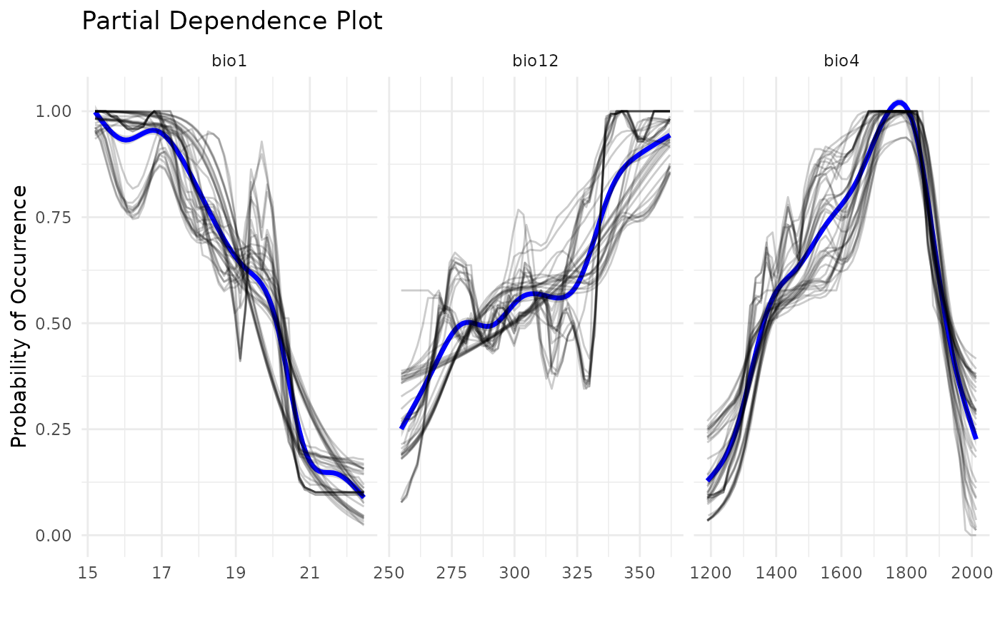

# Modeling Rare Species using Ensemble of Small Models

## Introduction

Species Distribution Modeling (SDM) is a method majorly used to solve
Wallacean shortfalls, i.e. it aims to uncover the distribution of
species. This workflow is very well established for species with well
studied and well collected species, which we have great availability of
records. However, most species are rare species, which even if well
sampled would not have a lot of data to work with. In this sense,
modelers have developed methods to overcome the lack of data in SDMs.
The most widespread is the Ensemble of Small Models (ESMs), which builds
SDMs using bivariate models and then ensembles them into one result.

In caretSDM, ESMs area available through a simple function called
use_esm. This function should be used before training the model to
adjust the settings properly. A compact code for ESM is the following:

``` r
library(caretSDM)
start_time <- Sys.time()
set.seed(1)

# Build sdm_area object
sa <- sdm_area(parana, 
               cell_size = 25000, 
               crs = 6933, 
               gdal = T) |> 
  add_predictors(bioc) |> 
  add_scenarios() |>
  select_predictors(c("bio1", "bio4", "bio12"))
#> ! Making grid over study area is an expensive task. Please, be patient!
#> ℹ Using GDAL to make the grid and resample the variables.
#> ! Making grid over the study area is an expensive task. Please, be patient!
#> ℹ Using GDAL to make the grid and resample the variables.

# Build occurrences_sdm object
oc <- occurrences_sdm(occ, crs = 6933) |> 
  join_area(sa)
#> Warning: Some records from `occ` do not fall in `pred`.
#> ℹ 2 elements from `occ` were excluded.
#> ℹ If this seems too much, check how `occ` and `pred` intersect.

# Merge sdm_area and occurrences_sdm and perform pre-processing, processing and projecting.
i_esm <- input_sdm(oc, sa) |> 
  data_clean() |> 
  pseudoabsences(method = "bioclim") |> 
  use_esm(n_records = 999) |>
  train_sdm(algo = c("naive_bayes", "kknn"), 
            crtl = caret::trainControl(method = "repeatedcv", 
                                       number = 4, 
                                       repeats = 1, 
                                       classProbs = TRUE, 
                                       returnResamp = "all", 
                                       summaryFunction = summary_sdm, 
                                       savePredictions = "all")) |> 
  predict_sdm(th = 0.9) |> 
  suppressWarnings()
#> Cell_ids identified, removing duplicated cell_id.
#> Testing country capitals
#> Removed 0 records.
#> Testing country centroids
#> Removed 0 records.
#> Testing duplicates
#> Removed 0 records.
#> Testing equal lat/lon
#> Removed 0 records.
#> Testing biodiversity institutions
#> Removed 0 records.
#> Testing coordinate validity
#> Removed 0 records.
#> Testing sea coordinates
#> Reading ne_110m_land.zip from naturalearth...Removed 0 records.
#> Predictors identified, procceding with grid filter (removing NA and duplicated data).
#> ESM species
#> Loading required package: ggplot2
#> Loading required package: lattice
#> 
#> Attaching package: 'caret'
#> 
#> The following object is masked from 'package:caretSDM':
#> 
#>     predictors
#> 
#> ESM species
#> ESM species
#> ESM species
#> ESM species
#> ESM species
#> ESM species
#> ESM species
#> ESM species
#> ESM species
#> [1] "Projecting: 1/1"
#> [1] "Ensembling..."
#> [1] "current"
#> [1] "Araucaria angustifolia"
```

Note that we are setting `use_esm(n_records = 999)`, which means that we
want every species with number of records lower than 999. The standard
value is 20, but the user can also specifically inform which species
should the ESM framework be applied to, by using the `spp` argument
(e.g.: `use_esm(spp = "Araucaria angustifolia")`).

## Comparing projections with standard SDM workflow

Now let’s compare the outputs of ESM and standard SDMs. First, we need
to create the standard SDM. We will do that by just removing the
`use_esm` function from previous chunk.

``` r
i_sdm <- input_sdm(oc, sa) |> 
  data_clean() |> 
  pseudoabsences(method = "bioclim") |> 
  train_sdm(algo = c("naive_bayes", "kknn"), 
            crtl = caret::trainControl(method = "repeatedcv", 
                                       number = 4, 
                                       repeats = 1, 
                                       classProbs = TRUE, 
                                       returnResamp = "all", 
                                       summaryFunction = summary_sdm, 
                                       savePredictions = "all")) |> 
  predict_sdm(th = 0.9) |> 
  suppressWarnings()
#> Cell_ids identified, removing duplicated cell_id.
#> Testing country capitals
#> Removed 0 records.
#> Testing country centroids
#> Removed 0 records.
#> Testing duplicates
#> Removed 0 records.
#> Testing equal lat/lon
#> Removed 0 records.
#> Testing biodiversity institutions
#> Removed 0 records.
#> Testing coordinate validity
#> Removed 0 records.
#> Testing sea coordinates
#> Reading ne_110m_land.zip from naturalearth...
#> Removed 0 records.
#> 
#> Predictors identified, procceding with grid filter (removing NA and duplicated data).
#> [1] "Projecting: 1/1"
#> [1] "Ensembling..."
#> [1] "current"
#> [1] "Araucaria angustifolia"
```

Now let’s compare both results:

``` r
# Plotting ESM result for current scenario
plot_predictions(i_esm,
                 spp_name = NULL,
                 scenario = "current",
                 id = NULL,
                 ensemble = TRUE,
                 ensemble_type = "mean_occ_prob")
```


``` r
# Plotting standard result for current scenario
plot_predictions(i_sdm,
                 spp_name = NULL,
                 scenario = "current",
                 id = NULL,
                 ensemble = TRUE,
                 ensemble_type = "mean_occ_prob")
```


## Comparing response curves

Another way to compare outputs is by plotting response curves. We can
see that, when using ESMs, a lot more models are built. This is because
each model from the standard SDM is divided in multiple bivariate
models. However, a good level of concordance is achieved, when comparing
to ESMs with standard SDMs, as shown bellow.

``` r
pdp_sdm(i_esm)
#> `geom_smooth()` using method = 'gam' and formula = 'y ~ s(x, bs = "cs")'
```



``` r
pdp_sdm(i_sdm)
#> `geom_smooth()` using method = 'gam' and formula = 'y ~ s(x, bs = "cs")'
```


## Conclusion

This vignette demonstrates how to build Ensemble of Small Models using
`caretSDM`. With a simple function the user can automatically control
which species should pass to ESM by setting a number of records
threshold or nominally indicate which species it wants to apply
bivariate models.

``` r
end_time <- Sys.time()
end_time - start_time
#> Time difference of 2.338899 mins
```
