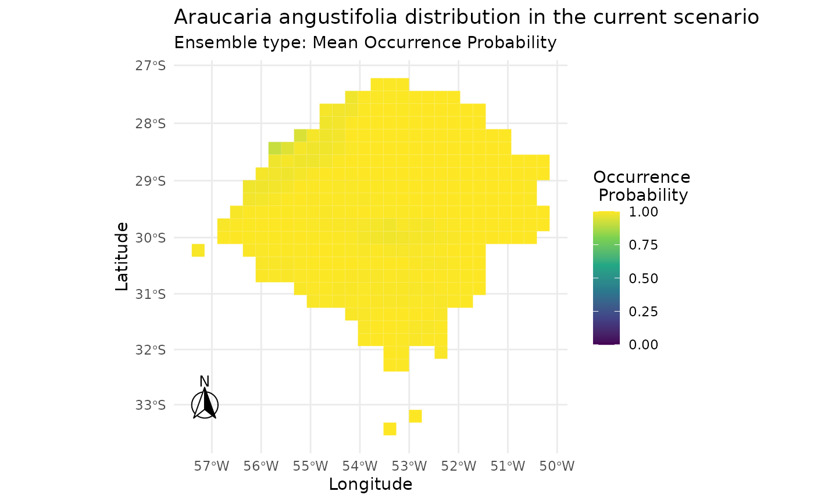
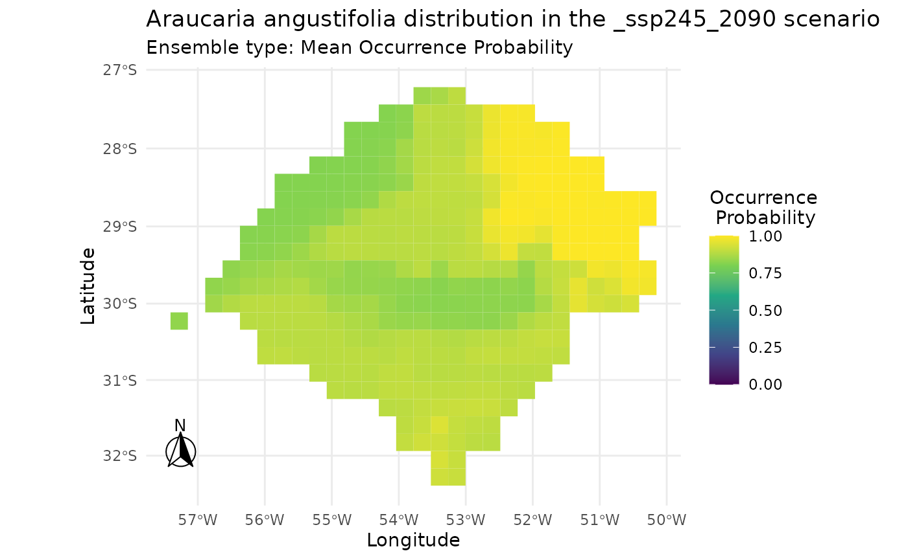
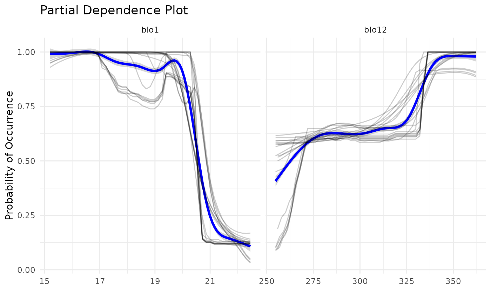

# Projecting Non-native Distribution using SDMs

## Introduction

One of the main uses for Species Distribution Models is to project the
impact of invasive species. To facilitate the use of `caretSDM` in
invasiveness assessments, we put this document together. Here, we will
build the Ecological Niche Model, i.e. the mathematical model that
describes the hypervolume that encompasses the limiting values
permitting a species to persist through time, for *Araucaria
angustifolia* using records on Paraná. We then project the models into
the Rio Grande do Sul state, further to the South, to assess the
invasiveness potential of the species.

This article may read repetitive, when comparing with others, but our
aim here is to have a complete tutorial, thus some steps will be exactly
as from other articles.

First, we need to open our library.

``` r
library(caretSDM)
start_time <- Sys.time()
set.seed(1)
```

## Pre-Processing

To obtain models, we will need climatic data and species records. To
easily obtain these data, we have two functions: `WorldClim_data`
function downloads climatic variables from WorldClim 2.1, a widely used
open-source database; in the same way, `GBIF_data` function downloads
species records from GBIF, also a widely used open-source database. You
can read more about them by running in the console
[`?GBIF_data`](https://luizesser.github.io/caretSDM/reference/GBIF_data.md)
and
[`?WorldClim_data`](https://luizesser.github.io/caretSDM/reference/WorldClim_data.md).

### Obtaining species records

A easy way to get species data using `caretSDM` is the function
`GBIF_data`, which retrieves species records from GBIF. Understandably,
there are other sources of species data available, as well as our own
data that can be the result of field work. In this sense, one can import
to R it’s own data in multiple ways, but be sure that the table must
always have three columns: species, decimalLongitude and
decimalLatitude. `GBIF_data` function can retrieve the data ready to be
included in caretSDM, thus if you have any doubt on how to format your
own data, use `GBIF_data` function with the parameter `as_df = TRUE` to
retrieve an example table. As standard, `GBIF_data` function sets
`as_df = FALSE`, which makes the function return a `occurrences` object
(more about that further below). An example code for this step would be:

``` r
occ <- GBIF_data(c("Araucaria angustifolia"), as_df = TRUE)
```

But we already have a `occ` object included in the package, which is the
same output, but with filtered records to match our study area. Note
that coordinates are in a metric CRS (EPSG: 6933).

``` r
occ |> head()
#>                    species decimalLongitude decimalLatitude
#> 327 Araucaria angustifolia         -4700678        -3065133
#> 405 Araucaria angustifolia         -4711827        -3146727
#> 404 Araucaria angustifolia         -4711885        -3147170
#> 310 Araucaria angustifolia         -4717665        -3142767
#> 49  Araucaria angustifolia         -4726011        -3148963
#> 124 Araucaria angustifolia         -4727265        -3148517
```

### Obtaining climatic data

For climatic data, we will first download and import current data, which
is used to build the models. `WorldClim_data` function has an argument
to set the directory in which you want to save the files. If you don’t
set it, files will be saved in your working directory (run
[`getwd()`](https://rdrr.io/r/base/getwd.html) to find out your working
directory) in the folder “input_data/WorldClim_data_current/”. If period
is set to “future”, then it is saved in
“input_data/WorldClim_data_future/”. We could run this script with a
smaller resolution, but as the aim here is to show how the package
works, we will use a resolution of 10 arc-minutes, which is very coarse,
but quicker to download and run.

``` r
# Download current bioclimatic variables
WorldClim_data(path = NULL, 
               period = "current", 
               variable = "bioc", 
               resolution = 10)

# Import current bioclimatic variables to R
bioc <- read_stars(list.files("input_data/WorldClim_data_current/", full.names = T), along = "band", normalize_path = F)
```

As we are aiming for a climate change assessment, we will also download
future data.

``` r
WorldClim_data(path = NULL, 
               period = "future", 
               variable = "bioc",
               year = "2090",
               gcm = c("ca", "mi"),
               ssp = c("245","585"),
               resolution = 10)
```

#### KEY CHANGE FOR INVASIVENESS ASSESSMENT:

In caretSDM, we will set the study area to match the region where the
model will be trained. The region where models will be projected can be
adapted from scenarios data. One can work around with this environmental
data to adapt it using any package. We already have included in the
package an object with current and future data for the Rio Grande do Sul
state. To build it, we used an adaptation of the following code:

``` r
# THIS IS AN EXAMPLE CODE, IT MUST BE ADAPTED TO RUN CORRECTLY!!!
# Import aim area shape
rs <- st_read("Rio_Grande_do_Sul.shp")

# Import current data
current <- read_stars(list.files("WorldClim_data_current_folder", full.names=T), along = "band")

# Change name of current scenario
names(current) <- "current"

# Select variables and crop using the shape of the aim area
current <- sf::st_crop(current[,,,c("1.tif", "4.tif", "12.tif")], rs)

# Set names of variables to match future scenario
current <- stars::st_set_dimensions(current, "band", values = c("bio1", "bio4","bio12"))

# Import future data
future <- read_stars(list.files("WorldClim_data_future_folder", full.names=T))

# Change names of future scenarios
names(future) <- c("ca_ssp245_2090", "ca_ssp585_2090", 
                   "mi_ssp245_2090", "mi_ssp585_2090")

# Select variables and crop using the shape of the aim area
future <- sf::st_crop(future[,,,c("bio01", "bio04", "bio12")], rs)

# Set names of variables to match current scenario
future <- stars::st_set_dimensions(future, "band", values = c("bio1", "bio4","bio12"))

# Sum scenarios
scen_rs <- c(current, future)
```

The result should resemble the included object (see
[`?scen_rs`](https://luizesser.github.io/caretSDM/reference/scen_rs.md)
for more information on the data).:

``` r
scen_rs
#> stars object with 3 dimensions and 5 attributes
#> attribute(s):
#>                     Min. 1st Qu.   Median     Mean  3rd Qu.   Max. NA's
#> current         14.38403 19.5185 397.1582 668.0422 1467.000 2079.0 3204
#> ca_ssp245_2090  17.60000 23.0000 414.1000 677.0502 1516.225 2134.2 3264
#> ca_ssp585_2090  20.70000 26.6000 446.2500 688.5646 1551.125 2098.2 3264
#> mi_ssp245_2090  15.70000 20.8000 407.8500 721.1667 1608.125 2284.4 3264
#> mi_ssp585_2090  16.90000 22.1000 407.7500 754.2061 1679.425 2439.8 3264
#> dimension(s):
#>      from  to offset   delta refsys point              values x/y
#> x     735 782   -180  0.1667 WGS 84 FALSE                NULL [x]
#> y     703 743     90 -0.1667 WGS 84 FALSE                NULL [y]
#> band    1   3     NA      NA     NA    NA bio1 , bio4 , bio12
```

### Defining the study area

A important step on model building in Species Distribution Models, is
the definition of accessible area (the M in BAM diagram). This area can
be, in Geographical Information Systems terms, as an example, the
delimitation of a habitat (polygon) or a river basin network (lines).
Another broadly used approach is the use of buffers around presences.
The buffer size translates the potential distribution capabilities of a
species. As our invasiveness assessment aims to build models in the
Parana state and project in the Rio Grande do Sul state, we will use a
simple polygon of Parana state boundaries as study area. This shape is
available in caretSDM as the `parana` object (see
[`?parana`](https://luizesser.github.io/caretSDM/reference/parana.md)
for more information on the data).

``` r
parana
#> Simple feature collection with 1 feature and 4 fields
#> Geometry type: MULTIPOLYGON
#> Dimension:     XY
#> Bounding box:  xmin: -54.61834 ymin: -26.71679 xmax: -48.02308 ymax: -22.51621
#> Geodetic CRS:  WGS 84
#>   GID0 CODIGOIB1 NOMEUF2 SIGLAUF3                           geom
#> 1   19        41  PARANA       PR MULTIPOLYGON (((-52.06416 -...
```

``` r
parana |> select_predictors(NOMEUF2) |> plot()
```


The `sdm_area` function is responsible to create a grid to build models,
a key aspect of caretSDM workflow. With a grid built, modelers can pass
multiple rasters with different resolutions, CRSs and extents. The
package will be responsible to rescale, transform and crop every raster
to match the grid. The grid returned by the `sdm_area` function is from
`sdm_area` class, a class that will also keep the environmental/climatic
data (*i.e.* “predictor variables”, “covariates”, “explanatory
variables”, “features” or “control variables”). With this class we will
perform analysis using only the predictors. The grid is built using
mostly the first three arguments: (1) a shape from `sf` class, but
rasters from `stars`, `rasterStack` or `SpatRaster` class are also
allowed; (2) the cell size of the grid; and (3) the Coordinate Reference
System (CRS). Note that the cell size can be metric or not depending on
the CRS informed. It is important to inform a cell size bigger than the
coarser raster that will be used, otherwise rescaling process may return
empty cells. The rescaling can be performed using GDAL (quicker but less
precise) or the `stars` package (slower but more precise). The first
will address values to cells by calculating the mean (for continuous
variables) or the median (for categorical variables) of the values
falling within the cell. The approach using `stars` will do the same
thing, but weighting for the area of each value within the cell. For
other arguments meaning see
[`?sdm_area`](https://luizesser.github.io/caretSDM/reference/sdm_area.md).

``` r
sa <- sdm_area(parana, 
               cell_size = 25000, 
               crs = 6933, 
               variables_selected = NULL,
               gdal = TRUE, 
               crop_by = NULL, 
               lines_as_sdm_area = FALSE)
#> ! Making grid over study area is an expensive task. Please, be patient!
#> ℹ Using GDAL to make the grid and resample the variables.
sa
#>           caretSDM         
#> ...........................
#> Class                     : sdm_area
#> Extent                    : -5276744 -3295037 -4626744 -2795037 (xmin, xmax, ymin, ymax)
#> CRS                       : WGS 84 / NSIDC EASE- 
#> Resolution                : (25000, 25000) (x, y)
#> Number of Predictors      : 4 
#> Predictors Names          : GID0, CODIGOIB1, NOMEUF2, SIGLAUF3
```

Note that the function returned four predictor variables
(`Predictor Names` above). These “predictors” are actually columns
included in the `parana` shape’s data table. One can filter these
variables using `select_predictors` function, but we will not do that
here, once the package will automatically drop them further. You can
explore the grid generated and stored in the `sdm_area` object using the
functions
[`mapview_grid()`](https://luizesser.github.io/caretSDM/reference/plot_occurrences.md)
or
[`plot_grid()`](https://luizesser.github.io/caretSDM/reference/plot_occurrences.md).

``` r
plot_grid(sa)
```


Now that we have a study area, we can assign predictor variables to it.
To do that, we use the `add_predictors` function, which usually will
only use the fist two arguments, which are the `sdm_area` build in the
previous step and the `RasterStack`, `SpatRaster` or `stars` object with
predictors data. Note that `add_predictors` also has a `gdal` argument,
which works as the previous one in `sdm_area` function.

``` r
sa <- add_predictors(sa, 
                     bioc, 
                     variables_selected = NULL, 
                     gdal = TRUE)
#> ! Making grid over the study area is an expensive task. Please, be patient!
#> ℹ Using GDAL to make the grid and resample the variables.
sa
#>           caretSDM         
#> ...........................
#> Class                     : sdm_area
#> Extent                    : -5276744 -3295037 -4626744 -2795037 (xmin, xmax, ymin, ymax)
#> CRS                       : WGS 84 / NSIDC EASE- 
#> Resolution                : (25000, 25000) (x, y)
#> Number of Predictors      : 7 
#> Predictors Names          : GID0, CODIGOIB1, NOMEUF2, SIGLAUF3, bio1, bio4, bio12
```

Predictors variables are used to train the models. After training the
models, we need to project models into scenarios. Currently, we don’t
have any scenario in our `sdm_area` object. We can address the
predictors data as the current scenario by applying the function
`add_scenario` without considering any other argument. This happens
because the argument `pred_as_scen` is standarly set to `TRUE`. However,
in invasiveness assessments, we want to project models into another
region. This region was previously set as the `scen_rs` object.

``` r
sa <- add_scenarios(sa, 
                    scen = scen_rs, 
                    scenarios_names = NULL,
                    pred_as_scen = FALSE,
                    variables_selected = NULL, 
                    stationary = NULL)
#> Warning: Some variables in `variables_selected` are not present in `scen`.
#> ℹ Using only variables present in `scen`: bio1, bio4, and bio12
#> ! Making grid over the study area is an expensive task. Please, be patient!
#> ℹ Using GDAL to make the grid and resample the variables.
#> ! Making grid over the study area is an expensive task. Please, be patient!
#> ℹ Using GDAL to make the grid and resample the variables.
#> ! Making grid over the study area is an expensive task. Please, be patient!
#> ℹ Using GDAL to make the grid and resample the variables.
#> ! Making grid over the study area is an expensive task. Please, be patient!
#> ℹ Using GDAL to make the grid and resample the variables.
#> ! Making grid over the study area is an expensive task. Please, be patient!
#> ℹ Using GDAL to make the grid and resample the variables.
sa
#>           caretSDM         
#> ...........................
#> Class                     : sdm_area
#> Extent                    : -5276744 -3295037 -4626744 -2795037 (xmin, xmax, ymin, ymax)
#> CRS                       : WGS 84 / NSIDC EASE- 
#> Resolution                : (25000, 25000) (x, y)
#> Number of Predictors      : 3 
#> Predictors Names          : bio1, bio4, bio12 
#> Number of Scenarios      : 5 
#> Scenarios Names          : current, ca_ssp245_2090, ca_ssp585_2090, mi_ssp245_2090, mi_ssp585_2090
```

It is common that modelers need to subset variables that will inform
models. This can be due to statistical artifacts that are common in
quarter bioclimatic variables, or a causation subset, aiming for those
variables with causality effect on species distribution. The user may
also want to change scenarios names, predictors names or retrieve
predictors data. For that there are a myriad of functions that can be
found in the package, most of them under the help files of the functions
[`?add_predictors`](https://luizesser.github.io/caretSDM/reference/add_predictors.md)
and
[`?add_scenarios`](https://luizesser.github.io/caretSDM/reference/add_scenarios.md),
but also
[`?select_predictors`](https://luizesser.github.io/caretSDM/reference/tidyverse-methods.md).

### Defining the occurrences set in the study area

As `caretSDM` has a strong GIS background, it is necessary to explicitly
tell which CRS is your data in. This will assure that every GIS
transformation is correct. `occurrences_sdm` function creates a
occurrences class (*i.e.* “response variable”, “target” or “label”) that
will be used in occurrences’ transformations and functions, as
pseudoabsences generation. For a reference, GBIF data is in crs = 4326,
but our records stored in `occ` object is transformed to 6933 (see
[`?occ`](https://luizesser.github.io/caretSDM/reference/occ.md) for more
information on the data).

``` r
oc <- occurrences_sdm(occ, crs = 6933)
oc
#>         caretSDM       
#> .......................
#> Class                 : occurrences
#> Species Names         : Araucaria angustifolia 
#> Number of presences   : 419 
#> =================================
#> Data:
#> Simple feature collection with 6 features and 1 field
#> Geometry type: POINT
#> Dimension:     XY
#> Bounding box:  xmin: -4727265 ymin: -3148963 xmax: -4700678 ymax: -3065133
#> Projected CRS: WGS 84 / NSIDC EASE-Grid 2.0 Global
#>                    species                  geometry
#> 327 Araucaria angustifolia POINT (-4700678 -3065133)
#> 405 Araucaria angustifolia POINT (-4711827 -3146727)
#> 404 Araucaria angustifolia POINT (-4711885 -3147170)
#> 310 Araucaria angustifolia POINT (-4717665 -3142767)
#> 49  Araucaria angustifolia POINT (-4726011 -3148963)
#> 124 Araucaria angustifolia POINT (-4727265 -3148517)
```

``` r
plot_occurrences(oc)
```


This next step assigns occurrences into a study area, excluding records
outside the study area or with NAs as predictors.

``` r
oc <- join_area(oc, sa)
#> Warning: Some records from `occ` do not fall in `pred`.
#> ℹ 2 elements from `occ` were excluded.
#> ℹ If this seems too much, check how `occ` and `pred` intersect.
```

### The `input_sdm` class

In `caretSDM` we use multiple classes to perform our analysis. Every
time we perform a new analysis, objects keep the information of what we
did. Ideally, the workflow will have only one object throughout it. The
`input_sdm` class is the key class in the workflow, where every function
will orbitate. That class puts occurrences, predictors, scenarios,
models and predictions together to perform analysis that are only
possible when two or more of these classes are available. First, we
create the object by informing the occurrences and the sdm_area.

``` r
i <- input_sdm(oc, sa)
i
#>             caretSDM           
#> ...............................
#> Class                         : input_sdm
#> --------  Occurrences  --------
#> Species Names                 : Araucaria angustifolia 
#> Number of presences           : 417 
#> --------  Predictors  ---------
#> Number of Predictors          : 3 
#> Predictors Names              : bio1, bio4, bio12 
#> ---------  Scenarios  ---------
#> Number of Scenarios           : 5 
#> Scenarios Names               : current ca_ssp245_2090 ca_ssp585_2090 mi_ssp245_2090 mi_ssp585_2090
```

### Data cleaning routine

As the first step in our workflow with the `input_sdm` object, we will
clean our occurrences data by applying a group of functions from the
package `CoordinateCleaner`. In this function, we also provide a way to
check for environmental duplicates, by including a predictors object.
This function also checks for records in the sea if the species is
terrestrial, but note that this can be switched off if the studied
species is not terrestrial. The way `caretSDM` works, we can always
overwrite the main `input_sdm` object to update it. The function will
return a new object with all the previous information and the new
information obtained from the `data_clean` function, note that at the
end of the Data Cleaning information there is the Duplicated Cell
method. This method is only possible when we have both the `occurrence`
and `predictors` data.

``` r
i <- data_clean(i,
                capitals = TRUE,
                centroids = TRUE,
                duplicated = TRUE,
                identical = TRUE,
                institutions = TRUE,
                invalid = TRUE,
                terrestrial = TRUE)
#> Cell_ids identified, removing duplicated cell_id.
#> Testing country capitals
#> Removed 0 records.
#> Testing country centroids
#> Removed 0 records.
#> Testing duplicates
#> Removed 0 records.
#> Testing equal lat/lon
#> Removed 0 records.
#> Testing biodiversity institutions
#> Removed 0 records.
#> Testing coordinate validity
#> Removed 0 records.
#> Testing sea coordinates
#> Reading ne_110m_land.zip from naturalearth...
#> Removed 0 records.
#> 
#> Predictors identified, procceding with grid filter (removing NA and duplicated data).
```

### Removing multicolinearity from predictors’ data

There are two main methods in the SDM literature to consider
multicolinearity in predictors data. One is the use of VIFs, which in
`caretSDM` is performed using `vif_predictors`function. There, users are
able to perform variables selection through `usdm` package. The function
is a wrapper for
[`usdm::vifcor`](https://rdrr.io/pkg/usdm/man/vif.html), where variables
are kept given a maximum threshold of colinearity. The standard is 0.5.
Here is a example code for demonstration:

``` r
i <- vif_predictors(i, 
                    th = 0.5, 
                    maxobservations = 5000, 
                    variables_selected = NULL)
```

### Obtaining pseudoabsence data

Pseudoabsence data will be stored in the `occurrences` object (inside
the `input_sdm`). To generate them, you must inform some parameters.
Probably one of the most important arguments in this function is the
`method`. Currently, two methods are implemented: a “random”, which
takes random grid cells as pseudoabsences; and a “bioclim” method, which
creates a Surface Range Envelope (SRE) using presence records, binarizes
the projection of the SRE using the `th` threshold and then retrieves
pseudoabsences outside the envelope. The number of pseudoabsences
created can be changed using the `n_pa` parameter. When set to NULL,
`n_pa` will be equal the number of occurrences (to avoid imbalance
issues). The number of sets of pseudoabsences is adjusted with the
`n_set` parameter in the function. The argument `variables_selected`
will inform which variables you want to use to build your
pseudoabsences/models. This can either be a vector of variables names or
a previously performed selection method.

``` r
i <- pseudoabsences(i, 
                    method = "bioclim", 
                    n_set = 10,
                    n_pa = NULL,
                    variables_selected = "vif",
                    th = 0) 
i
#>             caretSDM           
#> ...............................
#> Class                         : input_sdm
#> --------  Occurrences  --------
#> Species Names                 : Araucaria angustifolia 
#> Number of presences           : 82 
#> Pseudoabsence methods         :
#>     Method to obtain PAs      : bioclim 
#>     Number of PA sets         : 10 
#>     Number of PAs in each set : 82 
#> Data Cleaning                 : NAs, Capitals, Centroids, Geographically Duplicated, Identical Lat/Long, Institutions, Invalid, Non-terrestrial, Duplicated Cell (grid) 
#> --------  Predictors  ---------
#> Number of Predictors          : 3 
#> Predictors Names              : bio1, bio4, bio12 
#> Area (VIF)                    : all
#> Threshold                     : 0.5
#> Selected Variables (VIF)      : bio1, bio12 
#> ---------  Scenarios  ---------
#> Number of Scenarios           : 5 
#> Scenarios Names               : current ca_ssp245_2090 ca_ssp585_2090 mi_ssp245_2090 mi_ssp585_2090
```

## Processing

### Modeling species relationship with variables

With the occurrences and predictors data put together, we can pass to
the modeling. As the name suggests, `caretSDM` uses the `caret` package
underlying its modeling procedure. For those who are not familiar,
`caret` is the easiest way to perform Machine Learning analysis in R. It
works by setting a modeling wrapper to pass multiple packages and can
provide a lot of automation regarding algorithms fine-tuning, data
spliting, pre-processing methods and predictions. These automated
functions from `caret` can be altered using the `ctrl` argument in
`train_sdm` function. See
[`?caret::trainControl`](https://rdrr.io/pkg/caret/man/trainControl.html)
for all options available.

We show here how to use a repeated crossvalidation method, which is
defined through
[`caret::trainControl`](https://rdrr.io/pkg/caret/man/trainControl.html).

Note that, when you are using an algorithm for the first time, caret
will ask you to install the relevant packages to properly run the
algorithm.

``` r
ctrl_sdm <- caret::trainControl(method = "repeatedcv", 
                                number = 4, 
                                repeats = 1, 
                                classProbs = TRUE,
                                returnResamp = "all", 
                                summaryFunction = summary_sdm, 
                                savePredictions = "all")

i <- train_sdm(i, 
               algo = c("naive_bayes", "kknn"), 
               variables_selected = "vif", 
               ctrl=ctrl_sdm) |> suppressWarnings()
#> Loading required package: ggplot2
#> Loading required package: lattice
#> 
#> Attaching package: 'caret'
#> The following object is masked from 'package:caretSDM':
#> 
#>     predictors
i
#>             caretSDM           
#> ...............................
#> Class                         : input_sdm
#> --------  Occurrences  --------
#> Species Names                 : Araucaria angustifolia 
#> Number of presences           : 82 
#> Pseudoabsence methods         :
#>     Method to obtain PAs      : bioclim 
#>     Number of PA sets         : 10 
#>     Number of PAs in each set : 82 
#> Data Cleaning                 : NAs, Capitals, Centroids, Geographically Duplicated, Identical Lat/Long, Institutions, Invalid, Non-terrestrial, Duplicated Cell (grid) 
#> --------  Predictors  ---------
#> Number of Predictors          : 3 
#> Predictors Names              : bio1, bio4, bio12 
#> Area (VIF)                    : all
#> Threshold                     : 0.5
#> Selected Variables (VIF)      : bio1, bio12 
#> ---------  Scenarios  ---------
#> Number of Scenarios           : 5 
#> Scenarios Names               : current ca_ssp245_2090 ca_ssp585_2090 mi_ssp245_2090 mi_ssp585_2090 
#> -----------  Models  ----------
#> Algorithms Names              : naive_bayes kknn 
#> Variables Names               : bio1 bio12 
#> Model Validation              :
#>     Method                    : repeatedcv 
#>     Number                    : 4 
#>     Metrics                   :
#> $`Araucaria angustifolia`
#>          algo       ROC      TSS Sensitivity Specificity
#> 1        kknn 0.9846174 0.968089      0.9890    0.979075
#> 2 naive_bayes 0.9979933 0.962443      0.9963    0.966125
```

## Post-Processing

### Predicting species distribution in given scenarios

Now that we have our models, we can make predictions in new scenarios.
The function `predict_sdm` incorporates also the prediction of ensembles
(`ensembles=TRUE` is standard). The function will only predict models
that passes a given validation threshold. This validation metric is set
using `metric` and `th` arguments. In the following example, metric is
set to be “ROC” and th is equal 0.9. This means that only models with
ROC \> 0.9 will be used in predictions and ensembles.

``` r
i <- predict_sdm(i,
                 metric = "ROC",
                 th = 0.9,
                 tp = "prob",
                 ensembles = TRUE)
#> [1] "Projecting: 1/5"
#> [1] "Projecting: 2/5"
#> [1] "Projecting: 3/5"
#> [1] "Projecting: 4/5"
#> [1] "Projecting: 5/5"
#> [1] "Ensembling..."
#> [1] "current"
#> [1] "Araucaria angustifolia"
#> [1] "ca_ssp245_2090"
#> [1] "Araucaria angustifolia"
#> [1] "ca_ssp585_2090"
#> [1] "Araucaria angustifolia"
#> [1] "mi_ssp245_2090"
#> [1] "Araucaria angustifolia"
#> [1] "mi_ssp585_2090"
#> [1] "Araucaria angustifolia"
i
#>             caretSDM           
#> ...............................
#> Class                         : input_sdm
#> --------  Occurrences  --------
#> Species Names                 : Araucaria angustifolia 
#> Number of presences           : 82 
#> Pseudoabsence methods         :
#>     Method to obtain PAs      : bioclim 
#>     Number of PA sets         : 10 
#>     Number of PAs in each set : 82 
#> Data Cleaning                 : NAs, Capitals, Centroids, Geographically Duplicated, Identical Lat/Long, Institutions, Invalid, Non-terrestrial, Duplicated Cell (grid) 
#> --------  Predictors  ---------
#> Number of Predictors          : 3 
#> Predictors Names              : bio1, bio4, bio12 
#> Area (VIF)                    : all
#> Threshold                     : 0.5
#> Selected Variables (VIF)      : bio1, bio12 
#> ---------  Scenarios  ---------
#> Number of Scenarios           : 5 
#> Scenarios Names               : current ca_ssp245_2090 ca_ssp585_2090 mi_ssp245_2090 mi_ssp585_2090 
#> -----------  Models  ----------
#> Algorithms Names              : naive_bayes kknn 
#> Variables Names               : bio1 bio12 
#> Model Validation              :
#>     Method                    : repeatedcv 
#>     Number                    : 4 
#>     Metrics                   :
#> $`Araucaria angustifolia`
#>          algo       ROC      TSS Sensitivity Specificity
#> 1        kknn 0.9846174 0.968089      0.9890    0.979075
#> 2 naive_bayes 0.9979933 0.962443      0.9963    0.966125
#> 
#> --------  Predictions  --------
#> Ensembles                     :
#>     Scenarios                 : current ca_ssp245_2090 ca_ssp585_2090 mi_ssp245_2090 mi_ssp585_2090 
#>     Methods                   : mean_occ_prob wmean_AUC committee_avg 
#> Thresholds                    :
#>     Method                    : threshold 
#>     Criteria                  : 0.9
```

In the above print, it is possible to see the “Methods” under the
“Predictions” section, which informs which ensemble types were made:
mean occurrence probability (`mean_occ_prob`; a simple mean between
GCMs), mean occurrence probability weighted by AUC/ROC (`wmean_AUC`;
AUC/ROC values are used as weights), and the majority rule, or the
committee average (`committee_avg`; the sum of binaries).

Besides the AUC/ROC metric, users can get every available metric by
model using the following code before commit to “ROC”:

``` r
get_validation_metrics(i)
#> $`Araucaria angustifolia`
#>              algo       ROC       TSS Sensitivity Specificity Pos Pred Value
#> m1.2         kknn 0.9940476 0.9880952      0.9880     1.00000        1.00000
#> m2.2         kknn 0.9895833 0.9791667      1.0000     0.97925        0.98875
#> m3.2         kknn 0.9836310 0.9672619      0.9880     0.97925        0.98800
#> m4.2         kknn 0.9737179 0.9474359      0.9875     0.96000        0.97675
#> m5.2         kknn 0.9895833 0.9791667      1.0000     0.97925        0.98800
#> m6.2         kknn 0.9675424 0.9361264      0.9760     0.96000        0.97600
#> m7.2         kknn 0.9823864 0.9647727      0.9875     0.97725        0.98875
#> m8.2         kknn 0.9875000 0.9625000      0.9875     0.97500        0.98875
#> m9.2         kknn 1.0000000 1.0000000      1.0000     1.00000        1.00000
#> m10.2        kknn 0.9781822 0.9563645      0.9755     0.98075        0.98750
#> m1.1  naive_bayes 1.0000000 1.0000000      1.0000     1.00000        1.00000
#> m2.1  naive_bayes 0.9990079 0.9791667      1.0000     0.97925        0.98875
#> m3.1  naive_bayes 0.9990079 0.9791667      1.0000     0.97925        0.98800
#> m4.1  naive_bayes 0.9990385 0.9458333      0.9875     0.95825        0.97825
#> m5.1  naive_bayes 0.9990079 0.9599359      1.0000     0.96000        0.97750
#> m6.1  naive_bayes 0.9981685 0.9682692      0.9875     0.98075        0.98875
#> m7.1  naive_bayes 0.9936147 0.9237013      0.9880     0.93550        0.96525
#> m8.1  naive_bayes 0.9930032 0.9068182      1.0000     0.90675        0.95675
#> m9.1  naive_bayes 1.0000000 0.9807692      1.0000     0.98075        0.98875
#> m10.1 naive_bayes 0.9990842 0.9807692      1.0000     0.98075        0.98875
#>       Neg Pred Value Precision Recall      F1 Prevalence Detection Rate
#> m1.2         0.97925   1.00000 0.9880 0.99400    0.64050        0.63275
#> m2.2         1.00000   0.98875 1.0000 0.99425    0.62600        0.62600
#> m3.2         0.98225   0.98800 0.9880 0.98800    0.62600        0.61850
#> m4.2         0.98225   0.97675 0.9875 0.98175    0.61675        0.60925
#> m5.2         1.00000   0.98800 1.0000 0.99400    0.62150        0.62150
#> m6.2         0.96450   0.97600 0.9760 0.97600    0.61675        0.60175
#> m7.2         0.98075   0.98875 0.9875 0.98775    0.64050        0.63275
#> m8.2         0.97925   0.98875 0.9875 0.98775    0.65575        0.64775
#> m9.2         1.00000   1.00000 1.0000 1.00000    0.61650        0.61650
#> m10.2        0.96150   0.98750 0.9755 0.98150    0.62125        0.60625
#> m1.1         1.00000   1.00000 1.0000 1.00000    0.64050        0.64050
#> m2.1         1.00000   0.98875 1.0000 0.99425    0.62575        0.62575
#> m3.1         1.00000   0.98800 1.0000 0.99400    0.62575        0.62575
#> m4.1         0.98225   0.97825 0.9875 0.98225    0.61650        0.60900
#> m5.1         1.00000   0.97750 1.0000 0.98850    0.62125        0.62125
#> m6.1         0.98075   0.98875 0.9875 0.98775    0.61675        0.60900
#> m7.1         0.97725   0.96525 0.9880 0.97650    0.64050        0.63300
#> m8.1         1.00000   0.95675 1.0000 0.97725    0.65600        0.65600
#> m9.1         1.00000   0.98875 1.0000 0.99425    0.61650        0.61650
#> m10.1        1.00000   0.98875 1.0000 0.99425    0.62125        0.62125
#>       Detection Prevalence Balanced Accuracy Accuracy   Kappa AccuracyLower
#> m1.2               0.63275           0.99400  0.99225 0.98300       0.87775
#> m2.2               0.63375           0.98950  0.99250 0.98325       0.88025
#> m3.2               0.62625           0.98350  0.98500 0.96775       0.86750
#> m4.2               0.62425           0.97375  0.97750 0.95150       0.85600
#> m5.2               0.62925           0.98950  0.99225 0.98300       0.88075
#> m6.2               0.61700           0.96800  0.97025 0.93650       0.84350
#> m7.2               0.64075           0.98250  0.98450 0.96575       0.86450
#> m8.2               0.65600           0.98125  0.98400 0.96375       0.86125
#> m9.2               0.61650           1.00000  1.00000 1.00000       0.89475
#> m10.2              0.61375           0.97825  0.97725 0.95225       0.85700
#> m1.1               0.65625           1.00000  1.00000 1.00000       0.89100
#> m2.1               0.64125           0.98950  0.99250 0.98325       0.88025
#> m3.1               0.63350           0.98950  0.99225 0.98300       0.88000
#> m4.1               0.62425           0.97300  0.97725 0.95025       0.85775
#> m5.1               0.63625           0.98000  0.98525 0.96750       0.86850
#> m6.1               0.62375           0.98425  0.98500 0.96775       0.86900
#> m7.1               0.66400           0.96200  0.96925 0.93200       0.84300
#> m8.1               0.68775           0.95350  0.96825 0.92525       0.83925
#> m9.1               0.62375           0.99050  0.99275 0.98425       0.88225
#> m10.1              0.62850           0.99050  0.99275 0.98425       0.88150
#>       AccuracyUpper AccuracyNull AccuracyPValue McnemarPValue Positive Negative
#> m1.2        0.99975      0.64050        0.00000        1.0000     20.5    11.50
#> m2.2        0.99975      0.62600        0.00000        1.0000     20.5    12.25
#> m3.2        0.99950      0.62600        0.00000        1.0000     20.5    12.25
#> m4.2        0.99925      0.61675        0.00000        1.0000     20.5    12.75
#> m5.2        0.99975      0.62150        0.00000        1.0000     20.5    12.50
#> m6.2        0.99900      0.61675        0.00000        1.0000     20.5    12.75
#> m7.2        0.99950      0.64050        0.00000        1.0000     20.5    11.50
#> m8.2        0.99950      0.65575        0.00000        1.0000     20.5    10.75
#> m9.2        1.00000      0.61650        0.00000           NaN     20.5    12.75
#> m10.2       0.99800      0.62125        0.00000        1.0000     20.5    12.50
#> m1.1        1.00000      0.64050        0.00000           NaN     20.5    11.50
#> m2.1        0.99975      0.62575        0.00000        1.0000     20.5    12.25
#> m3.1        0.99975      0.62575        0.00000        1.0000     20.5    12.25
#> m4.1        0.99800      0.61650        0.00000        0.7400     20.5    12.75
#> m5.1        0.99950      0.62125        0.00000        1.0000     20.5    12.50
#> m6.1        0.99950      0.61675        0.00000        1.0000     20.5    12.75
#> m7.1        0.99500      0.64050        0.00000        1.0000     20.5    11.50
#> m8.1        0.99475      0.65600        0.00125        0.8085     20.5    10.75
#> m9.1        0.99975      0.61650        0.00000        1.0000     20.5    12.75
#> m10.1       0.99975      0.62125        0.00000        1.0000     20.5    12.50
#>       True Positive False Positive True Negative False Negative       CBI pAUC
#> m1.2          20.25           0.25         11.50           0.00       NaN  NaN
#> m2.2          20.50           0.00         12.00           0.25       NaN  NaN
#> m3.2          20.25           0.25         12.00           0.25       NaN  NaN
#> m4.2          20.25           0.25         12.25           0.50       NaN  NaN
#> m5.2          20.50           0.00         12.25           0.25       NaN  NaN
#> m6.2          20.00           0.50         12.25           0.50 1.0000000  NaN
#> m7.2          20.25           0.25         11.25           0.25 1.0000000  NaN
#> m8.2          20.25           0.25         10.50           0.25       NaN  NaN
#> m9.2          20.50           0.00         12.75           0.00       NaN  NaN
#> m10.2         20.00           0.50         12.25           0.25       NaN  NaN
#> m1.1          20.50           0.00         11.50           0.50 1.0000000  NaN
#> m2.1          20.50           0.00         12.00           0.50 1.0000000  NaN
#> m3.1          20.50           0.25         12.00           0.25 0.7757500  NaN
#> m4.1          20.25           0.25         12.25           0.50 0.8136667  NaN
#> m5.1          20.50           0.00         12.00           0.50 1.0000000  NaN
#> m6.1          20.25           0.25         12.50           0.50 1.0000000  NaN
#> m7.1          20.25           0.25         10.75           1.00 0.7237500  NaN
#> m8.1          20.50           0.25          9.75           1.00 0.8750000  NaN
#> m9.1          20.50           0.25         12.50           0.25 1.0000000  NaN
#> m10.1         20.50           0.00         12.25           0.25 1.0000000  NaN
#>       Omission_10pct       ROCSD      TSSSD SensitivitySD SpecificitySD
#> m1.2         0.01200 0.011904762 0.02380952    0.02400000    0.00000000
#> m2.2         0.00000 0.020833333 0.04166667    0.00000000    0.04150000
#> m3.2         0.01200 0.020258510 0.04051702    0.02400000    0.04150000
#> m4.2         0.01250 0.018950956 0.03790191    0.02500000    0.04625293
#> m5.2         0.00000 0.020833333 0.04166667    0.00000000    0.04150000
#> m6.2         0.03650 0.010216719 0.01895073    0.02771281    0.04625293
#> m7.2         0.02500 0.021986018 0.04397204    0.02500000    0.04550000
#> m8.2         0.03700 0.025000000 0.04787136    0.02500000    0.05000000
#> m9.2         0.03625 0.000000000 0.00000000    0.00000000    0.00000000
#> m10.2        0.02450 0.029945510 0.05989102    0.02830194    0.03850000
#> m1.1         0.09750 0.000000000 0.05039445    0.00000000    0.05033554
#> m2.1         0.09750 0.009920635 0.04811252    0.00000000    0.04792007
#> m3.1         0.09750 0.002083333 0.04166667    0.02400000    0.04150000
#> m4.1         0.09750 0.002256376 0.07861651    0.02500000    0.08350000
#> m5.1         0.09750 0.009920635 0.04633600    0.00000000    0.04625293
#> m6.1         0.09750 0.005769231 0.03825264    0.02500000    0.04445597
#> m7.1         0.09750 0.024496056 0.10148376    0.02400000    0.08068251
#> m8.1         0.09750 0.008120843 0.15105077    0.02400000    0.12877209
#> m9.1         0.09750 0.000000000 0.03846154    0.02400000    0.03850000
#> m10.1        0.09750 0.007326007 0.03846154    0.00000000    0.03850000
#>       Pos Pred ValueSD Neg Pred ValueSD PrecisionSD   RecallSD       F1SD
#> m1.2        0.00000000       0.04150000  0.00000000 0.02400000 0.01200000
#> m2.2        0.02250000       0.00000000  0.02250000 0.00000000 0.01150000
#> m3.2        0.02400000       0.03550000  0.02400000 0.02400000 0.01385641
#> m4.2        0.02687471       0.03550000  0.02687471 0.02500000 0.01223043
#> m5.2        0.02400000       0.00000000  0.02400000 0.00000000 0.01200000
#> m6.2        0.02771281       0.04099187  0.02771281 0.02771281 0.00000000
#> m7.2        0.02250000       0.03850000  0.02250000 0.02500000 0.01419800
#> m8.2        0.02250000       0.04150000  0.02250000 0.02500000 0.01419800
#> m9.2        0.00000000       0.00000000  0.00000000 0.00000000 0.00000000
#> m10.2       0.02500000       0.04445597  0.02500000 0.02830194 0.02385372
#> m1.1        0.02687471       0.00000000  0.02687471 0.00000000 0.01357387
#> m2.1        0.02598076       0.00000000  0.02598076 0.00000000 0.01327906
#> m3.1        0.02400000       0.03850000  0.02400000 0.02400000 0.01385641
#> m4.1        0.04350000       0.03550000  0.04350000 0.02500000 0.02191461
#> m5.1        0.02598076       0.00000000  0.02598076 0.00000000 0.01327906
#> m6.1        0.02687471       0.03850000  0.02687471 0.02500000 0.01419800
#> m7.1        0.04379783       0.04550000  0.04379783 0.02400000 0.03300000
#> m8.1        0.06132699       0.05550000  0.06132699 0.02400000 0.04301453
#> m9.1        0.02250000       0.03850000  0.02250000 0.02400000 0.01357387
#> m10.1       0.02250000       0.00000000  0.02250000 0.00000000 0.01150000
#>       PrevalenceSD Detection RateSD Detection PrevalenceSD Balanced AccuracySD
#> m1.2   0.013178265      0.009673848            0.009673848         0.012000000
#> m2.2   0.007438638      0.007438638            0.022410935         0.021000000
#> m3.2   0.007438638      0.020984121            0.028546745         0.020420578
#> m4.2   0.007889867      0.022410935            0.036021984         0.018945096
#> m5.2   0.004041452      0.004041452            0.018136060         0.021000000
#> m6.2   0.007889867      0.017670597            0.034467376         0.009380832
#> m7.2   0.017897858      0.029680240            0.040409364         0.021794495
#> m8.2   0.015085865      0.026700499            0.040356743         0.023935678
#> m9.2   0.014177447      0.014177447            0.014177447         0.000000000
#> m10.2  0.012579746      0.021639085            0.009394147         0.029736341
#> m1.1   0.013178265      0.013178265            0.022529610         0.025144582
#> m2.1   0.014150972      0.014150972            0.030728651         0.024248711
#> m3.1   0.014150972      0.014840822            0.024494897         0.021000000
#> m4.1   0.014177447      0.025219040            0.051616373         0.039149287
#> m5.1   0.012579746      0.012579746            0.026474831         0.023151674
#> m6.1   0.007889867      0.011489125            0.023157072         0.018945096
#> m7.1   0.005196152      0.018493242            0.018997807         0.050655701
#> m8.1   0.008981462      0.017914147            0.047821718         0.075443135
#> m9.1   0.014177447      0.014177447            0.020982135         0.019000000
#> m10.1  0.012579746      0.012579746            0.017483325         0.019000000
#>         AccuracySD     KappaSD AccuracyLowerSD AccuracyUpperSD AccuracyNullSD
#> m1.2  0.0155000000 0.034000000     0.026612967    0.0005000000    0.013178265
#> m2.2  0.0150000000 0.033500000     0.025656383    0.0005000000    0.007438638
#> m3.2  0.0173397424 0.037348583     0.029126162    0.0005773503    0.007438638
#> m4.2  0.0150222058 0.032419130     0.027580186    0.0005000000    0.007889867
#> m5.2  0.0155000000 0.034000000     0.028640007    0.0005000000    0.004041452
#> m6.2  0.0009574271 0.003316625     0.004358899    0.0000000000    0.007889867
#> m7.2  0.0178978583 0.039601136     0.030599564    0.0005773503    0.017897858
#> m8.2  0.0184752086 0.041955333     0.032643274    0.0005773503    0.015085865
#> m9.2  0.0000000000 0.000000000     0.001500000    0.0000000000    0.014177447
#> m10.2 0.0291590466 0.060840639     0.046411206    0.0033665016    0.012579746
#> m1.1  0.0179164729 0.040177730     0.031106002    0.0005773503    0.013178265
#> m2.1  0.0173205081 0.038682468     0.029181901    0.0005773503    0.014150972
#> m3.1  0.0176139150 0.038140093     0.031219652    0.0005773503    0.014150972
#> m4.1  0.0291590466 0.064716690     0.047161955    0.0033665016    0.014177447
#> m5.1  0.0170367250 0.037563280     0.027814864    0.0005773503    0.012579746
#> m6.1  0.0173397424 0.037259227     0.030843692    0.0005773503    0.007889867
#> m7.1  0.0429059048 0.094318609     0.063566238    0.0093452305    0.005196152
#> m8.1  0.0590846850 0.137060510     0.084630077    0.0173397424    0.008981462
#> m9.1  0.0170367250 0.036664015     0.028651643    0.0005773503    0.014177447
#> m10.1 0.0145000000 0.031500000     0.023043437    0.0005000000    0.012579746
#>       AccuracyPValueSD McnemarPValueSD PositiveSD NegativeSD True PositiveSD
#> m1.2            0.0000              NA  0.5773503  0.5773503       0.5000000
#> m2.2            0.0000              NA  0.5773503  0.5000000       0.5773503
#> m3.2            0.0000       0.0000000  0.5773503  0.5000000       0.5000000
#> m4.2            0.0000       0.0000000  0.5773503  0.5000000       0.9574271
#> m5.2            0.0000              NA  0.5773503  0.5773503       0.5773503
#> m6.2            0.0000       0.0000000  0.5773503  0.5000000       0.0000000
#> m7.2            0.0000       0.0000000  0.5773503  0.5773503       0.9574271
#> m8.2            0.0000       0.0000000  0.5773503  0.5000000       0.9574271
#> m9.2            0.0000              NA  0.5773503  0.5000000       0.5773503
#> m10.2           0.0000       0.0000000  0.5773503  0.5773503       0.8164966
#> m1.1            0.0000              NA  0.5773503  0.5773503       0.5773503
#> m2.1            0.0000              NA  0.5773503  0.5000000       0.5773503
#> m3.1            0.0000              NA  0.5773503  0.5000000       0.5773503
#> m4.1            0.0000       0.3676955  0.5773503  0.5000000       0.9574271
#> m5.1            0.0000       0.0000000  0.5773503  0.5773503       0.5773503
#> m6.1            0.0000       0.0000000  0.5773503  0.5000000       0.9574271
#> m7.1            0.0000       0.0000000  0.5773503  0.5773503       0.5000000
#> m8.1            0.0025       0.5317443  0.5773503  0.5000000       0.5773503
#> m9.1            0.0000              NA  0.5773503  0.5000000       0.5773503
#> m10.1           0.0000              NA  0.5773503  0.5773503       0.5773503
#>       False PositiveSD True NegativeSD False NegativeSD     CBISD pAUCSD
#> m1.2         0.5000000       0.5773503        0.0000000        NA     NA
#> m2.2         0.0000000       0.8164966        0.5000000        NA     NA
#> m3.2         0.5000000       0.8164966        0.5000000        NA     NA
#> m4.2         0.5000000       0.9574271        0.5773503        NA     NA
#> m5.2         0.0000000       0.9574271        0.5000000        NA     NA
#> m6.2         0.5773503       0.9574271        0.5773503        NA     NA
#> m7.2         0.5000000       0.9574271        0.5000000        NA     NA
#> m8.2         0.5000000       1.0000000        0.5000000        NA     NA
#> m9.2         0.0000000       0.5000000        0.0000000        NA     NA
#> m10.2        0.5773503       0.5000000        0.5000000        NA     NA
#> m1.1         0.0000000       0.8164966        0.5773503        NA     NA
#> m2.1         0.0000000       0.9574271        0.5773503 0.3000000     NA
#> m3.1         0.5000000       0.8164966        0.5000000 0.4485000     NA
#> m4.1         0.5000000       1.5000000        1.0000000 0.3949076     NA
#> m5.1         0.0000000       0.8164966        0.5773503 0.3000000     NA
#> m6.1         0.5000000       0.5773503        0.5773503 0.3000000     NA
#> m7.1         0.5000000       0.9574271        0.9574271 0.5525000     NA
#> m8.1         0.5000000       1.5000000        1.4142136 0.5000000     NA
#> m9.1         0.5000000       0.5773503        0.5000000        NA     NA
#> m10.1        0.0000000       0.5000000        0.5000000 0.2500000     NA
#>       Omission_10pctSD
#> m1.2       0.024000000
#> m2.2       0.000000000
#> m3.2       0.024000000
#> m4.2       0.025000000
#> m5.2       0.000000000
#> m6.2       0.024351591
#> m7.2       0.028867513
#> m8.2       0.047707442
#> m9.2       0.045711961
#> m10.2      0.028301943
#> m1.1       0.002886751
#> m2.1       0.002886751
#> m3.1       0.002886751
#> m4.1       0.002886751
#> m5.1       0.002886751
#> m6.1       0.002886751
#> m7.1       0.002886751
#> m8.1       0.002886751
#> m9.1       0.002886751
#> m10.1      0.002886751
```

Otherwise, the mean validation metric values per algorithm can also be
obtained with the following code:

``` r
mean_validation_metrics(i)
#> $`Araucaria angustifolia`
#> # A tibble: 2 × 59
#>   algo       ROC   TSS Sensitivity Specificity `Pos Pred Value` `Neg Pred Value`
#>   <chr>    <dbl> <dbl>       <dbl>       <dbl>            <dbl>            <dbl>
#> 1 kknn     0.985 0.968       0.989       0.979            0.988            0.983
#> 2 naive_b… 0.998 0.962       0.996       0.966            0.982            0.994
#> # ℹ 52 more variables: Precision <dbl>, Recall <dbl>, F1 <dbl>,
#> #   Prevalence <dbl>, `Detection Rate` <dbl>, `Detection Prevalence` <dbl>,
#> #   `Balanced Accuracy` <dbl>, Accuracy <dbl>, Kappa <dbl>,
#> #   AccuracyLower <dbl>, AccuracyUpper <dbl>, AccuracyNull <dbl>,
#> #   AccuracyPValue <dbl>, McnemarPValue <dbl>, Positive <dbl>, Negative <dbl>,
#> #   `True Positive` <dbl>, `False Positive` <dbl>, `True Negative` <dbl>,
#> #   `False Negative` <dbl>, CBI <dbl>, pAUC <dbl>, Omission_10pct <dbl>, …
```

After building predictions, it is possible to ensemble GCMs using
`gcms_ensembles` function and informing in the parameter `gcms` which
part of `scenarios_names(i)` should be used to ensemble gcms. In this
example, scenarios names are:
`c("ca_ssp245_2090", "ca_ssp585_2090", "mi_ssp245_2090", "mi_ssp585_2090")`.
Thus, if we set the parameter to `c("ca", "mi")` the function searches
through scenarios names for `"ca"` and `"mi"` and remove these parts of
scenarios names. What remains, in the example, is:
`c("_ssp245_2090", "_ssp585_2090", "_ssp245_2090", "_ssp585_2090")`.
Then, the function ensembles scenarios with the same new names (note
that, by removing the gcms abbreviation, the remaining name repeats
itself two times). At the end, ensembles will be named after the new
names generated in this last step and are included in object `i`
scenarios.

``` r
i <- gcms_ensembles(i, gcms = c("ca", "mi"))
#> New names:
#> New names:
#> • `cell_id` -> `cell_id...1`
#> • `mean_occ_prob` -> `mean_occ_prob...2`
#> • `wmean_AUC` -> `wmean_AUC...3`
#> • `committee_avg` -> `committee_avg...4`
#> • `cell_id` -> `cell_id...5`
#> • `mean_occ_prob` -> `mean_occ_prob...6`
#> • `wmean_AUC` -> `wmean_AUC...7`
#> • `committee_avg` -> `committee_avg...8`
i
#>             caretSDM           
#> ...............................
#> Class                         : input_sdm
#> --------  Occurrences  --------
#> Species Names                 : Araucaria angustifolia 
#> Number of presences           : 82 
#> Pseudoabsence methods         :
#>     Method to obtain PAs      : bioclim 
#>     Number of PA sets         : 10 
#>     Number of PAs in each set : 82 
#> Data Cleaning                 : NAs, Capitals, Centroids, Geographically Duplicated, Identical Lat/Long, Institutions, Invalid, Non-terrestrial, Duplicated Cell (grid) 
#> --------  Predictors  ---------
#> Number of Predictors          : 3 
#> Predictors Names              : bio1, bio4, bio12 
#> Area (VIF)                    : all
#> Threshold                     : 0.5
#> Selected Variables (VIF)      : bio1, bio12 
#> ---------  Scenarios  ---------
#> Number of Scenarios           : 5 
#> Scenarios Names               : current ca_ssp245_2090 ca_ssp585_2090 mi_ssp245_2090 mi_ssp585_2090 
#> -----------  Models  ----------
#> Algorithms Names              : naive_bayes kknn 
#> Variables Names               : bio1 bio12 
#> Model Validation              :
#>     Method                    : repeatedcv 
#>     Number                    : 4 
#>     Metrics                   :
#> $`Araucaria angustifolia`
#>          algo       ROC      TSS Sensitivity Specificity
#> 1        kknn 0.9846174 0.968089      0.9890    0.979075
#> 2 naive_bayes 0.9979933 0.962443      0.9963    0.966125
#> 
#> --------  Predictions  --------
#> Ensembles                     :
#>     Scenarios                 : current ca_ssp245_2090 ca_ssp585_2090 mi_ssp245_2090 mi_ssp585_2090 _ssp245_2090 _ssp585_2090 
#>     Methods                   : mean_occ_prob wmean_AUC committee_avg 
#> Thresholds                    :
#>     Method                    : threshold 
#>     Criteria                  : 0.9
```

Note that now the section “Predictions” has two scenarios called
\_ssp245_2090 and \_ssp585_2090, which are the GCM’s ensembles that we
have calculated.

### Plotting results

To plot results, we prepared plot and mapview functions. Here we present
only the plot versions due to mapview limitations for markdown, but we
encourage users to use the mapview alternatives every time it is
possible. To do that, simply alternate the “plot” portion of functions
to “mapview”. As an example, `plot_occurrences` has its counterpart
function `mapview_occurrences` with the same set of arguments an
functioning. For plot_predictions, we can set some parameters to control
what is being plotted. Probably the most important parameter is the
`scenario`, which user can change to plot every different scenario
projected. If you are modeling more than one species you can inform the
correct species to be plotted using the `spp_name` parameter and if you
are wealling to debate separate projections you can plot them informing
the model `id` (see row names of `get_validation_metrics` above to
retrieve models ids).

``` r
plot_predictions(i,
                 spp_name = NULL,
                 scenario = "current",
                 id = NULL,
                 ensemble = TRUE,
                 ensemble_type = "mean_occ_prob")
```



``` r
plot_predictions(i,
                 spp_name = NULL,
                 scenario = "_ssp245_2090",
                 id = NULL,
                 ensemble = TRUE,
                 ensemble_type = "mean_occ_prob")
```



Another plot widely used in SDM studies is the Partial Dependence Plot,
which informs the response curves to each variable. Here we are using
PCA axes as predictors, so there is not much sense in plotting these
curves, but if someone want to do that, it is possible through the
`pdp_sdm` function.

``` r
pdp_sdm(i)
#> `geom_smooth()` using method = 'gam' and formula = 'y ~ s(x, bs = "cs")'
```



### Writing results

To export `caretSDM` objects and outputs from R you can use the write
functions. For all possibilities see the help file
[`?write_ensembles`](https://luizesser.github.io/caretSDM/reference/write_ensembles.md).
We encourage users to use standard path configuration, which organizes
outputs in a straightforward fashion. Common functions are the
following:

``` r
write_occurrences(i, path = "results/occurrences.csv", grid = FALSE)
write_pseudoabsences(i, path = "results/pseudoabsences", ext = ".csv", centroid = FALSE)
write_grid(i, path = "results/grid_study_area.gpkg", centroid = FALSE)
write_ensembles(i, path = "results/ensembles", ext = ".tif")
```

## Conclusion

This vignette demonstrates how to build Species Distribution Models
using `caretSDM`. This vignette aimed to terrestrial uses highlights the
use of the package using a grid in the sdm_area. Alternative to that can
be seen in vignettes(“Salminus”, “caretSDM”) where we build SDMs for a
fish species using river lines in a simplefeatures object instead of
cells in a grid.

``` r
end_time <- Sys.time()
end_time - start_time
#> Time difference of 1.876208 mins
```
